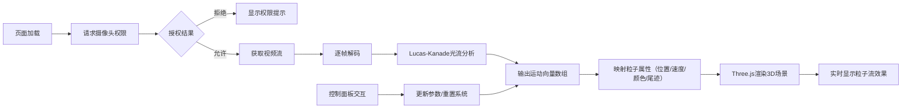

## 1. 产品概述
基于光流算法的实时3D粒子流交互可视化应用，通过摄像头捕捉画面中物体的运动轨迹，在三维空间中以粒子流形式呈现光影流动的艺术效果。
- 面向对视觉艺术、交互体验感兴趣的用户，提供沉浸式的运动可视化体验
- 将计算机视觉（光流算法）与3D图形渲染（Three.js）结合，创造独特的实时交互艺术装置

## 2. 核心功能

### 2.1 功能模块
1. **摄像头采集模块**：自动请求摄像头权限，实时获取视频流并解码每一帧
2. **光流分析模块**：采用Lucas-Kanade算法检测特征点运动向量
3. **3D粒子渲染模块**：基于Three.js构建三维场景，实时渲染粒子系统和运动尾迹
4. **控制面板模块**：提供参数调节和重置功能的交互界面

### 2.2 页面详情
| 页面名称 | 模块名称 | 功能描述 |
|---------|---------|----------|
| 主页面 | 摄像头采集 | 页面加载自动请求getUserMedia权限，获取视频流 |
| 主页面 | 光流分析 | 逐帧执行Lucas-Kanade光流检测，输出特征点运动向量 |
| 主页面 | 3D场景渲染 | 45度俯视视角，相机自动旋转，径向渐变背景，半透明网格地面 |
| 主页面 | 粒子系统 | 2000个动态粒子，运动向量映射到XYZ轴，带渐隐尾迹效果 |
| 主页面 | 控制面板 | 敏感度滑块、粒子数量滑块、重置按钮，毛玻璃半透明风格 |

## 3. 核心流程
页面加载后自动请求摄像头权限，用户授权后启动视频采集；逐帧分析光流得到运动向量，将向量映射为粒子的三维位置、速度、颜色和尾迹参数；Three.js渲染循环实时更新粒子系统；用户通过控制面板调节参数或重置系统。

## 4. 用户界面设计

### 4.1 设计风格
- **主色调**：深蓝色（#0a0a2a）到黑色（#000000）径向渐变背景
- **粒子渐变色**：从蓝色（#1e90ff）渐变到红色（#ff4500），速度越大颜色越亮
- **辅助色**：白色（#ffffff）网格线，透明度0.1
- **UI风格**：半透明毛玻璃效果，圆角16px，右下角控制面板
- **按钮交互**：悬停放大1.05倍（0.2s过渡），按下缩小0.95倍（0.1s过渡）

### 4.2 页面设计概述
| 页面名称 | 模块名称 | UI元素 |
|---------|---------|--------|
| 主页面 | 3D场景 | 全屏Canvas容器，径向渐变背景，45度俯视相机自动旋转 |
| 主页面 | 网格地面 | 半透明白色网格（0.5px线宽，透明度0.1），位于Z=0平面 |
| 主页面 | 粒子系统 | 4-8px随机大小粒子，带10-50px渐隐尾迹线条 |
| 主页面 | 控制面板 | 右下角固定位置，200px宽度，毛玻璃背景，可拖动 |
| 主页面 | 滑块控件 | 光流敏感度（0.1-1.0，默认0.5），粒子数量（500-3000，默认2000） |
| 主页面 | 重置按钮 | 清空粒子系统并重新积累 |
| 主页面 | 权限提示 | 摄像头权限被拒绝时显示引导提示 |

### 4.3 响应性
- Desktop优先设计，全屏Canvas自适应窗口尺寸
- 控制面板固定在右下角，不随窗口缩放影响布局
- 触摸设备支持滑块拖动和按钮点击

### 4.4 3D场景指导
- **环境与氛围**：深蓝到黑色径向渐变背景，营造宇宙深空氛围
- **光照设置**：环境光提供基础照明，粒子使用自发光材质确保可见性
- **相机设置**：PerspectiveCamera，45度俯视视角，围绕原点以0.2rad/s角速度缓慢旋转
- **构图与焦点**：粒子系统为视觉焦点，网格地面提供空间参考
- **交互与动画**：相机自动旋转，粒子根据光流实时运动，尾迹渐隐消失
- **性能要求**：默认2000粒子维持30FPS以上，3000粒子不低于25FPS
