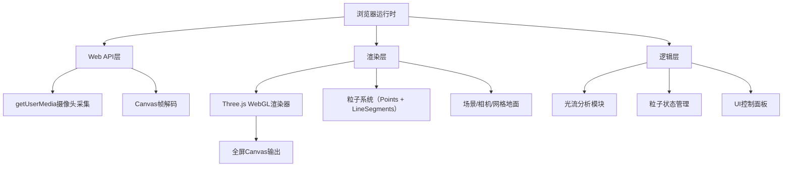

## 1. 架构设计
纯前端浏览器应用架构，所有计算在客户端完成，无后端依赖。



## 2. 技术说明
- **前端框架**：TypeScript + Three.js（原生，无React/Vue）
- **构建工具**：Vite，端口3000
- **光流算法**：Lucas-Kanade稀疏光流，基于OpenCV.js简化实现或自实现Shi-Tomasi角点检测 + LK光流追踪
- **3D渲染**：Three.js r160+，使用BufferGeometry和PointsMaterial实现高性能粒子系统
- **样式**：原生CSS实现毛玻璃效果（backdrop-filter），无需CSS框架
- **无后端服务**：所有计算在浏览器端完成

## 3. 项目文件结构
| 文件路径 | 用途 |
|---------|------|
| package.json | 依赖声明（three、typescript、vite、@types/three）及启动脚本 |
| index.html | 入口页面，全屏Canvas容器、摄像头权限提示、控制面板挂载点 |
| tsconfig.json | TypeScript配置（strict模式，target ES2020） |
| vite.config.js | Vite构建配置（端口3000） |
| src/main.ts | 项目入口：初始化摄像头、创建Three.js场景、启动渲染循环和光流分析 |
| src/opticalFlow.ts | 光流分析模块：Lucas-Kanade算法实现，接收视频帧返回运动向量数组 |
| src/particleSystem.ts | 粒子系统模块：管理粒子位置/速度/颜色/尾迹，与Three.js场景交互 |
| src/ui.ts | 控制面板模块：DOM创建、滑块和按钮事件绑定、拖动功能 |

## 4. 核心数据结构

### 4.1 运动向量（MotionVector）
```typescript
interface MotionVector {
  x: number;          // 特征点在画面中的X坐标（归一化 -1~1）
  y: number;          // 特征点在画面中的Y坐标（归一化 -1~1）
  vx: number;         // X方向运动速度
  vy: number;         // Y方向运动速度
  magnitude: number;  // 运动向量模长
}
```

### 4.2 粒子数据（ParticleData）
```typescript
interface ParticleData {
  position: { x: number; y: number; z: number };
  velocity: { x: number; y: number; z: number };
  color: THREE.Color;
  size: number;
  trail: { x: number; y: number; z: number }[];
  life: number;       // 剩余生命周期（秒）
}
```

### 4.3 配置参数（Config）
```typescript
interface Config {
  sensitivity: number;    // 光流敏感度 0.1~1.0，默认0.5
  particleCount: number;  // 粒子总数 500~3000，默认2000
}
```

## 5. 核心算法与流程

### 5.1 光流计算流程
1. 通过隐藏Canvas将当前视频帧绘制为ImageData
2. 转为灰度图，与上一帧灰度图对比
3. Shi-Tomasi角点检测提取特征点（最多500个）
4. Lucas-Kanade光流追踪计算每个特征点的位移
5. 过滤掉模长小于敏感度阈值的向量
6. 返回归一化后的运动向量数组

### 5.2 粒子更新流程
1. 每帧接收光流向量数组
2. 将向量分配给粒子（按位置匹配或随机分配）
3. 更新粒子位置（X/Y映射画面平面，Z由magnitude映射）
4. 更新粒子颜色（按magnitude从#1e90ff到#ff4500插值）
5. 更新粒子尾迹（压入当前位置，超出长度则出队）
6. 衰减粒子life，life≤0则重置粒子
7. 将数据同步到Three.js的BufferGeometry

### 5.3 颜色映射
```
magnitude ∈ [0, maxMagnitude] → t = magnitude / maxMagnitude
color = lerpColor(#1e90ff, #ff4500, t)
亮度随t线性增加
```

### 5.4 相机控制
- PerspectiveCamera: fov=60, aspect=window.innerWidth/window.innerHeight
- 初始位置: (0, -height, height) 形成45度俯视
- 每帧相机绕Y轴旋转: angle += 0.2 * deltaTime
- 始终看向原点 (0, 0, 0)
