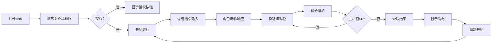

## 1. 产品概述

语音控制2D横板跑酷游戏，玩家通过声音指令和音量大小控制角色跳跃、蹲伏和冲刺，适用于运动康复或体感游戏场景，解决玩家无法解放双手操作键盘的问题。

- 核心价值：通过语音交互实现无手操作，为康复训练和体感游戏提供全新体验
- 目标用户：运动康复患者、体感游戏爱好者

## 2. 核心功能

### 2.1 功能模块

1. **游戏主场景**：像素风格城市背景卷轴、角色控制、障碍物生成
2. **语音交互模块**：音量检测、语音指令识别、置信度显示
3. **游戏系统**：生命值、得分、难度升级、碰撞检测
4. **数据持久化**：最高分、游戏次数存储
5. **UI界面**：HUD显示、游戏结束界面、麦克风权限控制

### 2.2 功能详情

| 功能名称 | 模块名称 | 功能描述 |
|---------|---------|----------|
| 音量控制跳跃 | 角色控制 | 音量30-80分贝线性映射跳跃高度50-200px，80分贝以上触发超级跳跃300px |
| 语音指令识别 | 语音交互 | 支持中英文"跳/蹲/冲"指令，置信度80%以上触发 |
| 障碍物系统 | 游戏系统 | 随机生成箱子、尖刺、路障，生成频率随难度提升 |
| 生命值系统 | 游戏系统 | 3条生命，碰撞障碍物闪烁减血，归零游戏结束 |
| 背景卷轴 | 渲染模块 | 像素城市背景，速度渐增，日落渐变效果 |
| 数据存储 | 持久化 | localStorage保存最高分和游戏次数 |
| 音量波形 | UI界面 | 左下角实时波形显示，渐变色条绘制 |

## 3. 核心流程

玩家打开页面 → 请求麦克风权限 → 授权后开始游戏 → 语音控制角色跳跃/蹲伏/冲刺 → 躲避障碍物获得分数 → 生命值归零游戏结束 → 显示得分并可重新开始

## 4. 用户界面设计

### 4.1 设计风格
- **像素复古风格**：整体采用8-bit像素艺术风格
- **主色调**：天空蓝(#87CEEB)渐变为日落橙(#FF8C00)
- **强调色**：生命红(#e74c3c)、波形渐变(#00ff88到#ff8800)
- **按钮样式**：渐变背景(#e67e22到#d35400)，圆角8px，悬停放大1.1倍
- **字体**：像素风格字体，数字清晰易读

### 4.2 页面设计

| 页面 | 模块 | UI元素 |
|-----|------|--------|
| 游戏主界面 | 游戏画布 | 640x480像素，居中，圆角边框阴影 |
| 游戏主界面 | HUD | 左上角：心形生命值、得分、音量值 |
| 游戏主界面 | 波形显示 | 左下角：音量波形条、置信度显示 |
| 游戏主界面 | 权限按钮 | 底部：麦克风权限按钮(红/绿状态) |
| 结束界面 | 遮罩层 | 半透明黑色背景(rgba(0,0,0,0.7)) |
| 结束界面 | 得分显示 | 居中显示最终得分 |
| 结束界面 | 重新开始 | 渐变按钮，悬停放大效果 |

### 4.3 动画效果
- 角色跳跃/蹲伏/冲刺动画帧切换
- 超级跳跃金色粒子尾迹
- 碰撞红色闪烁动画(0.3秒透明度交替)
- 按钮脉冲扩散动画
- 背景卷轴与日落渐变

### 4.4 响应式
- 桌面端优先，画布居中显示
- 支持页面可见性变化时暂停/恢复游戏
