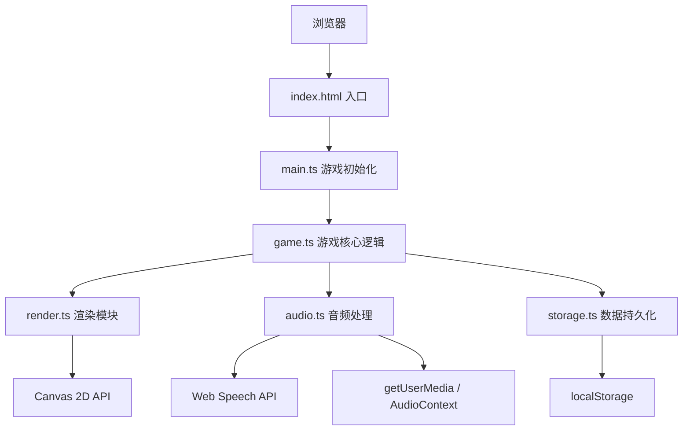

## 1. 架构设计



## 2. 技术描述

- **前端框架**：原生 TypeScript + Canvas 2D
- **构建工具**：Vite
- **语音识别**：Web Speech API (SpeechRecognition)
- **音频处理**：Web Audio API (AudioContext + AnalyserNode)
- **数据存储**：浏览器 localStorage
- **性能目标**：60FPS，低于30FPS自动降频

## 3. 项目文件结构

```
├── package.json          # 项目依赖与脚本
├── vite.config.js        # Vite配置
├── tsconfig.json         # TypeScript配置
├── index.html            # 入口HTML
└── src/
    ├── main.ts           # 入口，游戏循环，60FPS
    ├── game.ts           # 游戏核心逻辑
    ├── render.ts         # 渲染模块
    ├── audio.ts          # 音频处理与语音识别
    └── storage.ts        # localStorage持久化
```

## 4. 核心数据结构

### 4.1 游戏状态

```typescript
interface GameState {
  status: 'idle' | 'playing' | 'paused' | 'gameover';
  score: number;
  lives: number;
  volume: number;
  confidence: number;
  lastCommand: string;
  scrollSpeed: number;
  difficulty: number;
}
```

### 4.2 角色状态

```typescript
interface Player {
  x: number;
  y: number;
  width: number;
  height: number;
  velocityY: number;
  isJumping: boolean;
  isCrouching: boolean;
  isDashing: boolean;
  isHurt: boolean;
  hurtTimer: number;
  animFrame: number;
}
```

### 4.3 障碍物

```typescript
interface Obstacle {
  type: 'box' | 'spike' | 'barrier';
  x: number;
  y: number;
  width: number;
  height: number;
}
```

### 4.4 粒子

```typescript
interface Particle {
  x: number;
  y: number;
  vx: number;
  vy: number;
  life: number;
  color: string;
  size: number;
}
```

## 5. 模块职责

### 5.1 main.ts
- 创建Canvas并挂载到DOM
- 初始化60FPS游戏循环(requestAnimationFrame)
- 监听页面可见性变化(visibilitychange)
- 协调各模块初始化

### 5.2 game.ts
- 角色状态机管理
- 障碍物生成与碰撞检测
- 得分计算与难度升级
- 调用render.ts渲染
- 接收audio.ts的语音指令回调

### 5.3 render.ts
- 背景卷轴与日落渐变渲染
- 角色动画帧绘制
- 障碍物绘制
- HUD叠加层(生命值、得分、音量)
- 游戏结束遮罩
- 波形可视化

### 5.4 audio.ts
- 初始化getUserMedia获取麦克风流
- 实时音量计算(AnalyserNode)
- Web Speech API语音识别
- 指令置信度阈值判断(80%)
- 通过回调将音量和指令结果传递给game.ts

### 5.5 storage.ts
- 封装localStorage的save/load方法
- 存储最高分、游戏次数
- 异步Promise封装

## 6. 性能优化策略

- 使用requestAnimationFrame实现60FPS
- 帧率监控，低于30FPS时障碍物生成频率减半
- 粒子对象池复用
- 离屏画布缓存静态背景元素
