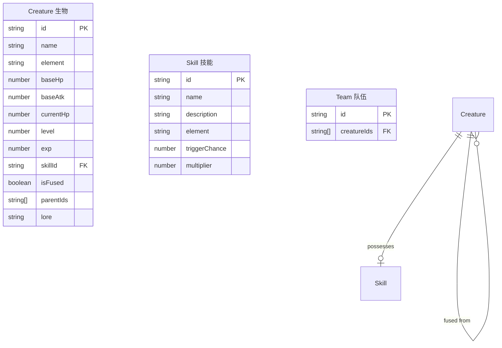

## 1. 架构设计

```mermaid
graph TB
    subgraph "前端层"
        "React App" --> "React Router"
        "React Router" --> "/home 融合工坊"
        "React Router" --> "/bestiary 生物图鉴"
        "React Router" --> "/arena 自动竞技场"
    end
    subgraph "引擎层"
        "/home 融合工坊" --> "FusionEngine 融合引擎"
        "/arena 自动竞技场" --> "BattleEngine 战斗引擎"
    end
    subgraph "渲染层"
        "FusionEngine 融合引擎" --> "Canvas动画工具 animation.ts"
        "BattleEngine 战斗引擎" --> "Canvas动画工具 animation.ts"
    end
    subgraph "数据层"
        "FusionEngine 融合引擎" --> "LocalStorage 持久化"
        "BattleEngine 战斗引擎" --> "LocalStorage 持久化"
        "React App" --> "LocalStorage 持久化"
    end
```

## 2. 技术说明

- **前端框架**：React@18 + TypeScript + Vite
- **构建工具**：Vite（端口3000）
- **样式方案**：CSS Modules + CSS变量（暗紫/星空蓝主题）
- **路由**：react-router-dom@6
- **Canvas渲染**：自定义2D引擎模块（FusionEngine + BattleEngine + animation.ts）
- **状态管理**：React Context + useReducer（轻量级，无Redux）
- **数据持久化**：LocalStorage（生物数据、图鉴解锁、经验等级）
- **动画库**：requestAnimationFrame + 自定义Canvas粒子系统
- **后端**：无（纯前端单机游戏，所有逻辑客户端运行）

## 3. 路由定义

| 路由 | 用途 |
|-------|---------|
| /home | 融合工坊：基础生物列表、合成槽、融合动画 |
| /bestiary | 生物图鉴：已解锁生物列表、详细属性面板 |
| /arena | 自动竞技场：队伍选择、Canvas回合制对战 |

## 4. 数据模型

### 4.1 数据模型定义



### 4.2 核心类型定义

```typescript
type Element = 'fire' | 'water' | 'plant' | 'thunder' | 'shadow' | 'rock';

interface Creature {
  id: string;
  name: string;
  element: Element;
  baseHp: number;
  baseAtk: number;
  currentHp: number;
  level: number;
  exp: number;
  expToNext: number;
  skillId: string;
  isFused: boolean;
  parentIds: string[];
  lore: string;
  colorPrimary: string;
  colorSecondary: string;
}

interface Skill {
  id: string;
  name: string;
  description: string;
  element: Element;
  triggerChance: number;
  multiplier: number;
}

interface BattleState {
  playerTeam: Creature[];
  enemyTeam: Creature[];
  currentTurn: number;
  currentActorIndex: number;
  phase: 'select' | 'battle' | 'result';
  winner: 'player' | 'enemy' | null;
  log: BattleLogEntry[];
}
```

## 5. 核心算法

### 5.1 融合公式

- **攻击力**：`max(parentA.baseAtk, parentB.baseAtk) * 1.2`
- **生命值**：`(parentA.baseHp + parentB.baseHp) / 2`
- **元素**：随机继承一个父代元素，或当两个父代元素不同时有概率产生变异元素
- **技能**：随机继承一个父代技能
- **配色**：取两个父代的主色和副色进行混合

### 5.2 战斗公式

- **普通伤害**：`attacker.baseAtk * (0.9 + Math.random() * 0.2)`
- **技能伤害**：`attacker.baseAtk * skill.multiplier * (0.9 + Math.random() * 0.2)`
- **技能触发**：每回合 `Math.random() < skill.triggerChance` 则触发技能
- **回合顺序**：按攻击力从高到低排序，双方交替行动
- **经验值**：胜利后每只生物获得 `10 + enemyAvgLevel * 5` 经验
- **升级**：每级所需经验 `level * 20`，升级后 HP+10, ATK+3

## 6. 文件结构

```
├── package.json
├── vite.config.js
├── tsconfig.json
├── index.html
└── src/
    ├── main.tsx
    ├── App.tsx
    ├── components/
    │   └── CreatureCard.tsx
    ├── engine/
    │   ├── FusionEngine.ts
    │   └── BattleEngine.ts
    └── utils/
        └── animation.ts
```
