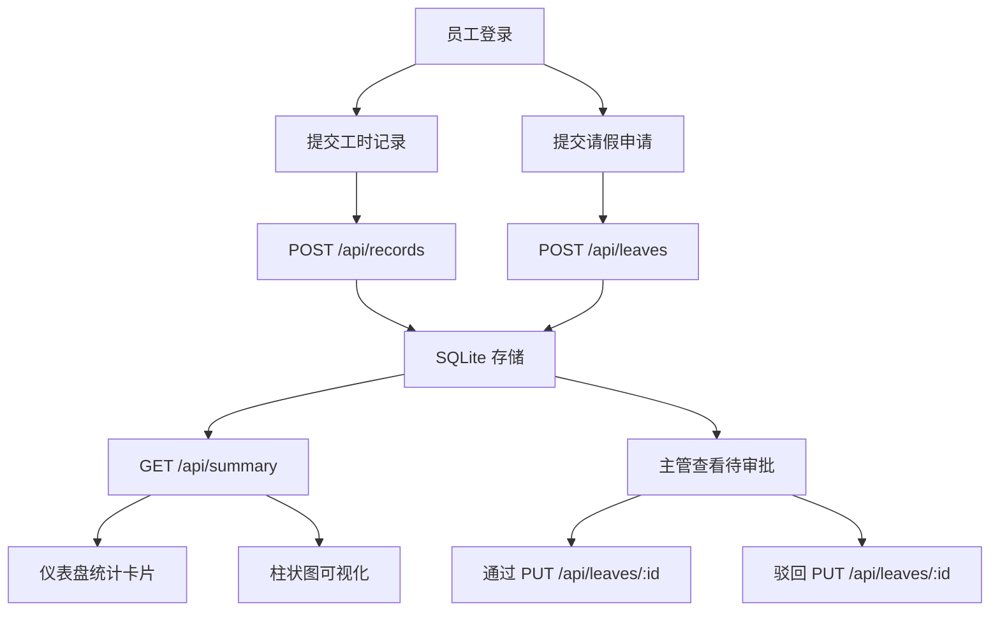

## 1. 产品概述

WorkFlow 是一款面向中小型企业人力资源部门的工时与考勤管理应用，解决 Excel 模板多、易出错、缺乏集成在线管理工具的问题。员工可提交每日工时记录，主管可审批请假申请，系统自动汇总统计并以可视化图表呈现。

- 目标用户：中小型企业员工及主管
- 核心价值：统一工时记录、简化请假审批、可视化考勤统计

## 2. 核心功能

### 2.1 用户角色

| 角色 | 注册方式 | 核心权限 |
|------|----------|----------|
| 员工 | 默认身份 | 提交工时记录、提交请假申请、查看个人统计 |
| 主管 | 默认身份 | 审批/驳回请假申请、查看团队统计 |

### 2.2 功能模块

1. **仪表盘页面**：本周/本月工时统计卡片、出勤率、待审批请假列表、柱状图可视化
2. **工时记录页面**：工时提交表单、最近30天工时列表（编辑/删除）
3. **请假审批页面**：请假提交模态框、待审批列表、通过/驳回操作

### 2.3 页面详情

| 页面名称 | 模块名称 | 功能描述 |
|----------|----------|----------|
| 仪表盘 | 统计卡片 | 显示当前周期、总工时(80px蓝色大字)、平均每日工时、出勤天数、请假天数，每个卡片带图标 |
| 仪表盘 | 柱状图 | 横轴周一至周日(或1-31号)，纵轴每日工时，柱体渐变色，柱顶数值，悬停tooltip |
| 仪表盘 | 待审批请假 | 主管视角显示待审批列表，通过/驳回按钮 |
| 工时记录 | 提交表单 | 选择项目(项目A/B/日常事务)，工时数(0.5-24步长0.5)，备注，绿色toast提示 |
| 工时记录 | 记录列表 | 最近30天记录表格，斑马条纹，悬停浅蓝，编辑/删除按钮 |
| 请假审批 | 请假模态框 | 开始/结束日期、请假类型(年假/病假/事假)、理由 |
| 请假审批 | 审批列表 | 待审批列表，通过(绿色)/驳回(红色)按钮，状态变色行 |

## 3. 核心流程

**工时提交流程**：员工选择项目 → 填写工时数和备注 → 点击提交 → 后端保存 → 表单清空 → 绿色toast提示"提交成功"(2秒后淡出)

**请假审批流程**：员工填写请假信息 → 提交(状态:待审批) → 主管看到待审批列表 → 点击通过/驳回 → 状态更新 → 行颜色变化

**统计汇总流程**：系统自动汇总每周/每月数据 → 仪表盘卡片展示 → 柱状图可视化

## 4. 用户界面设计

### 4.1 设计风格

- 主色调：蓝色系 #1976d2，辅色灰色 #f5f5f5，白色 #ffffff
- 按钮：扁平化，悬停亮度变化10%，点击 scale(0.97)，持续0.2s ease-out
- 字体：系统默认无衬线字体 (-apple-system, BlinkMacSystemFont, 'Segoe UI')
- 布局：左侧固定侧边栏(220px，深蓝#1565c0) + 右侧卡片式主内容区
- 卡片：圆角12px，间距16px，阴影0 4px 12px rgba(0,0,0,0.06)，背景白色

### 4.2 页面设计概览

| 页面名称 | 模块名称 | UI元素 |
|----------|----------|--------|
| 全局 | 侧边栏 | 宽220px，背景#1565c0，白色文字居中，菜单项高48px，hover背景#1976d2，左滑白色下划线0.2s |
| 仪表盘 | 统计卡片 | 总工时80px蓝色#1976d2加粗，时钟/日历图标，卡片间距24px，白底阴影 |
| 仪表盘 | 柱状图 | 渐变#42a5f5→#1e88e5，柱顶12px数值，tooltip深灰#333白字圆角4px |
| 工时记录 | 表格 | 斑马条纹#f9f9f9，hover浅蓝#e3f2fd，编辑/删除图标按钮 |
| 请假审批 | 模态框 | 通过绿色#4caf50，驳回红色#f44336，按钮缩放动画0.2s |
| 请假审批 | 状态行 | 通过绿色#e8f5e9，拒绝红色#ffebee |

### 4.3 响应式适配

- 桌面优先设计，屏幕宽度 < 768px 时：
  - 侧边栏变为顶部导航(高56px，横向菜单，溢出水平滚动)
  - 主内容区变为单列布局
- 主内容区最小宽度 320px

### 4.4 交互细节

- Toast提示：绿色成功提示"提交成功"，2秒后自动消失，淡出动画0.3s
- 按钮反馈：悬停亮度变化10%，点击 scale(0.97)，持续0.2s ease-out
- 侧边栏菜单：hover时左滑白色下划线动画0.2s
- 请假按钮：通过/驳回按钮缩放动画0.2s
