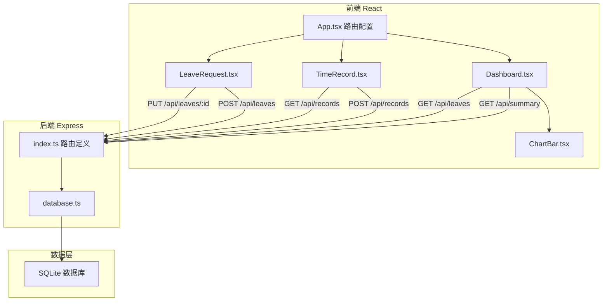
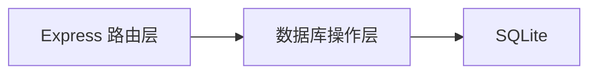
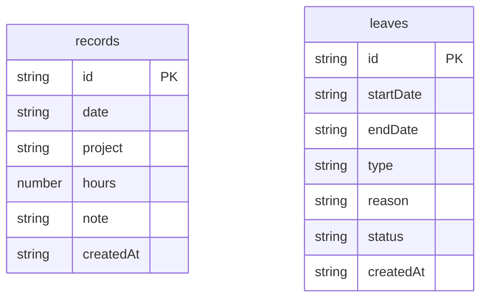

## 1. 架构设计



## 2. 技术说明

- 前端：React@18 + TypeScript + Vite + Tailwind CSS
- 后端：Express@4 + TypeScript (ESM格式)
- 数据库：SQLite (better-sqlite3)
- 状态管理：Zustand
- 路由：react-router-dom
- 图标：lucide-react
- 初始化工具：vite-init (react-express-ts 模板)

## 3. 路由定义

| 路由 | 用途 |
|------|------|
| / | 仪表盘页面 - 工时统计和待审批请假 |
| /time-record | 工时记录页面 - 提交和查看工时 |
| /leave-request | 请假审批页面 - 提交和审批请假 |

## 4. API定义

### 4.1 工时记录 API

**GET /api/records**
- 查询参数: `?days=30` (最近N天)
- 响应: `{ records: Array<{ id: string, date: string, project: string, hours: number, note: string, createdAt: string }> }`

**POST /api/records**
- 请求体: `{ project: string, hours: number, note: string, date: string }`
- 响应: `{ success: boolean, record: Record }`

**PUT /api/records/:id**
- 请求体: `{ project?: string, hours?: number, note?: string }`
- 响应: `{ success: boolean, record: Record }`

**DELETE /api/records/:id**
- 响应: `{ success: boolean }`

### 4.2 请假 API

**GET /api/leaves**
- 查询参数: `?status=pending` (可选筛选)
- 响应: `{ leaves: Array<{ id: string, startDate: string, endDate: string, type: string, reason: string, status: string, createdAt: string }> }`

**POST /api/leaves**
- 请求体: `{ startDate: string, endDate: string, type: '年假'|'病假'|'事假', reason: string }`
- 响应: `{ success: boolean, leave: Leave }`

**PUT /api/leaves/:id**
- 请求体: `{ status: '已通过'|'已拒绝' }`
- 响应: `{ success: boolean, leave: Leave }`

### 4.3 统计 API

**GET /api/summary**
- 查询参数: `?period=week|month`
- 响应: `{ totalHours: number, avgDailyHours: number, attendanceDays: number, leaveDays: number, dailyHours: Array<{ date: string, hours: number }>, periodLabel: string }`

## 5. 服务端架构图



## 6. 数据模型

### 6.1 数据模型定义



### 6.2 数据定义语言

```sql
CREATE TABLE IF NOT EXISTS records (
    id TEXT PRIMARY KEY,
    date TEXT NOT NULL,
    project TEXT NOT NULL,
    hours REAL NOT NULL CHECK(hours >= 0.5 AND hours <= 24),
    note TEXT DEFAULT '',
    createdAt TEXT NOT NULL DEFAULT (datetime('now'))
);

CREATE TABLE IF NOT EXISTS leaves (
    id TEXT PRIMARY KEY,
    startDate TEXT NOT NULL,
    endDate TEXT NOT NULL,
    type TEXT NOT NULL CHECK(type IN ('年假', '病假', '事假')),
    reason TEXT DEFAULT '',
    status TEXT NOT NULL DEFAULT '待审批' CHECK(status IN ('待审批', '已通过', '已拒绝')),
    createdAt TEXT NOT NULL DEFAULT (datetime('now'))
);

CREATE INDEX IF NOT EXISTS idx_records_date ON records(date);
CREATE INDEX IF NOT EXISTS idx_leaves_status ON leaves(status);
```
