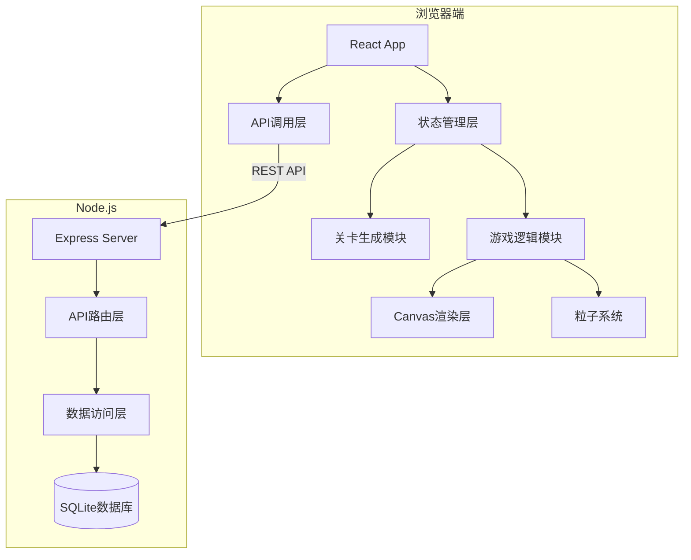

# 扩散泡泡龙游戏 - 技术架构文档

## 1. 技术选型说明

### 1.1 前端技术栈
| 技术 | 版本 | 选型理由 |
|------|------|----------|
| React | 18.x | 组件化开发，便于状态管理和UI复用 |
| TypeScript | 5.x | 类型安全，提升代码可维护性 |
| Vite | 5.x | 快速的开发体验，热更新，支持React插件 |
| Canvas API | - | 高性能游戏渲染，支持像素级操作 |

### 1.2 后端技术栈
| 技术 | 版本 | 选型理由 |
|------|------|----------|
| Node.js | 18+ | JavaScript全栈，前后端语言统一 |
| Express | 4.x | 轻量级Web框架，易于配置RESTful API |
| better-sqlite3 | 9.x | 同步SQLite驱动，性能优异，类型支持完善 |
| uuid | 9.x | 生成唯一关卡标识符 |

### 1.3 开发工具
| 工具 | 用途 |
|------|------|
| @vitejs/plugin-react | Vite的React支持 |
| concurrently | 同时启动前端和后端开发服务器 |

---

## 2. 系统架构设计

### 2.1 整体架构图



### 2.2 模块职责划分

#### 2.2.1 关卡生成模块 (`gridGenerator.ts`)
- **职责**：纯函数实现扩散算法，不依赖React
- **输入**：种子值、迭代步数
- **输出**：50×30网格矩阵、颜色映射表
- **核心算法**：
  1. 随机初始化网格
  2. 20步扩散迭代（根据邻居颜色分布调整）
  3. 重力下沉（每步后泡泡落至最低可用行）
- **性能约束**：单步迭代≤50ms

#### 2.2.2 游戏主板模块 (`GameBoard.tsx`)
- **职责**：React组件，封装游戏逻辑和Canvas渲染
- **Props**：
  - `levelData`: 关卡网格数据
  - `onScoreUpdate`: 得分更新回调
  - `onLevelComplete`: 通关回调
- **核心功能**：
  - 鼠标瞄准角度计算
  - 泡泡发射与飞行轨迹
  - 六边形碰撞检测
  - 同色连接消除判定
  - 悬空泡泡检测与掉落
  - `requestAnimationFrame` 游戏循环

#### 2.2.3 粒子系统 (`particles.ts`)
- **职责**：纯函数实现粒子生命周期管理，不依赖React
- **核心数据结构**：
  ```typescript
  interface Particle {
    id: string;
    x: number;
    y: number;
    vx: number;
    vy: number;
    color: string;
    radius: number;
    life: number;
    maxLife: number;
    createdAt: number;
  }
  ```
- **核心方法**：
  - `addParticles(bubbles)`: 添加消除产生的粒子
  - `updateParticles(deltaTime)`: 更新粒子状态
  - **性能约束**：粒子总数≤200，超出时FIFO移除

#### 2.2.4 后端服务 (`server.ts`)
- **职责**：Express服务器，提供RESTful API
- **数据库表设计**：
  ```sql
  CREATE TABLE levels (
    id TEXT PRIMARY KEY,
    level_number INTEGER NOT NULL,
    grid_matrix TEXT NOT NULL,  -- JSON序列化的50×30矩阵
    score INTEGER NOT NULL,
    time_spent INTEGER NOT NULL,  -- 毫秒
    created_at DATETIME DEFAULT CURRENT_TIMESTAMP
  );
  ```
- **API端点**：
  - `POST /api/levels` - 保存通关关卡
  - `GET /api/levels` - 获取关卡列表（分页）
  - `GET /api/stats` - 获取统计数据（总得分、通关数等）

---

## 3. 核心算法设计

### 3.1 扩散生成算法

```
算法：扩散迭代生成泡泡布局
输入：网格列数cols=50，行数rows=30，迭代次数steps=20，颜色数colors=5
输出：稳定的泡泡网格矩阵

1. 初始化：
   - 创建50×30的二维数组grid
   - 随机为约30%的格子分配颜色（1-5），其余为0（空）

2. 对于每一步迭代（共20步）：
   a. 复制当前grid到newGrid
   b. 遍历每个格子(i,j)：
      - 收集8个邻居的颜色统计
      - 如果当前格子为空：
        * 若邻居中有≥3个同色，则有60%概率变为该颜色
        * 否则保持为空
      - 如果当前格子有颜色：
        * 若周围同色邻居<2，则有30%概率变为空
        * 否则保持原色
   c. 施加重力下沉：
      - 对每一列，从下往上遍历
      - 将非空格子下移至最低可用位置
   d. grid = newGrid
   e. 触发动画帧更新

3. 返回最终grid
```

### 3.2 六边形碰撞检测算法

泡泡采用**轴向坐标系**（offset coordinates）排列：
- 偶数列y坐标正常，奇数列y坐标偏移半个泡泡高度
- 泡泡半径：12px，直径24px
- 行高：24px，列宽：20.78px（24 × √3/2）

**碰撞检测**：
```
给定发射泡泡位置(x,y)，遍历所有已有泡泡：
1. 计算两泡泡中心距离d
2. 若d ≤ 24 - 0.5（考虑0.5px精度），则发生碰撞
3. 找到距离最近的六边形网格位置
4. 将泡泡粘附到该位置
```

### 3.3 同色连接消除算法

使用**BFS广度优先搜索**：
```
1. 从新粘附的泡泡开始
2. BFS遍历所有相连的同色泡泡
3. 若连接数≥3，则标记这些泡泡为待消除
4. 消除后，从顶部重新BFS找出所有与顶部相连的泡泡
5. 未被访问到的泡泡即为悬空泡泡，触发掉落
```

---

## 4. 性能优化策略

### 4.1 渲染优化
- 使用**离屏Canvas**预渲染泡泡纹理
- 只重绘变化区域，而非全帧重绘
- 粒子系统使用对象池减少GC

### 4.2 算法优化
- 碰撞检测使用**空间分区**（网格哈希）减少O(n²)复杂度
- BFS使用队列复用，避免频繁内存分配

### 4.3 帧率控制
- 游戏循环固定时间步长（`deltaTime`）
- 生成动画每步固定50ms间隔
- 粒子更新与游戏循环同步

---

## 5. 状态管理设计

### 5.1 全局状态（App.tsx）
```typescript
interface GameState {
  currentLevel: number;
  score: number;
  shotsFired: number;
  isGenerating: boolean;
  isPlaying: boolean;
  levelData: number[][];
  generationProgress: number;
}
```

### 5.2 局部状态（GameBoard.tsx）
```typescript
interface BoardState {
  grid: number[][];
  activeBubble: Bubble | null;
  aimAngle: number;
  particles: Particle[];
  fallingBubbles: FallingBubble[];
  scoreAnimation: { value: number; startTime: number } | null;
}
```

---

## 6. 构建与部署

### 6.1 开发环境
- 前端：Vite开发服务器，端口3000
- 后端：Express + ts-node，端口3001
- 代理：`/api/**` 转发到 `http://localhost:3001`

### 6.2 生产构建
```bash
npm run build
# 输出到 dist/ 目录
# 后端使用 ts-node 或编译为 JavaScript
```

---

## 7. 安全考虑

1. **输入验证**：后端API对所有输入进行类型和范围校验
2. **SQL注入防护**：使用better-sqlite3的参数化查询
3. **XSS防护**：React自动转义，用户数据不直接渲染为HTML
4. **CORS配置**：开发环境允许跨域，生产环境限制域名
