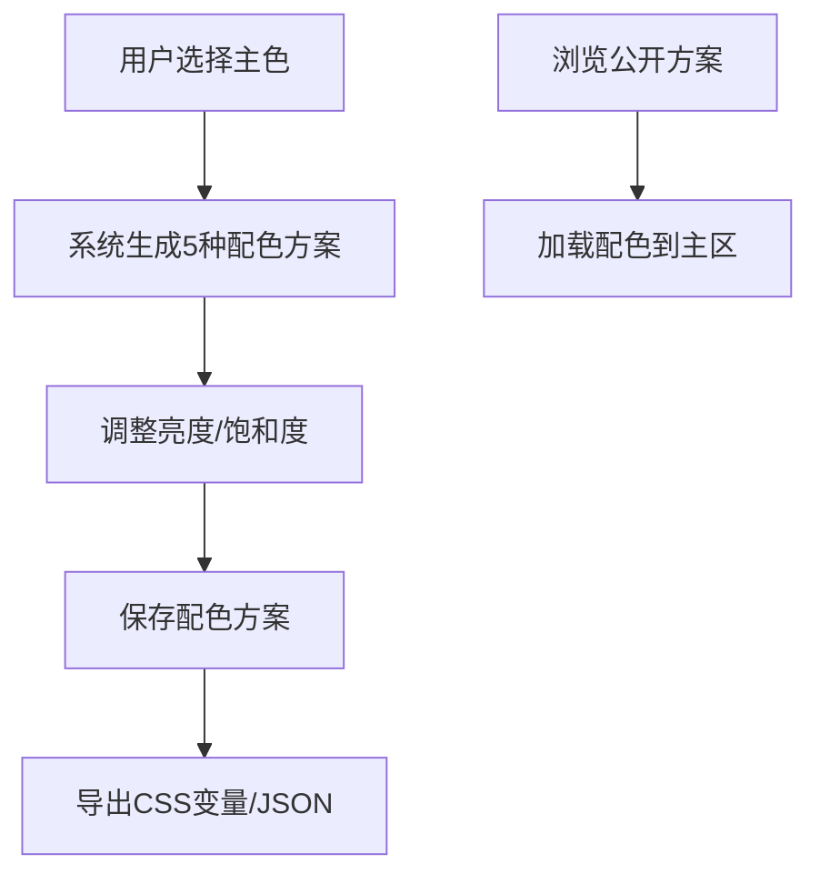

## 1. 产品概述

配色工坊是一个在线品牌配色方案生成与分享平台，帮助设计师和开发者快速创建、保存和分享专业的颜色组合。用户通过色轮交互选择主色，系统自动基于色彩理论生成多种配色方案，支持导出CSS变量和分享给其他用户。

## 2. 核心功能

### 2.1 用户角色
| 角色 | 注册方式 | 核心权限 |
|------|----------|----------|
| 普通用户 | 无需注册，本地生成方案 | 浏览、创建、保存、删除配色方案 |

### 2.2 功能模块
1. **色轮交互模块**：Canvas绘制HSV色环，支持点击/拖拽选择主色，亮度/饱和度滑块调节
2. **配色方案生成模块**：基于色轮角度自动生成5种配色规则（互补、相似、三色、分裂互补、单色）
3. **方案管理模块**：保存、加载、删除配色方案，数据持久化到SQLite
4. **导出分享模块**：复制CSS变量到剪贴板，导出JSON文件
5. **公开方案浏览模块**：瀑布流展示所有用户公开的配色方案

### 2.3 页面详情
| 页面名称 | 模块名称 | 功能描述 |
|---------|----------|----------|
| 首页 | 色轮交互区 | 直径300px HSV色环，支持点击/拖拽选择主色，外圈亮度/饱和度滑块 |
| 首页 | 配色方案展示区 | 2行3列网格展示5种配色方案卡片，每种5个色块 |
| 首页 | 已保存方案面板 | 右侧320px宽度面板，展示用户保存的方案列表 |
| 首页 | 公开方案瀑布流 | 页面底部3-4列瀑布流，展示所有公开配色方案 |

## 3. 核心流程

用户选择主色 → 系统自动生成5种配色方案 → 用户可调整亮度/饱和度 → 保存方案到后端 → 导出CSS变量或JSON → 浏览其他用户公开方案

## 4. 用户界面设计

### 4.1 设计风格
- 主色调：渐变色 #667eea 到 #764ba2（按钮）
- 背景色：#ffffff（主区），#f8f9fa（右侧面板）
- 按钮样式：圆角20px，渐变背景，白色文字14px
- 字体：系统默认无衬线字体，标题加粗18px，正文14px
- 卡片：白色背景，阴影0 2px 8px rgba(0,0,0,0.06)，圆角8px，间距20px

### 4.2 页面设计概述
| 页面名称 | 模块名称 | UI元素 |
|---------|----------|--------|
| 首页 | 色轮交互区 | Canvas色环300px直径，滑块，hex/rgb值显示，拾色器动画 |
| 首页 | 配色卡片 | 60x60px色块，hover tooltip，卡片悬浮抬起效果 |
| 首页 | 右侧面板 | 320px宽，#f8f9fa背景，可滚动，方案列表带删除按钮 |
| 首页 | 公开方案区 | 2px虚线分隔，瀑布流布局，淡入动画 |

### 4.3 响应式
- 桌面端：左右分栏60%/40%，配色卡片2行3列网格
- 移动端：上下堆叠，色轮和卡片区满宽，配色卡片1列堆叠
- 触摸优化：色块点击区域增大，滑动选择流畅

### 4.4 动画效果
- 拾色器反馈：0.2s缩放动画
- 卡片hover：0.2s过渡，悬浮抬起
- 方案加载：0.4s旋转切入动画
- 瀑布流卡片：0.3s staggered淡入动画
- 导出提示：1.5秒checkmark提示
- 所有交互：0.3s ease平滑过渡
