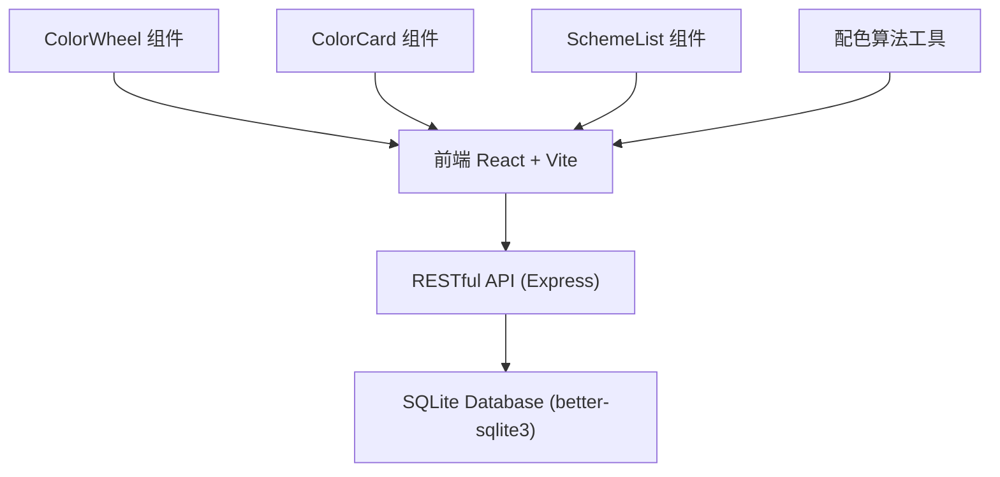
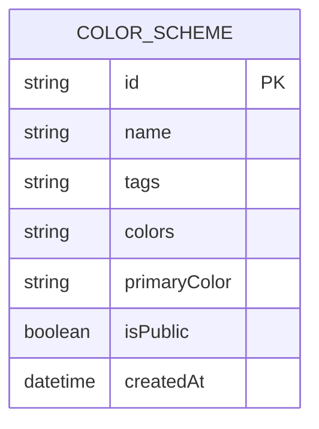

## 1. 架构设计



## 2. 技术描述
- **前端**：React@18 + TypeScript + Vite
- **初始化工具**：Vite
- **后端**：Express@4 + TypeScript
- **数据库**：SQLite (better-sqlite3)
- **状态管理**：React useState/useEffect
- **样式**：CSS Modules / 内联样式（无UI库）

## 3. 项目结构
```
auto182/
├── package.json
├── vite.config.js
├── tsconfig.json
├── index.html
├── server/
│   └── expressApp.ts
├── src/
│   ├── App.tsx
│   ├── components/
│   │   ├── ColorWheel.tsx
│   │   ├── ColorCard.tsx
│   │   └── SchemeList.tsx
│   ├── utils/
│   │   └── colorUtils.ts
│   ├── types/
│   │   └── index.ts
│   └── main.tsx
```

## 4. 组件拆分
| 组件 | 职责 |
|------|------|
| ColorWheel.tsx | Canvas绘制HSV色环，处理点击/拖拽事件，亮度/饱和度滑块 |
| ColorCard.tsx | 展示单个配色方案的5个色块，处理复制CSS变量和导出JSON |
| SchemeList.tsx | 展示已保存和公开的配色方案列表，处理加载和删除 |
| App.tsx | 整体布局，状态管理，API调用，组件组合 |

## 5. API 定义

### 5.1 类型定义
```typescript
interface ColorScheme {
  id: string;
  name: string;
  tags?: string[];
  colors: string[];
  primaryColor: string;
  isPublic: boolean;
  createdAt: string;
}

interface CreateSchemeRequest {
  name: string;
  tags?: string[];
  colors: string[];
  primaryColor: string;
  isPublic?: boolean;
}
```

### 5.2 API 接口
| 方法 | 路由 | 描述 |
|------|------|------|
| GET | /api/schemes | 获取所有公开配色方案 |
| GET | /api/schemes/:id | 获取单个配色方案 |
| POST | /api/schemes | 保存新的配色方案 |
| DELETE | /api/schemes/:id | 删除配色方案 |

## 6. 配色算法

### 6.1 色彩转换工具
- hexToHsv: hex 转 HSV
- hsvToHex: HSV 转 hex
- hsvToRgb: HSV 转 RGB
- rgbToHex: RGB 转 hex
- hexToRgb: hex 转 RGB

### 6.2 配色规则
| 规则 | 算法 |
|------|------|
| 互补色 | 主色 Hue + 180° |
| 相似色 | 主色 Hue ±30°，±15° |
| 三色 | 主色 Hue + 120°，+240° |
| 分裂互补 | 主色 Hue + 150°，+210° |
| 单色 | 主色 饱和度/亮度变化 |

## 7. 数据模型

### 7.1 ER 图


### 7.2 DDL
```sql
CREATE TABLE IF NOT EXISTS color_schemes (
  id TEXT PRIMARY KEY,
  name TEXT NOT NULL,
  tags TEXT,
  colors TEXT NOT NULL,
  primaryColor TEXT NOT NULL,
  isPublic INTEGER DEFAULT 0,
  createdAt DATETIME DEFAULT CURRENT_TIMESTAMP
);
```

## 8. 性能要求
- 配色规则计算：客户端完成，<30ms
- 色轮响应：<30ms
- API响应：<200ms（本地SQLite）
