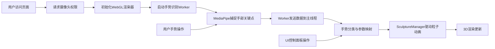

## 1. 产品概述

GestureSculpt 是一款基于手势交互的实时3D数字艺术装置，让观众通过手部动作与由数千粒子组成的抽象雕塑进行实时互动，创造出"人与数字艺术共舞"的沉浸式体验。

- 主要用途：数字艺术展览、沉浸式体验空间、科技馆互动装置
- 解决问题：传统数字艺术展品缺乏观众参与度，只能被动欣赏
- 目标用户：艺术展览观众、科技馆访客、互动艺术爱好者
- 市场价值：开创手势与3D粒子艺术结合的新型交互形式，提升展览参与度和传播性

## 2. 核心功能

### 2.1 用户角色
无需登录，所有功能面向匿名用户开放。

### 2.2 功能模块
1. **主交互场景**：3D粒子雕塑渲染、手势驱动形变、旋转、色彩变化
2. **手势识别模块**：MediaPipe Hands手部关键点捕捉、手势分类
3. **视觉特效模块**：粒子尾迹、闪烁效果、颜色渐变动画
4. **UI控制面板**：模式切换、粒子重置、FPS显示、响应式适配
5. **摄像头预览模块**：实时摄像头画面、手部关键点叠加、状态提示

### 2.3 页面详情
| 页面名称 | 模块名称 | 功能描述 |
|---------|----------|----------|
| 主交互页 | 3D雕塑渲染 | 6000粒子组成的抽象雕塑，支持形变、旋转、颜色变化 |
| 主交互页 | 手势识别 | Web Worker中运行MediaPipe Hands，识别21个手部关键点 |
| 主交互页 | 摄像头预览 | 200x150px半透明预览窗口，显示手部关键点叠加层 |
| 主交互页 | 控制面板 | 三种模式切换（形变/旋转/颜色）、重置按钮、FPS显示 |
| 主交互页 | 响应式适配 | 移动端自动折叠UI、减少粒子数量、缩小预览窗口 |

## 3. 核心流程

用户进入页面后，系统自动请求摄像头权限，启动手势识别Worker和3D渲染循环。用户通过不同手势与雕塑互动：张开手掌使粒子膨胀，握拳使粒子收缩，食指指向控制旋转，OK手势持续2秒切换颜色主题。

## 4. 用户界面设计

### 4.1 设计风格
- **设计基调**：沉浸式暗色科技风，极简主义与数字艺术的融合
- **主色调**：深空黑 `#0a0a0a` 背景，青蓝色系粒子（`#00d4ff` 至 `#0077b6` 渐变）
- **色彩主题**：三种可切换主题（极光、熔岩、霓虹）
- **视觉元素**：无连线纯净粒子、球形粒子、尾迹效果、随机闪烁
- **交互反馈**：平滑插值动画、惯性阻尼效果、HSV颜色渐变

### 4.2 页面设计概述
| 页面名称 | 模块名称 | UI元素 |
|---------|----------|--------|
| 主交互页 | 3D场景 | 全屏深色背景，6000个粒子组成动态雕塑，球形粒子大小0.03-0.1单位 |
| 主交互页 | 摄像头预览 | 右上角200x150px圆角8px窗口，半透明背景`rgba(0,0,0,0.4)`，绿色关键点连线 |
| 主交互页 | 控制面板 | 左下角三个模式按钮、重置按钮、FPS显示，白色半透明风格 |
| 主交互页 | 提示文字 | 底部居中"Hey! 张开手掌或握拳试试"，16px，`rgba(255,255,255,0.3)`，0.5秒淡入 |
| 主交互页 | 状态提示 | 未检测到手部时显示"请将手部置于摄像头前"，16px白色 |

### 4.3 响应式适配
- **桌面端（≥768px）**：完整UI面板，6000粒子，200x150px预览窗口
- **移动端（<768px）**：UI折叠为40px直径圆点按钮，点击展开；3000粒子；120x90px预览窗口
- **触摸优化**：按钮尺寸不小于44x44px，避免误触

### 4.4 3D场景指导
- **环境与氛围**：纯黑背景，无外部光源，粒子自发光营造科技感
- **光照设置**：环境光强度0.3，点光源两个（青蓝色和白色），强度0.8
- **相机设置**：PerspectiveCamera，fov 75，位置(0, 0, 5)，指向原点
- **构图**：雕塑位于屏幕中央，占据视觉核心区域，粒子向四周发散形成有机形态
- **交互动画**：
  - 张开手掌：粒子沿法线方向向外膨胀，距离越近膨胀越大
  - 握拳：粒子向中心收缩至原始半径0.5倍
  - 食指指向：雕塑绕Y/X轴旋转，带惯性阻尼
  - OK手势：HSV颜色插值渐变，1.5秒完成主题切换
- **后处理效果**：轻微Bloom发光效果，增强粒子科技感
- **性能预算**：6000粒子，每帧更新控制在8ms内，手势识别延迟<80ms
