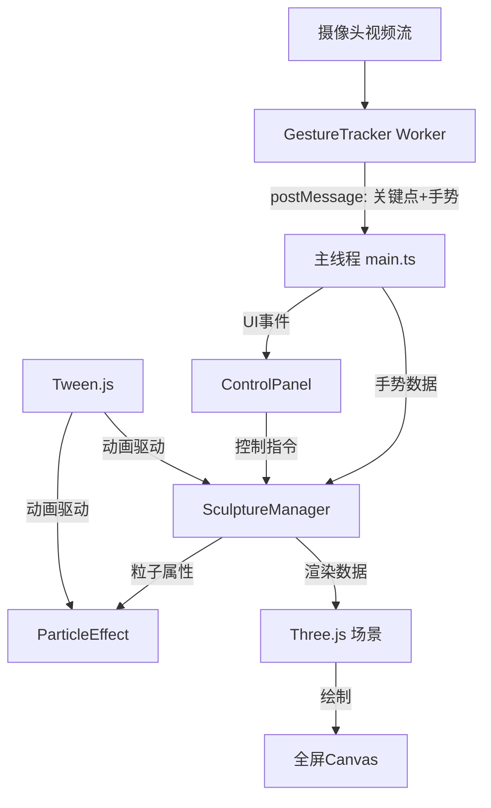

## 1. 架构设计

本项目为纯前端应用，采用模块化分层架构。手势识别在Web Worker中独立运行避免阻塞主线程，3D渲染采用Three.js，状态数据通过postMessage在Worker与主线程间传递。



## 2. 技术描述

- **前端框架**：TypeScript + Three.js（原生，非React），Vite 构建
- **手势识别**：@mediapipe/hands + @mediapipe/camera_utils，在Web Worker中运行
- **动画库**：@tweenjs/tween.js 负责颜色渐变、粒子插值等缓动动画
- **初始化方式**：手动搭建Vite + TypeScript项目结构
- **后端**：无，纯客户端运行，所有数据本地处理
- **性能策略**：
  - 手势识别与主线程隔离（Web Worker）
  - BufferGeometry批量渲染粒子
  - 响应式粒子数量（桌面6000/移动3000）
  - requestAnimationFrame渲染循环
  - 矩阵批量更新而非逐个粒子操作

## 3. 目录结构与文件说明

```
auto183/
├── index.html                      # 入口HTML：全屏canvas、摄像头预览、UI容器
├── package.json                    # 依赖管理与启动脚本
├── vite.config.js                  # Vite配置：支持Worker导入、路径别名
├── tsconfig.json                   # TypeScript配置：严格模式、bundler解析
└── src/
    ├── main.ts                     # 应用入口：初始化所有模块、启动渲染循环
    ├── sculpture/
    │   └── SculptureManager.ts     # 核心雕塑：6000粒子BufferGeometry管理、手势驱动
    ├── gesture/
    │   ├── GestureTracker.ts       # 手势识别主线程代理：管理Worker生命周期
    │   └── gesture.worker.ts       # Web Worker：MediaPipe Hands运行、手势分类
    ├── effects/
    │   └── ParticleEffect.ts       # 粒子特效：尾迹、闪烁、颜色渐变
    ├── ui/
    │   └── ControlPanel.ts         # UI控制面板：模式切换、重置、FPS显示
    └── types/
        └── index.ts                # 类型定义：手势数据、粒子状态、模式枚举
```

**文件调用关系与数据流向：**

1. **[main.ts](file:///c:/Users/Administrator/Desktop/P/tasks/auto183/src/main.ts)** → 入口调度
   - 初始化 `Three.js Renderer/Scene/Camera`
   - 创建 `GestureTracker` 实例，监听 `onGestureData` 事件
   - 创建 `SculptureManager` 实例，传入场景
   - 创建 `ControlPanel` 实例，绑定控制事件
   - 启动 `requestAnimationFrame` 循环，每帧调用 `SculptureManager.update()` 和 `TWEEN.update()`

2. **[GestureTracker.ts](file:///c:/Users/Administrator/Desktop/P/tasks/auto183/src/gesture/GestureTracker.ts)** → 手势识别代理
   - 构造函数创建 `new Worker('./gesture.worker.ts', { type: 'module' })`
   - 调用 `worker.postMessage({ type: 'init', video })` 发送视频元素给Worker
   - 监听 `worker.onmessage` 接收 `{ landmarks, gesture, distance, velocity }` 数据
   - 通过回调 `onGestureData(data)` 将数据传递给 `main.ts`

3. **[gesture.worker.ts](file:///c:/Users/Administrator/Desktop/P/tasks/auto183/src/gesture/gesture.worker.ts)** → Worker线程
   - 导入 `@mediapipe/hands` 和 `@mediapipe/camera_utils`
   - 初始化 `Hands` 实例，配置 `maxNumHands: 1`
   - 每帧处理视频帧，提取21个关键点归一化坐标
   - 调用 `classifyGesture(landmarks)` 进行手势分类
   - 计算 `palmDistance`（手掌到摄像头距离估计）、`handVelocity`（移动速度）
   - `postMessage({ landmarks, gesture, distance, velocity, indexDirection })` 发送结果

4. **[SculptureManager.ts](file:///c:/Users/Administrator/Desktop/P/tasks/auto183/src/sculpture/SculptureManager.ts)** → 雕塑核心
   - 初始化 `BufferGeometry`，创建6000个粒子的位置、颜色、大小属性数组
   - `PointsMaterial` 配置：透明、深度写入关闭、大小衰减
   - `handleGestureData(data)` 接收手势数据，更新内部状态
   - `update(deltaTime)` 每帧更新：
     - 根据手势模式应用膨胀/收缩/旋转
     - 调用 `ParticleEffect.updateTrails()` 更新尾迹
     - 调用 `ParticleEffect.updateFlicker()` 更新闪烁
     - 更新 `BufferGeometry.attributes.position/color/size`
     - 调用 `needsUpdate = true` 标记更新
   - 支持 `setMode(mode)`、`reset()` 等控制方法

5. **[ParticleEffect.ts](file:///c:/Users/Administrator/Desktop/P/tasks/auto183/src/effects/ParticleEffect.ts)** → 特效管理
   - 维护每个粒子的尾迹历史数组（长度20）
   - `updateTrails()`：将当前位置加入历史，超出长度移除最早位置
   - `updateFlicker()`：20%概率触发闪烁，Tween控制0.1秒闪烁周期
   - `transitionColorTheme(theme)`：Tween驱动1.5秒HSV颜色插值
   - 距离映射算法：`expansion = distance < 80 ? 2 : distance < 150 ? 1 : 0`

6. **[ControlPanel.ts](file:///c:/Users/Administrator/Desktop/P/tasks/auto183/src/ui/ControlPanel.ts)** → UI控制
   - 创建DOM元素：三个模式按钮、重置按钮、FPS计数器
   - 监听窗口大小变化，<768px时自动折叠UI
   - 点击事件调用 `SculptureManager` 的对应方法
   - FPS计算：每10帧记录时间戳，计算平均帧率

## 4. 数据类型定义

```typescript
// types/index.ts
export type GestureType = 'open_palm' | 'fist' | 'pointing' | 'ok' | 'none';
export type SculptureMode = 'deform' | 'rotate' | 'color';
export type ColorTheme = 'aurora' | 'lava' | 'neon';

export interface Landmark {
  x: number;
  y: number;
  z: number;
}

export interface GestureData {
  landmarks: Landmark[];           // 21个手部关键点，归一化坐标0-1
  gesture: GestureType;            // 分类后的手势类型
  palmDistance: number;            // 手掌到摄像头距离估计(cm)
  handVelocity: { x: number; y: number };  // 手部移动速度(px/s)
  indexDirection: { x: number; y: number }; // 食指指向方向向量
  detected: boolean;               // 是否检测到手部
}

export interface ParticleData {
  basePosition: Float32Array;      // 粒子原始位置(3 * N)
  currentPosition: Float32Array;   // 当前位置
  baseColor: Float32Array;         // 原始颜色(3 * N)
  currentColor: Float32Array;      // 当前颜色
  size: Float32Array;              // 粒子大小(N)
  trailHistory: Float32Array[][];  // 尾迹历史
  flickerState: boolean[];         // 闪烁状态
  flickerTween: any[];             // 闪烁动画实例
}
```

## 5. 关键算法说明

### 5.1 手势分类算法
- **张开手掌**：检测5个指尖与掌根的距离，全部大于阈值则判定
- **握拳**：检测5个指尖到掌心的距离，全部小于阈值则判定
- **食指指向**：食指尖与掌根连线，其余四指弯曲
- **OK手势**：拇指尖与食指尖距离<0.05，其余三指张开，持续2秒触发

### 5.2 距离估算算法
- 通过 `landmarks[0]`（腕部）到 `landmarks[9]`（中指根）的像素距离估算深度
- 校准系数：`distance(cm) = 200 / pixelDistance`

### 5.3 旋转控制算法
```typescript
// 食指方向 → 旋转角度
targetRotationY = indexDirection.x * Math.PI;
targetRotationX = -indexDirection.y * Math.PI * 0.5;

// 速度映射
angularVelocity = Math.min(handVelocity.magnitude / 100, 1) * 0.3; // rad/s

// 惯性阻尼
rotationVelocity *= 0.95; // 每帧衰减
if (Math.abs(rotationVelocity) < 0.001) rotationVelocity = 0;
```

### 5.4 颜色主题定义
```typescript
const colorThemes = {
  aurora: ['#00ff87', '#60efff', '#0066ff'],
  lava: ['#ff4500', '#ff8c00', '#ffd700'],
  neon: ['#ff00ff', '#00ffff', '#ffff00']
};
```

## 6. 性能保障措施

1. **Web Worker隔离**：MediaPipe计算完全在Worker线程，主线程仅处理渲染
2. **BufferGeometry批量渲染**：所有粒子共享一个Geometry，单次draw call
3. **TypedArray直接操作**：避免频繁创建对象，直接操作Float32Array
4. **帧率自适应**：移动端粒子数量减半，确保60FPS
5. **内存管理**：Worker终止时清理资源，Tween动画完成后自动销毁
6. **对象池**：尾迹历史数组复用，避免GC卡顿
