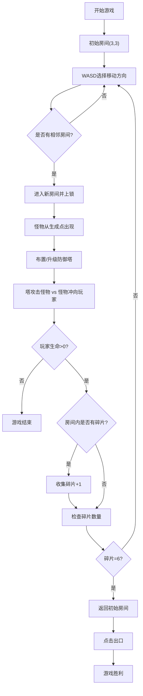

## 1. 产品概述
塔防房间逃脱游戏是一款融合塔防策略与房间逃脱解谜的浏览器客户端游戏。玩家在6x6房间网格中移动，通过布置防御塔阻止怪物入侵，收集钥匙碎片并找到出口逃离。
- 主要目的：提供策略性与紧张感并存的休闲游戏体验
- 目标用户：喜欢策略塔防类游戏的网页游戏玩家

## 2. 核心功能

### 2.1 功能模块
1. **游戏主循环系统**：状态机管理、60FPS帧率控制、输入处理、游戏更新、渲染调度
2. **房间地图系统**：6x6房间网格布局、房间切换检测、BFS路径查找、钥匙碎片分布
3. **防御塔系统**：5种塔类型（箭塔/魔法塔/冰冻塔/火炮塔/治疗塔）、3级升级系统、入场动画、升级特效
4. **怪物AI系统**：3种怪物类型（普通僵尸/快速幽灵/巨型石像）、BFS寻路、生成控制、伤害计算
5. **渲染系统**：Canvas 2D全量渲染、粒子特效、UI状态面板、动画效果
6. **玩家系统**：WASD移动、生命值管理、金币管理、碎片收集

### 2.2 功能详情
| 模块名称 | 功能点 | 功能描述 |
|-----------|---------|---------|
| 房间地图 | 网格布局 | 6x6房间网格，每个房间有墙壁、门、2-4个怪物生成点 |
| 房间地图 | 房间切换 | WASD移动进入相邻房间，自动上锁并触发怪物生成 |
| 房间地图 | 路径查找 | BFS算法计算怪物到玩家的最短路径 |
| 防御塔 | 放置 | 鼠标点击30x30空闲格子放置，5种塔不同价格 |
| 防御塔 | 升级 | 点击塔可升级至3级，升级花费递增，属性增强 |
| 防御塔 | 特效 | 放置时0.3秒缩放旋转入场，升级时塔身闪烁+文字弹出 |
| 怪物 | 类型 | 普通僵尸(慢速高血)、快速幽灵(快速低血)、巨型石像(中速中血可破墙) |
| 怪物 | 行为 | BFS寻路向玩家移动，触碰玩家扣血，死亡掉落金币 |
| 玩家 | 资源 | 初始500金币、20生命值、6个钥匙碎片待收集 |
| 玩家 | 胜负 | 生命归零游戏结束，集齐碎片回到初始房间点击出口胜利 |
| UI | 状态面板 | 右侧生命值(心形+渐变数字)、金币、房间编号、碎片进度条 |
| UI | 功能按钮 | 暂停(空格)、重新开始、退出 |
| UI | 响应式 | <800px时地图缩放、面板移至底部高60px |

## 3. 核心流程
玩家在初始房间开始，使用WASD在6x6房间网格中探索。每进入一个房间，该房间上锁，怪物从生成点涌向玩家，玩家需布置防御塔抵御。每个房间藏有钥匙碎片，收集6个后出口出现在初始房间，返回起点点击出口完成逃脱。

## 4. 用户界面设计
### 4.1 设计风格
- 主题：暗黑奇幻风格
- 主色调：深蓝(#1a1a2e)到深蓝黑(#16213e)径向渐变背景
- 强调色：深灰网格线(#2c3e50)、棕色门(#8B4513)、金色UI、红色生命警告
- 字体：白色带1px发光效果，状态面板背景半透明rgba(0,0,0,0.7)
- 视觉元素：圆形怪物(红/紫/深灰)、五边形塔带内部图标、心形生命图标

### 4.2 页面设计
| 区域 | 模块 | UI元素 |
|------|------|--------|
| 中央70% | 游戏主视图 | Canvas地图、网格线、房间门、防御塔、怪物、粒子特效、玩家 |
| 右侧(>800px) | 状态面板 | 生命值(心形+渐变数字)、金币(金色图标)、房间编号(淡入动画)、碎片进度条(5段圆角渐变) |
| 右上角 | 功能按钮 | 暂停按钮、重新开始按钮、退出按钮 |
| 底部(<800px) | 状态面板 | 缩减至60px高度，横向排列状态信息 |

### 4.3 响应式设计
- 桌面优先：视口宽度≥800px，地图居中控70%，状态面板在右侧
- 移动适配：视口宽度<800px，地图自动缩放适应宽度，状态面板移至底部高60px

### 4.4 动画与特效
- 塔入场：0.3秒缩放+旋转动画
- 塔升级：塔身闪烁+升级文字弹出
- 怪物死亡：10-15个白→怪物色渐变粒子，1秒消散
- 攻击命中：3-5个黄色火花粒子闪烁
- 房间编号：淡入动画
- 暂停：半透明遮罩+文字提示
