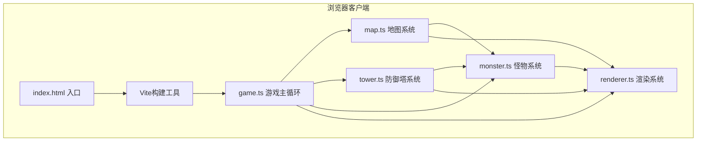

## 1. 架构设计



## 2. 技术说明
- 前端框架：纯TypeScript，无UI框架
- 渲染引擎：原生Canvas 2D API
- 构建工具：Vite 5.x
- 语言版本：TypeScript 5.x (严格模式，target ES2020)
- 后端：无，纯客户端游戏
- 数据存储：运行时内存，无持久化

## 3. 项目文件结构
| 文件 | 说明 |
|------|------|
| package.json | 依赖配置(typescript, vite, @types/node)，启动脚本npm run dev |
| index.html | 入口HTML，全屏Canvas居中 |
| tsconfig.json | TS配置，严格模式，target ES2020 |
| vite.config.js | Vite构建配置 |
| src/game.ts | 游戏主循环：状态机、帧率控制(rAF)、输入处理、调度所有子系统 |
| src/map.ts | 6x6房间网格、房间数据、墙壁门生成点、BFS路径查找、房间切换检测 |
| src/tower.ts | 5种塔类型定义、攻击逻辑、升级系统、入场/升级动画状态 |
| src/monster.ts | 3种怪物类型、BFS寻路AI、移动、伤害、掉落金币 |
| src/renderer.ts | Canvas全量渲染：地图/塔/怪物/粒子/UI，性能控制 |

## 4. 数据模型

### 4.1 房间数据模型
```typescript
interface Room {
  x: number;           // 网格X坐标 0-5
  y: number;           // 网格Y坐标 0-5
  doors: {             // 四个方向是否有门
    top: boolean;
    right: boolean;
    bottom: boolean;
    left: boolean;
  };
  spawnPoints: Point[]; // 怪物生成点 2-4个
  isLocked: boolean;    // 是否已进入并上锁
  hasKeyFragment: boolean; // 是否有钥匙碎片
  keyPosition: Point;    // 碎片位置
  fragmentCollected: boolean;
  walls: boolean[][];    // 墙壁格子
}

interface Point { x: number; y: number; }
```

### 4.2 防御塔数据模型
```typescript
type TowerType = 'arrow' | 'magic' | 'ice' | 'cannon' | 'heal';

interface TowerStats {
  damage: number;
  range: number;
  attackSpeed: number;
  specialEffect?: string;
}

interface Tower {
  id: number;
  type: TowerType;
  gridX: number;
  gridY: number;
  level: 1 | 2 | 3;
  stats: TowerStats;
  placementAnim: number; // 0-1 入场动画进度
  upgradeFlash: number;  // 升级闪烁计时
  lastAttackTime: number;
  targetId?: number;
}
```

### 4.3 怪物数据模型
```typescript
type MonsterType = 'zombie' | 'ghost' | 'golem';

interface Monster {
  id: number;
  type: MonsterType;
  x: number;          // 像素坐标
  y: number;
  hp: number;
  maxHp: number;
  speed: number;      // 格/秒
  damage: number;     // 触碰伤害
  goldDrop: number;
  path: Point[];      // BFS路径点
  pathIndex: number;
  slowTimer: number;  // 冰冻减速
}
```

### 4.4 玩家与游戏状态
```typescript
interface Player {
  roomX: number;
  roomY: number;
  hp: number;
  maxHp: number;
  gold: number;
  fragments: number;
}

interface GameState {
  phase: 'title' | 'playing' | 'paused' | 'gameover' | 'victory';
  currentRoom: Room;
  towers: Tower[];
  monsters: Monster[];
  particles: Particle[];
  player: Player;
  selectedTowerType: TowerType | null;
  showExit: boolean;
}
```

### 4.5 粒子系统
```typescript
interface Particle {
  x: number;
  y: number;
  vx: number;
  vy: number;
  life: number;     // 剩余生命0-1
  maxLife: number;
  colorStart: string;
  colorEnd: string;
  size: number;
}
```

## 5. 性能约束
- 主循环：requestAnimationFrame锁定60FPS，单帧<16ms
- 怪物上限：每房间30个，超上限暂停生成
- 粒子上限：200个，超量丢弃最早粒子
- 响应式：<800px时地图等比缩放
