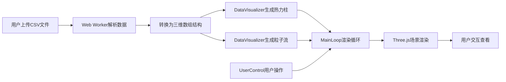

## 1. 产品概述

OceanFlow是一款面向海洋科学研究的三维可视化工具，通过动态热力柱和粒子流形式直观展示不同海域深度下的洋流温度、盐度和流速变化。解决传统二维图表无法同时展现三维空间连续变化趋势的问题。

- 核心价值：将抽象的海洋水文数据转化为沉浸式三维可视化场景，帮助研究人员快速洞察洋流变化规律
- 目标用户：海洋科学研究人员、数据分析人员、教育工作者

## 2. 核心功能

### 2.1 功能模块

1. **数据导入模块**：支持CSV格式的海洋浮标数据上传（拖拽或点击），包含经纬度、深度、温度、盐度、流速维度
2. **三维热力图模块**：六个标准深度层（0m、200m、500m、1000m、2000m、4000m）的10x10热力柱网格
3. **粒子流模块**：深度层之间的半透明粒子流，展示盐度分布和洋流方向
4. **交互控制模块**：深度层选择、流速范围调节、温度色阶切换、自动旋转开关
5. **数据提示模块**：点击热力柱显示详细数据信息
6. **时间轴模块**：多时间点数据切换（可选）

### 2.2 页面详情

| 页面名称 | 模块名称 | 功能描述 |
|-----------|-------------|---------------------|
| 主页面 | 文件上传区 | 左上角拖拽/点击上传CSV，虚线边框高亮动画 |
| 主页面 | 3D场景区域 | 全屏居中显示三维热力柱和粒子流 |
| 主页面 | 右侧控制浮窗 | 深度层开关、流速滑块、色阶切换、自动旋转 |
| 主页面 | 数据提示框 | 点击柱体后显示温度、盐度、流速详情 |
| 主页面 | 时间轴 | 底部水平时间轴，多时间点数据切换 |
| 主页面 | 加载动画 | 旋转的深海蓝粒子环 |

## 3. 核心流程

用户通过上传CSV海洋浮标数据，系统在Web Worker中解析数据并转换为三维数组，然后在Three.js场景中渲染六个深度层的热力柱和粒子流。用户可通过右侧控制面板调整可视化参数，点击热力柱查看详细数据。

## 4. 用户界面设计

### 4.1 设计风格

- **主色调**：深海蓝渐变背景（#0a0a23到#000000）
- **强调色**：青色#00bcd4、浅蓝#87CEEB、红橙#FF4500、深紫#8B008B
- **字体**：Inter或系统无衬线字体，白色#ffffff和浅蓝色#87CEEB
- **风格定位**：科技感、沉浸式、深邃海洋氛围

### 4.2 页面设计概述

| 页面名称 | 模块名称 | UI元素 |
|-----------|-------------|-------------|
| 主页面 | 文件上传区 | 300x180px，虚线边框#00bcd4，圆角16px，上传图标+提示文字，状态波纹动画 |
| 主页面 | 3D场景 | 全屏居中，最小视口1280x720，深蓝到黑渐变背景 |
| 主页面 | 控制浮窗 | 宽280px，半透明磨砂玻璃#1a1a2ecc，圆角12px，顶部边距100px |
| 主页面 | 数据提示框 | 圆角+阴影，跟随相机面向屏幕，显示精确数值 |
| 主页面 | 时间轴 | 底部水平滑块，0.6s缓动过渡 |
| 主页面 | 加载动画 | 旋转深海蓝粒子环 |

### 4.3 响应式设计

桌面端优先设计，最小视口1280x720。控制浮窗固定右侧，上传区固定左上角，时间轴固定底部。

### 4.4 3D场景设计

- **环境**：深蓝到黑色渐变背景，营造深海氛围
- **光照**：环境光+方向光，突出柱体立体感
- **相机**：透视相机，支持OrbitControls轨道控制
- **热力柱**：圆角柱体，高度映射温度，颜色从深蓝到红橙渐变
- **粒子流**：2000个半透明粒子，盐度映射颜色，沿洋流方向漂移
- **性能优化**：BufferGeometry合并减少draw call，高负载时禁用鼠标悬停检测
- **动画**：粒子漂移、柱体颜色过渡、相机自动旋转
