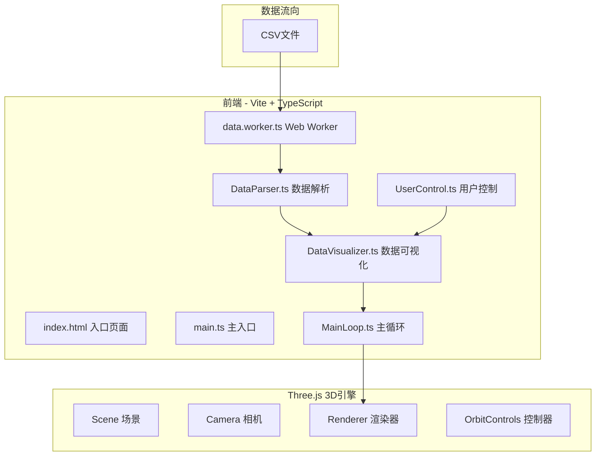

## 1. 架构设计



## 2. 技术描述

- **前端框架**：原生 TypeScript + Three.js
- **构建工具**：Vite 5.x
- **3D引擎**：Three.js 最新版
- **类型支持**：@types/three
- **并发处理**：Web Worker（数据解析与颜色映射）
- **样式方案**：原生CSS + CSS变量

## 3. 文件结构与调用关系

```
├── package.json           # 项目依赖与脚本
├── index.html             # 入口HTML页面
├── tsconfig.json          # TypeScript配置
├── vite.config.js         # Vite构建配置
└── src/
    ├── main.ts            # 主入口：初始化场景/相机/控制器
    ├── workers/
    │   └── data.worker.ts # Web Worker：CSV解析+颜色映射
    └── modules/
        ├── DataParser.ts      # 数据解析模块（Worker包装器）
        ├── DataVisualizer.ts  # 数据可视化模块（热力柱+粒子流）
        ├── UserControl.ts     # 用户控制面板模块
        └── MainLoop.ts        # requestAnimationFrame主循环
```

### 调用关系与数据流向

1. **main.ts** → 初始化 Three.js 场景、相机、渲染器、控制器
2. **main.ts** → 监听 UserControl 事件 → 传递给 DataVisualizer
3. **UserControl.ts** → 用户操作 → 派发自定义事件 → DataVisualizer 接收更新
4. **DataParser.ts** → 创建 Web Worker → 解析 CSV → 返回三维数组 → DataVisualizer
5. **DataVisualizer.ts** → 生成/更新热力柱和粒子流 → 通知 MainLoop 重渲染
6. **MainLoop.ts** → requestAnimationFrame 循环 → 更新粒子动画、相机 → 调用渲染器

## 4. 数据模型

### 4.1 海洋数据点结构

```typescript
interface OceanDataPoint {
  longitude: number;   // 经度
  latitude: number;    // 纬度
  depth: number;       // 深度 (米)
  temperature: number; // 温度 (°C)
  salinity: number;    // 盐度 (PSU)
  velocity: number;    // 流速 (单位/秒)
  velocityDir: number; // 流速方向 (弧度)
}
```

### 4.2 三维网格数据结构

```typescript
interface GridCell {
  temperature: number;
  salinity: number;
  velocity: number;
  velocityDir: number;
}

interface DepthLayer {
  depth: number;       // 深度值
  grid: GridCell[][];  // 10x10 网格
}

interface OceanDataset {
  layers: DepthLayer[];      // 6个深度层
  timePoints?: string[];     // 时间点列表（可选）
  currentTimeIndex?: number; // 当前时间索引
}
```

### 4.3 配置参数

```typescript
interface VisualizerConfig {
  visibleLayers: boolean[];    // 各深度层可见性
  velocityScale: number;       // 流速缩放比例 (0.5-3)
  colorScheme: 'thermal' | 'cool' | 'monochrome'; // 色阶方案
  autoRotate: boolean;         // 自动旋转
}
```

## 5. 性能优化策略

1. **BufferGeometry 合并**：同深度层柱体使用合并几何体，减少 draw call
2. **InstancedMesh**：粒子使用实例化网格，批量渲染
3. **Web Worker**：数据解析和颜色映射在 Worker 中执行，不阻塞主线程
4. **帧率自适应**：粒子数2000+柱体全显示时，禁用鼠标悬停检测
5. **动画优化**：所有动画使用 requestAnimationFrame，使用 lerp 平滑过渡
6. **材质复用**：相同属性的物体共享材质，降低内存占用

## 6. 标准深度层配置

| 索引 | 深度 | Y轴位置 |
|------|------|---------|
| 0 | 0m | 200 |
| 1 | 200m | 150 |
| 2 | 500m | 100 |
| 3 | 1000m | 50 |
| 4 | 2000m | 0 |
| 5 | 4000m | -50 |

## 7. 颜色映射

### 温度色阶

- **热力方案**：深蓝 #00008B → 青色 → 黄色 → 红橙 #FF4500
- **冷色方案**：深紫 → 蓝色 → 青色
- **黑白方案**：深灰 → 白色

### 盐度色阶（粒子）

- 浅蓝 #87CEEB → 深紫 #8B008B
