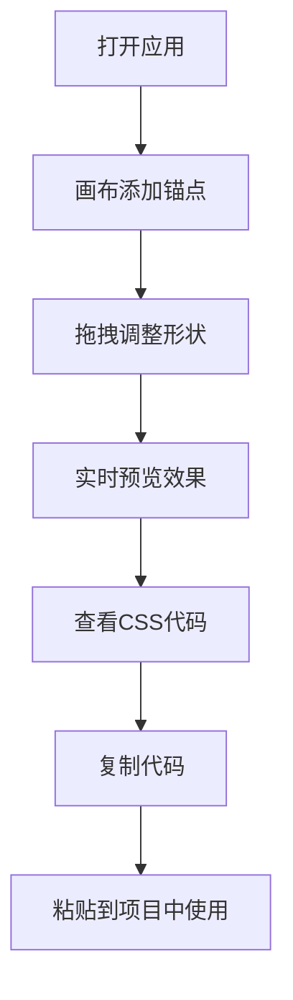

## 1. 产品概述

ClipCraft是一款创意CSS裁剪路径生成器，帮助前端开发者通过可视化交互方式快速生成CSS clip-path属性代码。用户通过在画布上点击添加锚点、拖拽调整形状，即可实时预览裁剪效果并导出可用的CSS代码。

- **目标用户**：前端开发者、UI设计师、视觉创意工作者
- **核心价值**：将繁琐的多边形坐标编写工作转化为直观的可视化操作，大幅提升设计效率

## 2. 核心功能

### 2.1 用户角色

| 角色 | 注册方式 | 核心权限 |
|------|----------|----------|
| 普通用户 | 无需注册 | 使用所有画布编辑功能、预览效果、复制导出代码 |

### 2.2 功能模块

1. **画布编辑模块**：可交互的2D坐标画布，支持锚点添加、拖拽、编辑、删除
2. **预览模块**：实时预览clip-path裁剪效果，展示生成的CSS代码
3. **工具栏模块**：网格显示开关、画布缩放、清除锚点等辅助功能

### 2.3 页面详情

| 页面名称 | 模块名称 | 功能描述 |
|----------|----------|----------|
| 主页面 | 画布编辑区 | 800x600画布，单击添加锚点，拖拽调整，双击编辑坐标，多边形实时重绘 |
| 主页面 | 预览区 | 示例图片应用clip-path效果，实时更新，展示CSS代码块 |
| 主页面 | 工具栏 | 网格显示开关、响应式缩放开关、清除锚点按钮、复制代码按钮 |

## 3. 核心流程

用户打开应用后，在左侧画布上点击添加锚点，通过拖拽调整多边形形状，右侧实时预览裁剪效果和CSS代码。满意后点击复制代码按钮，将生成的clip-path代码复制到剪贴板使用。

## 4. 用户界面设计

### 4.1 设计风格

- **主色调**：深紫色 #6366f1（强调色）
- **背景色**：#1e1e2e（主背景）、#2a2a3e（卡片背景）
- **文字色**：#e0e0e0（主文字）、#abb2bf（代码文字）
- **设计风格**：深色主题，现代简约，科技感
- **字体**：Inter，Logo使用斜体400字重24px字号
- **按钮风格**：圆角设计，带有hover过渡动画
- **动效**：呼吸动画、弹性缓动、淡入淡出、滑入滑出等微交互

### 4.2 页面设计概述

| 页面名称 | 模块名称 | UI元素 |
|----------|----------|--------|
| 主页面 | 顶部导航 | Logo（ClipCraft斜体）、两个开关按钮（网格显示/响应式缩放） |
| 主页面 | 左侧画布 | 浅灰背景#f0f0f0、网格线#ddd间距5px、空心圆点锚点（半径6px）、半透明填充多边形 |
| 主页面 | 右侧预览 | 示例图片（400x300，圆角12px，淡入效果）、代码块（背景#282c34）、复制按钮 |
| 主页面 | 底部操作 | 清除所有锚点按钮（带确认弹窗） |

### 4.3 响应式

- **桌面优先设计**，支持响应式适配
- 画布等比例缩放，最小宽度400px
- 开关按钮带0.3s动画过渡
- 弹窗带淡入缩放0.3s动画

### 4.4 交互动效

- 多边形填充呼吸动画：透明度0.3-0.4，周期2秒
- 锚点拖拽弹性跟随：0.1s缓动
- 图片淡入效果：0.5s
- Toast提示：从底部滑入，手风琴折叠效果
- 复制按钮状态切换：持续2秒"已复制"状态
