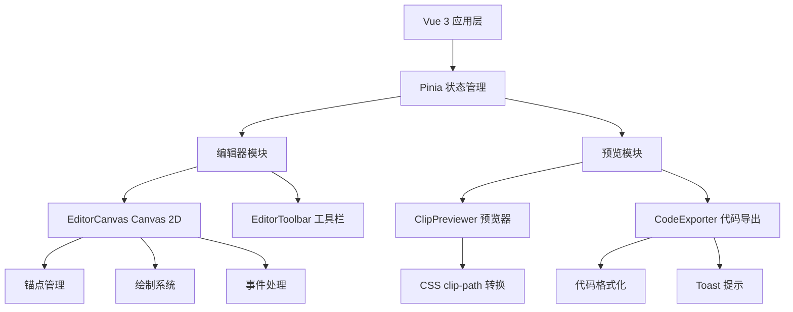

## 1. 架构设计



## 2. 技术描述

- **前端框架**：Vue 3（组合式API）+ TypeScript
- **状态管理**：Pinia
- **构建工具**：Vite
- **画布渲染**：Canvas 2D API
- **开发端口**：5173

## 3. 项目结构

```
src/
├── editor/
│   ├── EditorCanvas.ts       # Canvas画布编辑模块
│   └── EditorToolbar.ts      # 编辑工具栏模块
├── viewer/
│   ├── ClipPreviewer.ts      # 预览模块
│   └── CodeExporter.ts       # 代码导出模块
├── store/
│   └── useEditorStore.ts     # Pinia状态管理
├── components/
│   └── App.vue               # 根组件
└── main.ts                   # 应用入口
```

## 4. 模块职责

### 4.1 EditorCanvas（画布编辑模块）
- 管理锚点的增删改查
- 绘制网格线、锚点、多边形填充
- 处理鼠标事件（点击、拖拽、双击）
- 实现呼吸动画和弹性缓动
- 性能优化：60FPS帧率，重绘时间<5ms

### 4.2 EditorToolbar（工具栏模块）
- 网格显示开关控制
- 响应式缩放开关控制
- 清除锚点功能（带确认弹窗）
- 通过Pinia store与画布通信

### 4.3 ClipPreviewer（预览模块）
- 将多边形坐标转换为CSS clip-path百分比
- 应用到示例图片
- 实时响应锚点变化

### 4.4 CodeExporter（代码导出模块）
- 生成标准CSS clip-path代码
- 代码语法高亮
- 复制到剪贴板功能
- Toast提示展示

### 4.5 useEditorStore（状态管理）
- 锚点坐标数组
- 网格显示状态
- 画布缩放比例
- 在编辑器和预览模块间同步数据

## 5. 数据模型

### 5.1 锚点数据结构

```typescript
interface AnchorPoint {
  id: string;
  x: number;
  y: number;
}
```

### 5.2 Store状态

```typescript
interface EditorState {
  anchors: AnchorPoint[];
  showGrid: boolean;
  scale: number;
  canvasWidth: number;
  canvasHeight: number;
}
```

## 6. 性能要求

- 画布交互帧率：60FPS
- 锚点拖拽时多边形重绘时间：≤5ms
- 使用requestAnimationFrame进行动画循环
- 最小化Canvas重绘区域
