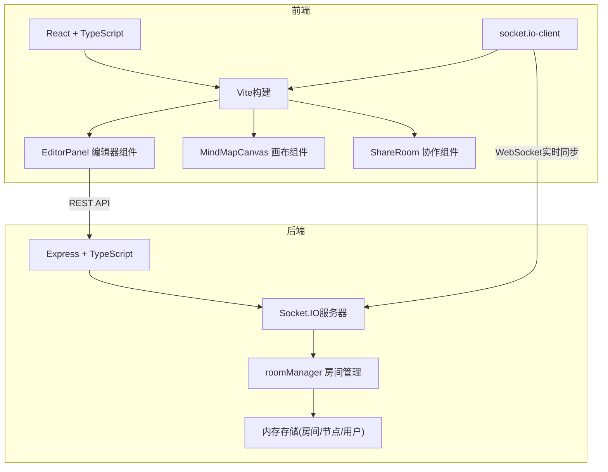

## 1. 架构设计



## 2. 技术说明

- 前端：React@18 + TypeScript + Vite + socket.io-client + uuid
- 后端：Express@4 + Socket.IO + TypeScript + ts-node + uuid
- 构建工具：Vite（前端），ts-node（后端）
- 数据存储：内存存储（roomManager管理）
- 通信方式：RESTful API + WebSocket（socket.io）
- 渲染技术：Canvas API（思维导图渲染）

## 3. 目录结构

```
.
├── package.json
├── index.html
├── tsconfig.json
├── vite.config.js
└── src/
    ├── client/
    │   ├── App.tsx              # 主应用组件
    │   ├── EditorPanel.tsx      # 文本编辑器面板
    │   ├── MindMapCanvas.tsx    # 思维导图画布
    │   └── ShareRoom.tsx        # 分享/房间组件
    └── server/
        ├── index.ts             # Express + Socket.IO入口
        └── roomManager.ts       # 房间管理模块
```

## 4. API定义

### REST API

| 方法 | 路径 | 描述 |
|-----|------|------|
| POST | /api/rooms | 创建房间，返回房间码 |
| GET | /api/rooms/:code | 获取房间节点数据 |

### WebSocket事件

| 事件名 | 方向 | 数据 | 描述 |
|-------|------|------|------|
| join-room | 客户端→服务端 | { roomCode, userId, userName } | 加入房间 |
| room-joined | 服务端→客户端 | { nodes, users } | 加入成功，返回初始数据 |
| user-joined | 服务端→客户端 | { user } | 新用户加入通知 |
| user-left | 服务端→客户端 | { userId } | 用户离开通知 |
| nodes-update | 客户端→服务端 | { nodes } | 节点数据更新 |
| nodes-updated | 服务端→客户端 | { nodes, fromUserId } | 节点数据广播 |
| node-drag | 客户端→服务端 | { nodeId, x, y } | 节点拖拽 |
| node-dragged | 服务端→客户端 | { nodeId, x, y, fromUserId } | 拖拽广播 |
| node-edit | 客户端→服务端 | { nodeId, text, note, icon } | 节点编辑 |
| node-edited | 服务端→客户端 | { nodeId, text, note, icon, fromUserId } | 编辑广播 |

## 5. 数据模型

### Node（节点）

```typescript
interface MindMapNode {
  id: string;
  text: string;
  level: number;      // 层级，0为根节点
  x: number;          // x坐标
  y: number;          // y坐标
  parentId: string | null;
  children: string[]; // 子节点id列表
  note?: string;      // 备注
  icon?: string;      // 图标类型
}
```

### User（用户）

```typescript
interface User {
  id: string;
  name: string;
  socketId: string;
  roomCode: string;
}
```

### Room（房间）

```typescript
interface Room {
  code: string;
  nodes: Record<string, MindMapNode>;
  users: Record<string, User>;
  createdAt: number;
}
```

## 6. 核心算法

### Markdown解析
- 解析标题层级（# ## ###）转换为节点层级
- 解析无序列表（-）和有序列表（1. 2.）转换为子节点
- 缩进表示层级关系

### 树状布局算法
- 根节点居中
- 子节点水平分布，垂直间距均匀
- 支持手动拖拽调整位置

### Canvas渲染
- 使用贝塞尔曲线绘制连接线
- 节点渐变背景根据层级计算
- 动画过渡使用requestAnimationFrame
