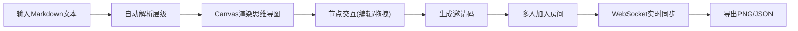

## 1. 产品概述

协作式思维导图应用，将用户的文本笔记自动转换为可交互的思维导图，支持多人实时协作编辑。解决团队头脑风暴和项目规划中文字记录缺乏结构化关联、沟通成本高的问题。

- 目标用户：团队成员、项目经理、产品经理
- 核心价值：将Markdown文本自动转化为可视化思维导图，支持多人实时协作

## 2. 核心功能

### 2.1 功能模块

1. **文本编辑器面板**：Markdown格式输入，实时解析标题与列表层级
2. **思维导图画布**：Canvas渲染树状图，支持拖拽、缩放、动画过渡
3. **节点编辑**：点击节点弹出编辑气泡，支持文字修改、备注、图标选择
4. **协作房间**：生成邀请码，多人实时同步，在线用户列表
5. **导出功能**：支持PNG（1920x1080）和JSON格式导出

### 2.3 页面详情

| 页面名称 | 模块名称 | 功能描述 |
|---------|---------|---------|
| 主应用 | 编辑器面板 | Markdown文本输入，自动解析标题和列表层级 |
| 主应用 | 思维导图画布 | Canvas实时渲染树状图，贝塞尔曲线连接 |
| 主应用 | 节点编辑气泡 | 修改文字、添加备注、选择图标 |
| 主应用 | 分享/加入房间 | 6位邀请码、在线用户列表、实时同步 |
| 主应用 | 导出功能 | PNG和JSON格式导出 |

## 3. 核心流程

用户在左侧编辑器输入Markdown文本 → 系统自动解析标题与列表层级 → 右侧画布实时生成树状思维导图 → 点击节点可编辑文字/备注/图标 → 点击分享生成邀请码 → 其他用户输入邀请码加入 → 所有操作通过WebSocket实时同步 → 可导出PNG或JSON

## 4. 用户界面设计

### 4.1 设计风格

- 主色调：紫蓝色系（#667eea主色，#764ba2渐变色）
- 背景色：#f9f9f9（编辑器）、#e0e7ff（浅色背景）
- 文字色：#1e1b4b（深色文字）、白色（节点文字）
- 按钮样式：圆角8px，渐变背景（#667eea到#764ba2），悬浮亮度提升10%，点击缩小0.95倍
- 字体：等宽字体（编辑器）
- 布局：左窄右宽两栏布局（40% / 60%），左侧可折叠
- 动画：0.3s缓动过渡，节点拖拽放大1.1倍带阴影

### 4.2 页面设计概览

| 页面名称 | 模块名称 | UI元素 |
|---------|---------|-------|
| 主应用 | 编辑器面板 | 圆角8px，背景#f9f9f9，等宽字体 |
| 主应用 | 画布面板 | Canvas绘制，贝塞尔曲线连接线宽2px颜色#aaa |
| 主应用 | 节点 | 渐变背景，白色文字，层级渐变 |
| 主应用 | 编辑气泡 | 圆角12px，阴影8px，淡入缩放0.2s |
| 主应用 | 在线用户 | 右上角头像圆圈，绿色在线圆点 |
| 主应用 | 导出按钮 | 侧边栏底部，波纹扩散反馈0.3s |

### 4.3 响应式设计

- 桌面端（≥768px）：左右两栏布局，40%/60%
- 移动端（<768px）：左侧面板变为顶部可折叠区域，画布全宽
- 触摸优化：增大点击区域，支持手势缩放

### 4.4 性能要求

- 200+节点时拖拽/缩放保持30fps以上
- 文本解析到渲染更新延迟≤100ms
- WebSocket同步延迟<200ms
- 操作冲突采用最后写入者获胜策略
