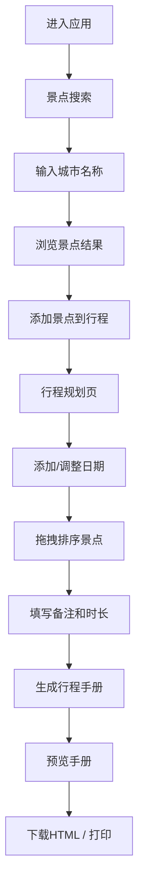

## 1. 产品概述
在线自助旅行规划器应用，用户可自定义行程、搜索景点并生成统一行程手册。
- 面向自由行用户，提供行程规划、景点搜索、手册生成一站式服务
- 降低旅行规划复杂度，提升用户规划效率与体验

## 2. 核心功能

### 2.1 用户角色
| 角色 | 注册方式 | 核心权限 |
|------|----------|----------|
| 普通用户 | 无需注册 | 行程规划、景点搜索、手册生成与下载 |

### 2.2 功能模块
1. **行程规划页面 (PlannerPage)**: 按日期添加景点、备注、游玩时长，拖拽排序，折叠展示
2. **景点搜索页面 (SearchPage)**: 城市景点搜索、标签/评分过滤、响应式卡片网格
3. **行程手册生成**: PDF风格Web预览、HTML下载、打印功能
4. **数据持久化**: 后端SQLite存储、RESTful API交互

### 2.3 页面详情
| 页面名称 | 模块名称 | 功能描述 |
|---------|----------|----------|
| 行程规划页 | 日期时间线 | 纵向时间线布局，日期圆点标记与连线，折叠/展开 |
| 行程规划页 | 景点卡片 | 景点名称、备注、游玩时长，淡入上浮动画，拖拽排序 |
| 行程规划页 | 操作栏 | 总天数统计、添加日期按钮、清空计划按钮 |
| 景点搜索页 | 搜索栏 | 城市输入框，300ms防抖搜索 |
| 景点搜索页 | 过滤器 | 评分过滤、标签过滤（地标/美食/自然） |
| 景点搜索页 | 结果网格 | 响应式卡片网格，悬浮放大效果，彩色标签药丸 |
| 手册预览页 | 手册内容 | 每日行程标题、景点列表、时间表 |
| 全局 | 未保存提示 | 页面标题与标签页显示未保存更改标记 |

## 3. 核心流程
用户进入应用 → 在搜索页搜索城市景点 → 将感兴趣景点加入行程规划 → 在规划页调整日期顺序和景点顺序 → 生成行程手册 → 下载HTML或打印

## 4. 用户界面设计

### 4.1 设计风格
- **主色调**: 雾灰蓝 (#6B8FA3)
- **背景色**: 大面积留白 (白色/浅灰)
- **卡片风格**: 圆角阴影卡片 (border-radius: 12px, box-shadow: 0 2px 8px rgba(0,0,0,0.1))
- **设计风格**: 北欧极简风格，简洁干净
- **字体**: 现代无衬线字体，清晰易读

### 4.2 页面设计概述
| 页面名称 | 模块名称 | UI 元素 |
|---------|----------|---------|
| 行程规划页 | 时间线布局 | 左侧日期圆点 + 连线，右侧景点卡片列表 |
| 行程规划页 | 景点卡片 | 淡入上浮动画，拖拽时平滑跟随+占位符动画 |
| 景点搜索页 | 卡片网格 | minmax(280px, 1fr)，悬浮放大1.02倍加深阴影 |
| 景点搜索页 | 标签药丸 | 彩色标签样式，不同标签不同颜色 |
| 全局 | 导航栏 | 顶部导航，行程规划/景点搜索切换 |
| 全局 | 响应式 | 手机端单列，桌面端三列网格 |

### 4.3 响应式
- 桌面端 (≥1024px): 三列网格布局
- 平板端 (768px-1023px): 两列网格布局
- 手机端 (<768px): 单列布局，优化触控交互

### 4.4 动效设计
- 景点卡片入场: translateY(20px → 0), opacity(0 → 1) 淡入上浮
- 卡片悬浮: scale(1.02) + 加深阴影
- 拖拽排序: 平滑跟随 + 占位符动画
- 折叠/展开: 平滑高度过渡
