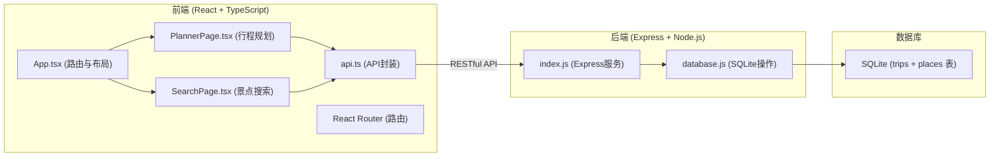
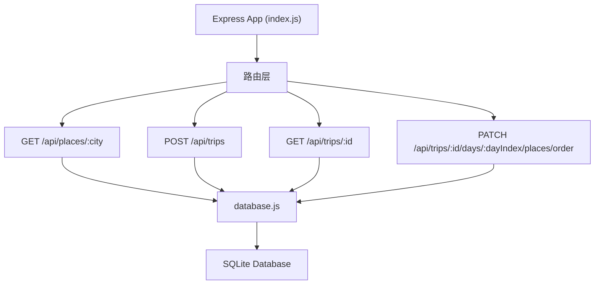
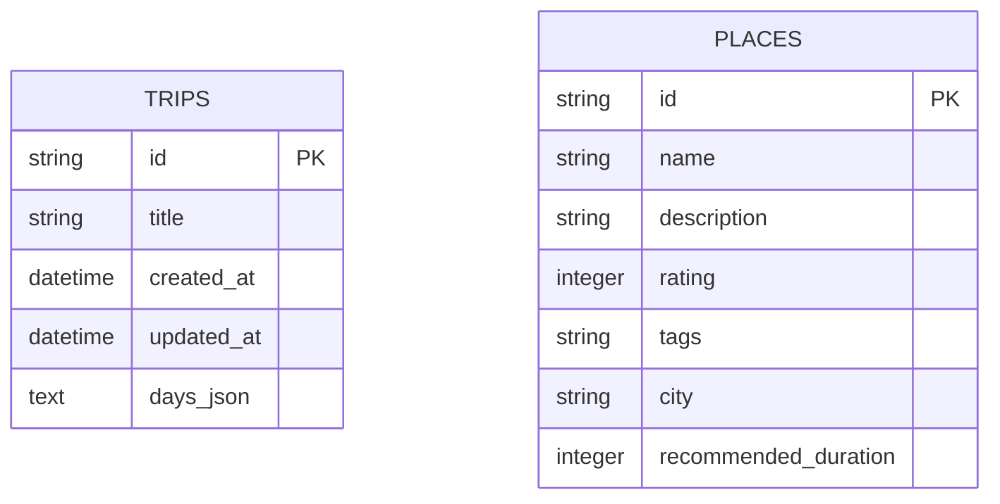

## 1. 架构设计



## 2. 技术描述
- **前端**: React 18 + TypeScript + Vite + React Router DOM
- **构建工具**: Vite (端口 5173)
- **后端**: Express 4 + Node.js (端口 3001)
- **数据库**: SQLite (sqlite3 包)
- **HTTP客户端**: 原生 fetch (封装在 api.ts) + axios (拖拽排序 PATCH 请求)
- **样式方案**: 纯 CSS + CSS 动画
- **并发启动**: concurrently

## 3. 路由定义

| 路由路径 | 页面组件 | 用途 |
|---------|----------|------|
| / | PlannerPage | 行程规划首页 |
| /planner | PlannerPage | 行程规划页 |
| /search | SearchPage | 景点搜索页 |
| /brochure/:id | BrochurePage | 行程手册预览页 |

## 4. API 定义

### 4.1 获取城市景点列表
- **GET** `/api/places/:city`
- **响应**:
```typescript
interface Place {
  id: string;
  name: string;
  description: string;
  rating: number; // 1-5
  tags: string[]; // 如 ["地标", "美食", "自然"]
  city: string;
  recommendedDuration: number; // 分钟
}
```

### 4.2 保存行程
- **POST** `/api/trips`
- **请求体**:
```typescript
interface TripCreateRequest {
  title: string;
  days: TripDay[];
}

interface TripDay {
  date: string;
  places: TripPlace[];
}

interface TripPlace {
  placeId: string;
  name: string;
  notes: string;
  duration: number; // 分钟
  order: number;
}
```
- **响应**: `{ id: string }`

### 4.3 获取行程详情
- **GET** `/api/trips/:id`
- **响应**:
```typescript
interface Trip {
  id: string;
  title: string;
  createdAt: string;
  updatedAt: string;
  days: TripDay[];
}
```

### 4.4 更新景点顺序
- **PATCH** `/api/trips/:id/days/:dayIndex/places/order`
- **请求体**: `{ placeIds: string[] }`
- **响应**: `{ success: boolean }`

## 5. 服务器架构图



## 6. 数据模型

### 6.1 数据模型定义



### 6.2 数据定义语言

```sql
-- 行程表
CREATE TABLE IF NOT EXISTS trips (
  id TEXT PRIMARY KEY,
  title TEXT NOT NULL,
  created_at DATETIME DEFAULT CURRENT_TIMESTAMP,
  updated_at DATETIME DEFAULT CURRENT_TIMESTAMP,
  days_json TEXT NOT NULL
);

-- 景点表（模拟数据）
CREATE TABLE IF NOT EXISTS places (
  id TEXT PRIMARY KEY,
  name TEXT NOT NULL,
  description TEXT,
  rating INTEGER,
  tags TEXT,
  city TEXT NOT NULL,
  recommended_duration INTEGER
);

-- 索引
CREATE INDEX IF NOT EXISTS idx_places_city ON places(city);
```
