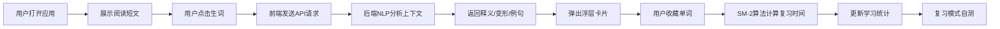

## 1. 产品概述

沉浸式上下文单词学习Web应用，为英语学习者提供情景化的单词记忆体验。用户在阅读英文短文时可实时查询生词，获取上下文相关释义、词形变化、双语例句及个性化记忆曲线推荐。

- 核心价值：替代传统单词表背诵方式，通过真实语境加深单词记忆
- 目标用户：英语学习者（初中至大学水平）
- 产品定位：轻量级、沉浸式、个性化的单词学习工具

## 2. 核心功能

### 2.1 用户角色
| 角色 | 注册方式 | 核心权限 |
|------|----------|----------|
| 普通用户 | 无需注册（本地存储） | 阅读文章、查询单词、收藏复习、查看学习统计 |

### 2.2 功能模块
1. **阅读面板**：预设英文短文展示、段落展开折叠、文本选择
2. **点击查词**：单词双击/点击触发、浮层卡片展示、上下文释义
3. **例句关联**：真实语料例句展示、目标单词高亮
4. **收藏与复习**：单词收藏、SM-2间隔重复算法、复习时间推荐
5. **学习统计**：今日学习数、累计收藏数、待复习数、复习模式

### 2.3 页面详情
| 页面名称 | 模块名称 | 功能描述 |
|----------|----------|----------|
| 主页面 | 阅读区域 | 展示300词左右英文短文，每段可展开折叠，文本可选中 |
| 主页面 | 释义浮层卡片 | 点击单词后弹出，显示原型、音标、词性、上下文释义、词形变化 |
| 主页面 | 例句展示区 | 卡片下方展示2个例句（简单/复杂），目标词高亮 |
| 主页面 | 收藏按钮 | 星形图标，点击加入今日学习列表，灰变金动画 |
| 个人面板 | 学习统计 | 今日学习数、累计收藏数、待复习数展示 |
| 个人面板 | 复习模式 | 隐藏释义卡片，自测后点击翻转显示答案 |

## 3. 核心流程

用户打开应用 → 阅读预设英文短文 → 遇到生词双击/点击 → 系统调用NLP分析上下文 → 弹出释义卡片展示详情 → 用户可收藏单词 → 后端基于SM-2算法记录并推荐复习时间 → 用户查看学习统计 → 进入复习模式自测

## 4. 用户界面设计

### 4.1 设计风格
- **主色调**：护眼米白色背景 #F5F0E8
- **强调色**：收藏星形 #F5A623 → #F7C948
- **字体**：正文使用 Merriweather Serif 字体，偏粗
- **布局**：阅读区域宽度 ≤ 720px，居中，行高 1.8 倍
- **卡片样式**：毛玻璃效果 backdrop-filter: blur(8px)，半透明白背景，圆角 16px
- **动画**：
  - 卡片滑入：向上滑入 300ms cubic-bezier 缓动
  - 收藏按钮：scale 1→1.15→1 弹跳缩放
  - 复习卡片：3D transform rotateY(180deg) 翻转动画

### 4.2 页面设计概览
| 页面名称 | 模块名称 | UI元素 |
|----------|----------|--------|
| 主页面 | 阅读区域 | 米白背景、Merriweather字体、720px宽度、段落可折叠 |
| 主页面 | 释义卡片 | 毛玻璃效果、圆角16px、向上滑入动画、300ms缓动 |
| 主页面 | 例句区 | 目标词高亮、简单/复杂双例句、双语对照 |
| 主页面 | 收藏按钮 | 星形图标、灰变金过渡、弹跳缩放动画 |
| 个人面板 | 统计卡片 | 三栏数据展示、醒目数字、淡入动画 |
| 个人面板 | 复习卡片 | 3D翻转效果、正面问题背面答案、点击交互 |

### 4.3 响应式设计
- 桌面端：阅读区域居中720px，卡片从单词位置弹出
- 移动端（≤768px）：单列布局，卡片宽度占满屏幕80%，弹层位置自动调整避免遮挡
- 触摸优化：点击区域 ≥ 44x44px，双击间隔调整适配移动端

## 5. 性能约束
- 单词查询响应时间 ≤ 200ms（含NLP处理）
- 滚动与动画帧率 ≥ 55fps
- 首屏加载时间 ≤ 2s
