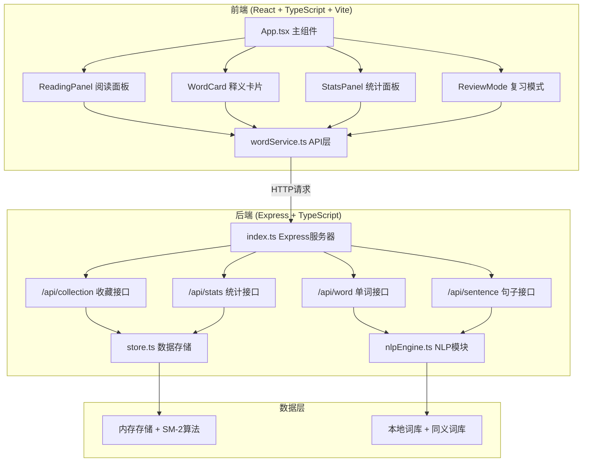
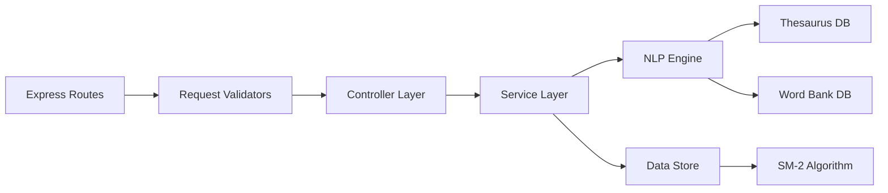

## 1. 架构设计



## 2. 技术描述

- **前端**：React 18 + TypeScript + Vite 5
- **样式**：CSS Modules / Styled Components，毛玻璃效果，CSS3动画
- **后端**：Express 4 + TypeScript
- **数据库**：内存数据存储（开发阶段），localStorage 持久化用户数据
- **NLP**：本地词库 + 上下文分析引擎，无需外部API
- **构建工具**：Vite，代理API请求至后端3001端口

## 3. 项目文件结构

```
auto2/
├── package.json              # 根依赖配置
├── vite.config.js            # Vite构建配置
├── tsconfig.json             # TypeScript配置
├── client/
│   ├── index.html            # 入口页面
│   └── src/
│       ├── App.tsx           # 主组件，路由与状态分发
│       ├── main.tsx          # React入口
│       ├── services/
│       │   └── wordService.ts # 前端API调用层
│       ├── components/
│       │   ├── ReadingPanel.tsx    # 阅读面板组件
│       │   ├── WordCard.tsx        # 释义卡片组件
│       │   ├── StatsPanel.tsx      # 统计面板组件
│       │   ├── ReviewCard.tsx      # 复习卡片组件
│       │   └── CollectionList.tsx  # 收藏列表组件
│       ├── hooks/
│       │   ├── useWordLookup.ts    # 单词查询Hook
│       │   └── useSM2.ts           # SM-2算法Hook
│       ├── types/
│       │   └── index.ts            # 类型定义
│       └── styles/
│           ├── global.css          # 全局样式
│           └── animations.css      # 动画关键帧
└── server/
    └── src/
        ├── index.ts                # Express服务器入口
        ├── nlpEngine.ts            # NLP核心模块
        ├── store.ts                # 内存数据存储模块
        ├── types.ts                # 后端类型定义
        └── data/
            ├── thesaurus.json      # 同义词库
            ├── wordBank.json       # 单词词库
            └── sampleArticle.ts    # 预设短文
```

## 4. 调用关系与数据流向

### 4.1 单词查询流程
```
用户点击单词 → App.tsx捕获事件 → wordService.getWordDetail() 
→ 后端 /api/word → nlpEngine.analyzeContext() → 返回 WordDetail
→ WordCard组件渲染 → 向上滑入动画展示
```

### 4.2 收藏单词流程
```
用户点击收藏按钮 → wordService.addToCollection()
→ 后端 /api/collection → store.addWord() 
→ SM-2算法计算下次复习时间 → store.updateReviewSchedule()
→ 返回收藏成功 → 星形按钮动画反馈
```

### 4.3 复习模式流程
```
用户点击待复习 → wordService.getReviewWords()
→ 后端 /api/stats/review → store.getDueWords()
→ 返回待复习列表 → ReviewCard组件渲染
→ 用户点击翻转 → 3D翻转动画展示答案
→ 用户评分 → store.updateSM2Metrics() → 计算下次复习时间
```

## 5. 路由定义

| 路由 | 方法 | 用途 |
|------|------|------|
| / | GET | 主页面（阅读+统计面板） |
| /api/word | POST | 查询单词详情（上下文释义） |
| /api/sentence | POST | 获取相关例句 |
| /api/collection | POST | 收藏单词 |
| /api/collection | GET | 获取收藏列表 |
| /api/collection/:id | DELETE | 取消收藏 |
| /api/stats | GET | 获取学习统计 |
| /api/stats/review | GET | 获取待复习单词 |
| /api/stats/review/:id | POST | 更新复习结果（SM-2评分） |

## 6. API 定义

### 6.1 类型定义

```typescript
// 共享类型
interface WordDetail {
  word: string;
  lemma: string;           // 原型
  phonetic: string;        // 音标
  partOfSpeech: string;    // 词性
  contextDefinition: string; // 上下文释义
  dictionaryDefinition: string; // 词典释义
  inflections: {           // 词形变化
    pastTense?: string;
    presentParticiple?: string;
    pastParticiple?: string;
    plural?: string;
    comparative?: string;
    superlative?: string;
  };
  examples: Example[];
}

interface Example {
  english: string;
  chinese: string;
  difficulty: 'easy' | 'complex';
  highlightStart: number;
  highlightEnd: number;
}

interface CollectionWord {
  id: string;
  word: string;
  lemma: string;
  contextSentence: string;
  collectedAt: number;
  reviewCount: number;
  easeFactor: number;      // SM-2 难度系数
  interval: number;        // SM-2 间隔天数
  nextReviewAt: number;
  lastReviewedAt?: number;
}

interface LearningStats {
  todayLearned: number;
  totalCollected: number;
  dueForReview: number;
}

// 请求/响应
interface LookupWordRequest {
  word: string;
  context: string;         // 所在句子
  paragraph: string;       // 所在段落
}

interface LookupWordResponse {
  success: boolean;
  data?: WordDetail;
  error?: string;
}
```

## 7. 服务器架构



### 7.1 模块职责

- **index.ts**：Express服务器初始化，端口3001，CORS配置，路由注册
- **nlpEngine.ts**：
  - `analyzeContext(word, context)`：分析上下文确定正确释义
  - `getInflections(word)`：获取词形变化
  - `getExamples(word, difficulty)`：抽取双语例句
  - `getLemma(word)`：词形还原
- **store.ts**：
  - 内存存储用户收藏、学习记录
  - SM-2间隔重复算法实现
  - localStorage 持久化
  - 统计数据计算

## 8. SM-2 算法实现

```typescript
interface SM2Metrics {
  easeFactor: number;   // 难度系数，默认2.5
  interval: number;     // 间隔天数
  repetitions: number;  // 复习次数
}

function calculateSM2(quality: number, metrics: SM2Metrics): SM2Metrics {
  // quality: 0-5 用户自评得分
  // 0: 完全忘记, 5: 完美回忆
  let { easeFactor, interval, repetitions } = metrics;
  
  if (quality < 3) {
    repetitions = 0;
    interval = 1;
  } else {
    if (repetitions === 0) {
      interval = 1;
    } else if (repetitions === 1) {
      interval = 6;
    } else {
      interval = Math.round(interval * easeFactor);
    }
    repetitions += 1;
  }
  
  easeFactor = easeFactor + (0.1 - (5 - quality) * (0.08 + (5 - quality) * 0.02));
  easeFactor = Math.max(1.3, easeFactor);
  
  return { easeFactor, interval, repetitions };
}
```

## 9. 性能优化策略

1. **单词查询缓存**：前端缓存最近100条查询结果，避免重复请求
2. **NLP预处理**：常用词预加载，本地词库索引优化
3. **动画优化**：使用 transform 和 opacity 动画，避免 layout thrashing
4. **虚拟滚动**：长列表使用虚拟滚动（如需要）
5. **代码分割**：复习模式组件懒加载
6. **防抖节流**：滚动事件节流，单词查询防抖
