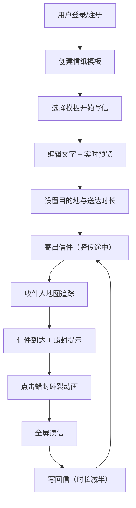

## 1. 产品概述

古风虚拟书信交换平台，模拟古代驿传书信体验，让用户以慢节奏、仪式感的方式进行文字交流。用户可定制古风信纸模板，以竖排文字书写书信，通过模拟古代驿传延时送达收件人，营造古典雅致的交流氛围。

- 目标用户：喜爱古风文化、追求慢生活仪式感的用户群体
- 核心价值：在快节奏的现代生活中提供富有仪式感的古典书信交流体验

## 2. 核心功能

### 2.1 用户角色

| 角色 | 注册方式 | 核心权限 |
|------|----------|----------|
| 普通用户 | 用户名+密码注册 | 信纸模板管理、写信、收信、回信 |

### 2.2 功能模块

1. **信纸模板管理**：创建/编辑/删除信纸模板，设置底色、纹理、字体、印章
2. **写信页面**：全屏编辑器，左侧信纸预览（竖排文字），右侧文本编辑区
3. **收件台**：信件列表、地图追踪动画、蜡封解锁动画、读信与回信

### 2.3 页面详情

| 页面名称 | 模块名称 | 功能描述 |
|----------|----------|----------|
| 模板管理 | 模板列表 | 展示已有模板卡片，支持增删改 |
| 模板管理 | 模板编辑 | 底色选择、纹理切换、字体设置、印章上传调整 |
| 写信页面 | 信纸预览 | 实时渲染竖排文字，支持每列字符数自定义 |
| 写信页面 | 文本编辑 | 纯文本输入，'——'分隔符表示换列 |
| 写信页面 | 寄送设置 | 目的地选择、送达时长范围设置 |
| 收件台 | 动态地图 | CSS动画模拟信件飞行路径与粒子拖尾 |
| 收件台 | 信件卡片 | 蜡封动画、瀑布流布局、未读标识 |
| 收件台 | 读信界面 | 全屏展开信纸原貌，竖排文字滚动 |
| 收件台 | 回信功能 | 回信模板选择、时长减半机制 |

## 3. 核心流程

用户注册登录后，首先创建个性化的信纸模板（设置底色、纹理、字体、印章）。进入写信页面，选择模板后在右侧编辑区输入文字（用'——'表示换列），左侧实时预览竖排排版效果。完成后选择目的地和送达时长范围，点击寄出。信件进入驿传途中状态，收件人在收件台可通过动态地图追踪信件进度。信件到达后，收件人点击带蜡封的信件卡片触发蜡封碎裂动画，随后全屏展开阅读。读后可写回信，回信的驿传时长自动减半。

## 4. 用户界面设计

### 4.1 设计风格

- **主色调**：墨黑（#1a1a1a）、宣纸白（#f5f0e6）、朱砂红（#c84c3c）、竹青（#4a7c59）
- **背景**：柔和渐变的宣纸色，带细微纹理
- **按钮风格**：印章风格，方形边框、手写体文字、悬浮时模拟印泥按压（缩进+阴影加深）
- **导航栏**：卷轴样式，左右两端画轴装饰（CSS伪元素实现阴影和弧度）
- **字体**：楷体（ZCOOL KuaiLe / Ma Shan Zheng）、行书、草书三种Web Font
- **整体基调**：古典水墨风格，克制雅致，留白充分

### 4.2 页面设计概述

| 页面名称 | 模块名称 | UI元素 |
|----------|----------|--------|
| 模板管理 | 模板卡片 | 方形印章边框、缩略预览、悬浮按压效果 |
| 模板管理 | 编辑器 | 颜色选择器、纹理切换标签、印章上传+位置调整滑块 |
| 写信页面 | 预览区 | 模拟纸张质感（CSS渐变+阴影叠加）、竖排从右向左文字 |
| 写信页面 | 编辑区 | 素雅文本框、分隔符提示、字符计数 |
| 写信页面 | 寄送面板 | 古风下拉选择器、印章风格按钮 |
| 收件台 | 动态地图 | 古风地图背景、平滑曲线路径、渐变粒子拖尾、地点高亮点 |
| 收件台 | 信件卡片 | 蜡封动画、竖屏瀑布流、纸张卷曲阴影分隔 |
| 收件台 | 读信界面 | 全屏信纸、竖排滚动、纸张纹理、回信按钮 |

### 4.3 响应式设计

- 桌面端：写信页面左右分栏（预览区+编辑区）
- 移动端：写信页面上下堆叠（预览区在上，编辑区在下）
- 信件列表：自适应瀑布流，移动端单列，PC端多列
- 触控优化：按钮最小尺寸48px，蜡封点击区域放大
