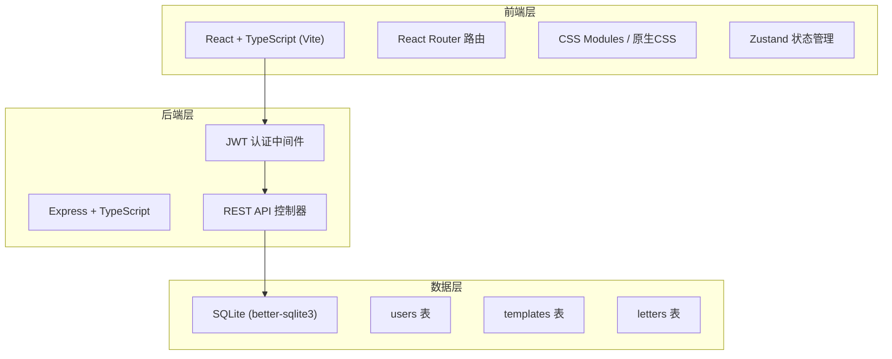
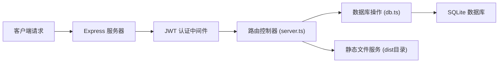

## 1. 架构设计



## 2. 技术说明

- **前端**：React 18 + TypeScript + Vite + React Router DOM + Zustand
- **样式**：原生CSS（CSS变量 + 动画），不使用Tailwind以精细控制水墨风格
- **后端**：Express 4 + TypeScript + JWT认证
- **数据库**：SQLite（better-sqlite3同步API）
- **构建工具**：Vite（前端） + TypeScript编译（后端）
- **进程管理**：concurrently同时运行前后端

## 3. 路由定义

| 路由 | 页面 | 用途 |
|------|------|------|
| /login | LoginPage | 用户登录/注册 |
| /write | WriteLetter | 写信页面（含模板选择、编辑器、预览） |
| /inbox | Inbox | 收件台（信件列表、地图追踪、读信） |
| /templates | TemplateManager | 信纸模板管理页面 |

## 4. API 定义

### 4.1 认证接口

```typescript
// POST /api/auth/register
interface RegisterRequest {
  username: string;
  password: string;
}
interface AuthResponse {
  token: string;
  user: { id: number; username: string };
}

// POST /api/auth/login
interface LoginRequest {
  username: string;
  password: string;
}
// 返回 AuthResponse
```

### 4.2 信纸模板接口

```typescript
interface LetterTemplate {
  id: number;
  userId: number;
  name: string;
  bgColor: string;          // 底色：宣纸黄/竹青绿等预设或自定义
  texture: 'hemp' | 'leather' | 'goldFleck';  // 纹理类型
  font: 'kai' | 'xing' | 'cao';  // 字体风格
  sealImage?: string;       // 印章图片base64
  sealSize: number;         // 印章大小 px
  sealPositionX: number;    // 印章X偏移 %
  sealPositionY: number;    // 印章Y偏移 %
  charsPerColumn: number;   // 每列字符数
}

// GET    /api/templates       获取用户模板列表
// POST   /api/templates       创建模板
// PUT    /api/templates/:id   更新模板
// DELETE /api/templates/:id   删除模板
```

### 4.3 信件接口

```typescript
interface Letter {
  id: number;
  senderId: number;
  receiverId: number;
  templateId: number;
  content: string;
  fromLocation: string;
  toLocation: string;
  status: 'transit' | 'delivered' | 'read' | 'replied';
  sentAt: number;       // 寄出时间戳
  deliverAt: number;    // 预计送达时间戳
  isReply: boolean;     // 是否为回信
  replyToId?: number;   // 原信件ID
}

// GET    /api/letters/sent       已发送信件
// GET    /api/letters/received   收件箱
// POST   /api/letters            寄信
// POST   /api/letters/:id/read   标记已读
// GET    /api/letters/:id        获取信件详情
```

## 5. 服务器架构



## 6. 数据模型

### 6.1 ER 图

```mermaid
erDiagram
    USERS ||--o{ TEMPLATES : creates
    USERS ||--o{ LETTERS : sends
    USERS ||--o{ LETTERS : receives
    TEMPLATES ||--o{ LETTERS : used_by
    LETTERS ||--o{ LETTERS : replies_to

    USERS {
        INTEGER id PK
        TEXT username UNIQUE
        TEXT password_hash
        TEXT created_at
    }
    TEMPLATES {
        INTEGER id PK
        INTEGER user_id FK
        TEXT name
        TEXT bg_color
        TEXT texture
        TEXT font
        TEXT seal_image
        INTEGER seal_size
        REAL seal_position_x
        REAL seal_position_y
        INTEGER chars_per_column
    }
    LETTERS {
        INTEGER id PK
        INTEGER sender_id FK
        INTEGER receiver_id FK
        INTEGER template_id FK
        TEXT content
        TEXT from_location
        TEXT to_location
        TEXT status
        INTEGER sent_at
        INTEGER deliver_at
        INTEGER is_reply
        INTEGER reply_to_id FK
    }
```

### 6.2 DDL

```sql
CREATE TABLE IF NOT EXISTS users (
  id INTEGER PRIMARY KEY AUTOINCREMENT,
  username TEXT UNIQUE NOT NULL,
  password_hash TEXT NOT NULL,
  created_at INTEGER NOT NULL
);

CREATE TABLE IF NOT EXISTS templates (
  id INTEGER PRIMARY KEY AUTOINCREMENT,
  user_id INTEGER NOT NULL REFERENCES users(id),
  name TEXT NOT NULL,
  bg_color TEXT NOT NULL DEFAULT '#f5f0e6',
  texture TEXT NOT NULL DEFAULT 'hemp',
  font TEXT NOT NULL DEFAULT 'kai',
  seal_image TEXT,
  seal_size INTEGER NOT NULL DEFAULT 60,
  seal_position_x REAL NOT NULL DEFAULT 80,
  seal_position_y REAL NOT NULL DEFAULT 85,
  chars_per_column INTEGER NOT NULL DEFAULT 12
);

CREATE TABLE IF NOT EXISTS letters (
  id INTEGER PRIMARY KEY AUTOINCREMENT,
  sender_id INTEGER NOT NULL REFERENCES users(id),
  receiver_id INTEGER NOT NULL REFERENCES users(id),
  template_id INTEGER NOT NULL REFERENCES templates(id),
  content TEXT NOT NULL,
  from_location TEXT NOT NULL,
  to_location TEXT NOT NULL,
  status TEXT NOT NULL DEFAULT 'transit',
  sent_at INTEGER NOT NULL,
  deliver_at INTEGER NOT NULL,
  is_reply INTEGER NOT NULL DEFAULT 0,
  reply_to_id INTEGER REFERENCES letters(id)
);

CREATE INDEX IF NOT EXISTS idx_letters_receiver ON letters(receiver_id);
CREATE INDEX IF NOT EXISTS idx_letters_sender ON letters(sender_id);
CREATE INDEX IF NOT EXISTS idx_templates_user ON templates(user_id);
```
