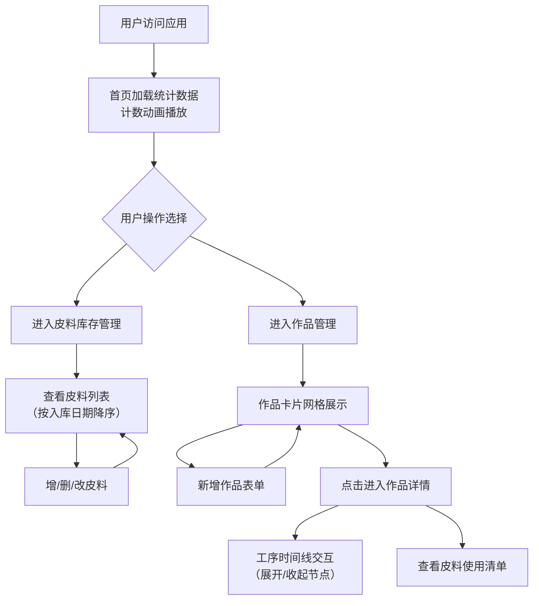

## 1. 产品概述

手工皮具工坊全栈管理应用，为手工皮具工作室的线上社群提供皮料库存管理、作品展示与制作工序追踪的一体化工具。解决社群成员信息分散、缺乏专业管理工具的痛点。

- 核心目标：将皮料管理、作品档案、工序记录三大核心业务数字化，提升工作室运营效率
- 目标用户：手工皮具工作室主理人、皮具制作爱好者、社群成员
- 市场价值：垂直领域的专业管理工具，填补手工皮具行业数字化管理的空白

## 2. 核心功能

### 2.1 用户角色

| 角色 | 注册方式 | 核心权限 |
|------|----------|----------|
| 运营管理员 | 系统内置 | 皮料库存增删改查、作品增删改查、工序管理 |

### 2.2 功能模块

1. **首页（数据概览）**：统计卡片（总皮料种类数、总作品数、剩余皮料总面积）、导航入口
2. **皮料库存管理页**：皮料列表展示、新增皮料、编辑皮料、删除皮料、库存预警提示
3. **作品管理页**：作品卡片网格展示、新增作品表单、关联皮料选择、图片上传
4. **作品详情页**：作品基本信息、制作工序时间线（可展开/收起）、使用皮料清单

### 2.3 页面详情

| 页面名称 | 模块名称 | 功能描述 |
|-----------|-------------|---------------------|
| 首页 | 统计卡片区域 | 三个数据卡片，数值从0递增到目标值的计数动画，实时从后端获取 |
| 首页 | 导航栏 | 固定顶部，半透明毛玻璃效果，左右装饰条，三个导航入口 |
| 皮料库存管理页 | 皮料列表 | 卡片式列表，默认按入库日期降序，剩余面积<5dm²深红色小圆点预警 |
| 皮料库存管理页 | 新增/编辑表单 | 模态框表单，包含名称、类型、厚度、面积、剩余数量、入库日期字段 |
| 作品管理页 | 作品卡片网格 | 响应式网格布局，卡片悬停上移5px+阴影加深动画，显示缩略图/名称/完成日期 |
| 作品管理页 | 新增作品表单 | 模态框表单，包含名称、完成日期、主图URL、工序列表、关联皮料 |
| 作品详情页 | 工序时间线 | 垂直时间线，圆点节点+浅灰连线，点击展开/收起步骤描述和耗时，平滑高度过渡 |
| 作品详情页 | 皮料清单 | 展示本作品使用的所有关联皮料信息 |

## 3. 核心流程

主要用户操作流程描述：

1. 用户进入首页，查看三个统计数据（带动画），通过导航栏切换各功能页面
2. 用户进入皮料库存管理页，查看皮料列表，通过表单新增/编辑/删除皮料记录
3. 用户进入作品管理页，以网格形式浏览所有作品卡片，点击新增作品按钮创建作品
4. 用户点击作品卡片进入详情页，查看作品信息，点击时间线节点展开工序详情
5. 用户在作品详情页查看该作品使用的皮料清单

## 4. 用户界面设计

### 4.1 设计风格

- **主色调**：暖棕色 `#8B4513`（皮革色）+ 米色 `#F5DEB3`（衬底色）
- **背景纹理**：使用 `radial-gradient` 模拟皮革细颗粒毛孔纹理
- **按钮样式**：圆角12px，悬停背景色加深过渡动画（0.2s ease）
- **卡片样式**：圆角12px，悬停阴影从 `shadow-md` 过渡到 `shadow-xl`，上移5px（0.3s ease）
- **导航栏**：固定顶部，半透明毛玻璃效果 `backdrop-filter: blur(10px)`，左右两侧毛玻璃装饰条
- **字体选择**：标题使用衬线体（如 Playfair Display SC / 'Noto Serif SC'），正文使用易读无衬线体（如 'Noto Sans SC'），整体营造手作文艺质感
- **图标风格**：使用 lucide-react 图标库，线条风格，颜色统一使用主色调变体

### 4.2 页面设计概述

| 页面名称 | 模块名称 | UI元素 |
|-----------|-------------|-------------|
| 首页 | 统计卡片 | 三列布局（移动端堆叠），米色卡片背景+暖棕色边框，大号数字+衬线体+计数动画 |
| 首页 | 导航栏 | 毛玻璃半透明，左侧Logo+应用名，右侧三个导航链接，左右装饰条 |
| 皮料库存管理页 | 皮料卡片 | 卡片网格，右上角红色预警圆点，六项信息字段清晰排版，操作按钮组 |
| 皮料库存管理页 | 表单模态框 | 居中弹出，半透明遮罩，表单字段分组，提交/取消按钮 |
| 作品管理页 | 作品卡片网格 | 响应式grid，图片比例4:3，底部信息条（名称+日期），悬停动画 |
| 作品详情页 | 工序时间线 | 左侧垂直连接线+节点圆点，右侧步骤内容，展开max-height动画，折叠箭头指示 |
| 作品详情页 | 皮料清单 | 紧凑表格/标签式展示，关联皮料缩略信息 |

### 4.3 响应式

- **设计策略**：Desktop-first，移动端自适应
- **断点设置**：768px 为主要断点
- **布局变化**：
  - ≥768px：统计卡片三列并排，作品网格3-4列，皮料列表多列布局
  - <768px：统计卡片垂直堆叠，作品/皮料单列布局，导航菜单精简
- **触控优化**：移动端按钮最小高度44px，触控区域充足

### 4.4 动效设计

| 场景 | 动效描述 |
|------|----------|
| 统计数字加载 | 从0到目标值的缓动递增动画，使用 requestAnimationFrame 平滑过渡 |
| 卡片悬停 | transform: translateY(-5px) + 阴影加深，transition: 0.3s ease |
| 按钮悬停 | 背景色加深10%-15%，transition: 0.2s ease |
| 工序节点展开/收起 | max-height从0到auto（固定最大值）配合opacity，transition: 0.35s ease |
| 模态框弹出 | scale从0.9到1 + 透明度渐入，transition: 0.25s ease-out |
| 页面首次进入 | 元素依次入场（staggered reveal），导航栏→统计卡片→内容区依次淡入 |
