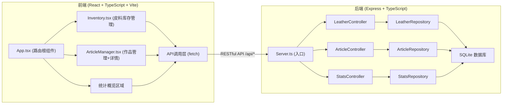
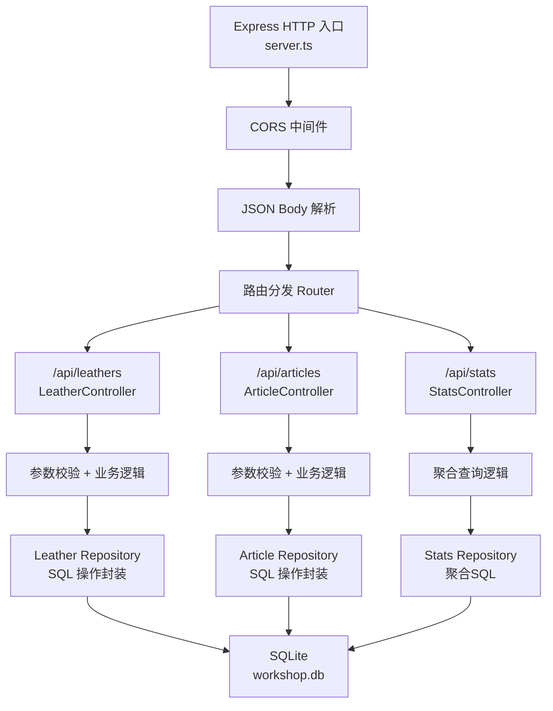
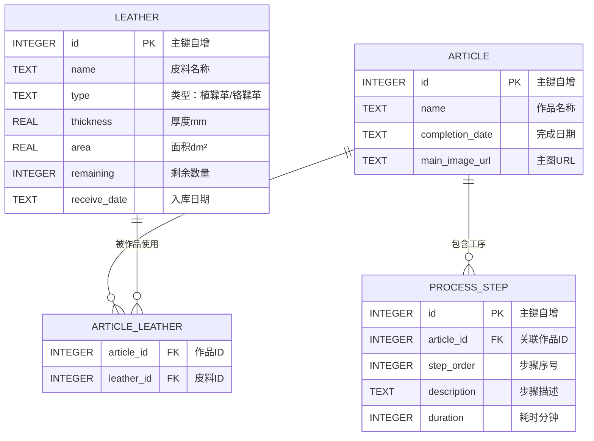

## 1. 架构设计



## 2. 技术描述

- **前端**：React@18 + TypeScript@5 + Vite@5 + React Router@6
- **前端样式**：原生CSS（CSS Modules）+ CSS变量主题系统，不使用Tailwind
- **前端构建**：Vite，配置 `/api` 代理到后端Express服务
- **后端**：Node.js + Express@4 + TypeScript@5
- **数据库**：SQLite3（通过 `sqlite3` npm包），文件型存储 `./data/workshop.db`
- **初始化工具**：vite-init（`react-express-ts` 模板）
- **图标库**：lucide-react

## 3. 路由定义

| 路由路径 | 组件 | 用途 |
|-------|------|------|
| `/` | App.tsx（统计区域） | 首页 - 数据统计概览 + 导航 |
| `/inventory` | Inventory.tsx | 皮料库存管理页面 |
| `/articles` | ArticleManager.tsx（列表视图） | 作品管理页面（卡片网格） |
| `/articles/:id` | ArticleManager.tsx（详情视图） | 作品详情页（工序时间线+皮料清单） |

## 4. API 定义

### 4.1 通用类型定义

```typescript
// 皮料类型
type LeatherType = '植鞣革' | '铬鞣革';

interface Leather {
  id: number;
  name: string;
  type: LeatherType;
  thickness: number;       // 厚度 mm
  area: number;            // 面积 dm²
  remaining: number;       // 剩余数量（张/块）
  receiveDate: string;     // 入库日期 ISO
}

// 制作工序
interface ProcessStep {
  id?: number;
  order: number;           // 步骤序号
  description: string;     // 描述
  duration: number;        // 耗时（分钟）
}

// 作品
interface Article {
  id: number;
  name: string;
  completionDate: string;  // 完成日期 ISO
  mainImageUrl: string;    // 主图URL
  steps: ProcessStep[];    // 制作工序列表
  leatherIds: number[];    // 关联皮料ID列表
}

// 统计数据
interface WorkshopStats {
  totalLeatherTypes: number;     // 总皮料种类数
  totalArticles: number;         // 总作品数
  totalRemainingArea: number;    // 剩余皮料总面积 dm²
}
```

### 4.2 接口清单

| 方法 | 路径 | 请求体 | 响应 | 说明 |
|------|------|--------|------|------|
| GET | `/api/leathers` | - | `Leather[]` | 获取所有皮料（按入库日期降序） |
| POST | `/api/leathers` | `Omit<Leather, 'id'>` | `Leather` | 新增皮料 |
| PUT | `/api/leathers/:id` | `Omit<Leather, 'id'>` | `Leather` | 更新皮料 |
| DELETE | `/api/leathers/:id` | - | `{ success: true }` | 删除皮料 |
| GET | `/api/articles` | - | `Article[]` | 获取所有作品 |
| GET | `/api/articles/:id` | - | `Article & { leathers: Leather[] }` | 获取作品详情（含关联皮料） |
| POST | `/api/articles` | `Omit<Article, 'id'>` | `Article` | 新增作品 |
| PUT | `/api/articles/:id` | `Omit<Article, 'id'>` | `Article` | 更新作品 |
| DELETE | `/api/articles/:id` | - | `{ success: true }` | 删除作品 |
| GET | `/api/stats` | - | `WorkshopStats` | 获取统计概览数据 |

## 5. 服务端架构图



后端代码模块结构：
```
api/
├── server.ts              # Express 应用入口，中间件注册、路由挂载
├── controllers/
│   ├── leatherController.ts   # 皮料接口处理逻辑
│   ├── articleController.ts   # 作品接口处理逻辑
│   └── statsController.ts     # 统计接口处理逻辑
├── repositories/
│   ├── leatherRepository.ts   # 皮料CRUD SQL封装
│   ├── articleRepository.ts   # 作品CRUD SQL封装（含步骤、关联表）
│   └── statsRepository.ts     # 统计聚合SQL
├── db/
│   └── init.ts               # 数据库初始化、建表、种子数据
└── types/
    └── index.ts              # 后端类型定义（与前端共享）
```

## 6. 数据模型

### 6.1 ER 图



### 6.2 DDL 与初始数据

```sql
-- 皮料表
CREATE TABLE IF NOT EXISTS leather (
  id INTEGER PRIMARY KEY AUTOINCREMENT,
  name TEXT NOT NULL,
  type TEXT NOT NULL CHECK(type IN ('植鞣革', '铬鞣革')),
  thickness REAL NOT NULL,
  area REAL NOT NULL,
  remaining INTEGER NOT NULL,
  receive_date TEXT NOT NULL
);

-- 作品表
CREATE TABLE IF NOT EXISTS article (
  id INTEGER PRIMARY KEY AUTOINCREMENT,
  name TEXT NOT NULL,
  completion_date TEXT NOT NULL,
  main_image_url TEXT NOT NULL
);

-- 工序步骤表
CREATE TABLE IF NOT EXISTS process_step (
  id INTEGER PRIMARY KEY AUTOINCREMENT,
  article_id INTEGER NOT NULL,
  step_order INTEGER NOT NULL,
  description TEXT NOT NULL,
  duration INTEGER NOT NULL,
  FOREIGN KEY (article_id) REFERENCES article(id) ON DELETE CASCADE
);

-- 作品-皮料关联表
CREATE TABLE IF NOT EXISTS article_leather (
  article_id INTEGER NOT NULL,
  leather_id INTEGER NOT NULL,
  PRIMARY KEY (article_id, leather_id),
  FOREIGN KEY (article_id) REFERENCES article(id) ON DELETE CASCADE,
  FOREIGN KEY (leather_id) REFERENCES leather(id) ON DELETE CASCADE
);

-- 索引
CREATE INDEX IF NOT EXISTS idx_leather_receive_date ON leather(receive_date DESC);
CREATE INDEX IF NOT EXISTS idx_process_step_article ON process_step(article_id, step_order);
CREATE INDEX IF NOT EXISTS idx_article_leather_article ON article_leather(article_id);
CREATE INDEX IF NOT EXISTS idx_article_leather_leather ON article_leather(leather_id);

-- 种子数据（示例）
INSERT INTO leather (name, type, thickness, area, remaining, receive_date) VALUES
  ('意大利植鞣牛皮 原色', '植鞣革', 2.0, 40, 15, '2026-05-10'),
  ('日本栎木皮 棕色', '植鞣革', 1.8, 35, 3, '2026-04-22'),
  ('法国山羊皮 黑色', '铬鞣革', 1.0, 25, 8, '2026-06-01'),
  ('水牛皮 复古棕', '植鞣革', 3.0, 50, 2, '2026-03-15'),
  ('小羊皮 米色', '铬鞣革', 0.8, 20, 20, '2026-06-08');

INSERT INTO article (name, completion_date, main_image_url) VALUES
  ('手工长款钱包', '2026-05-28', 'https://example.com/wallet.jpg'),
  ('复古托特包', '2026-06-05', 'https://example.com/tote.jpg');
```
