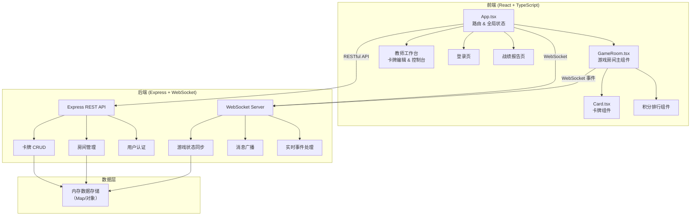
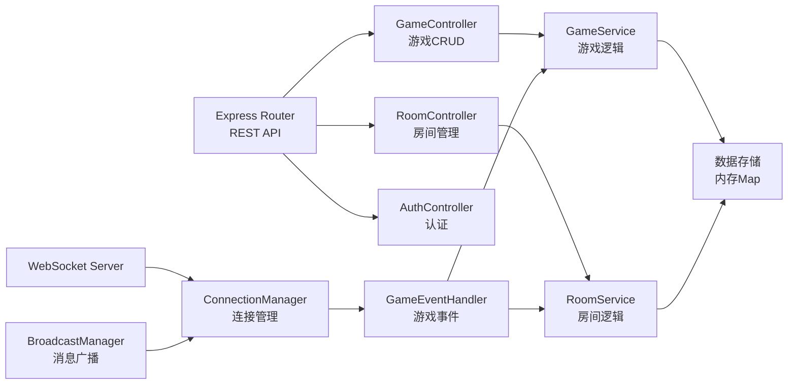
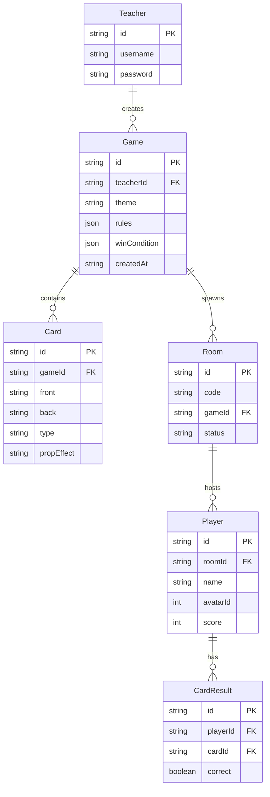

## 1. 架构设计



## 2. 技术说明

- **前端**：React@18 + TypeScript + Vite + CSS（玻璃拟态+渐变效果）
- **初始化工具**：vite-init（react-express-ts 模板）
- **后端**：Express@4 + ws（WebSocket）
- **数据库**：内存存储（Map 对象），无需外部数据库
- **实时通信**：ws 库实现 WebSocket 双向同步
- **PDF导出**：html2canvas + jsPDF（前端生成）

## 3. 路由定义

| 路由 | 用途 |
|------|------|
| `/` | 登录页，教师账号密码登录 |
| `/teacher` | 教师工作台，游戏创建/管理/控制台 |
| `/join` | 学生加入游戏页，输入游戏码+选头像 |
| `/game/:roomId` | 游戏房间，手牌+积分榜+实时对局 |
| `/report/:roomId` | 战绩报告页，统计+排行+导出 |

## 4. API 定义

### 4.1 RESTful API

| 方法 | 路径 | 描述 | 请求体 | 响应 |
|------|------|------|--------|------|
| POST | `/api/auth/login` | 教师登录 | `{ username, password }` | `{ token, teacher }` |
| POST | `/api/games` | 创建游戏 | `{ theme, cards, rules, winCondition }` | `{ game }` |
| GET | `/api/games` | 获取教师游戏列表 | - | `{ games[] }` |
| GET | `/api/games/:id` | 获取游戏详情 | - | `{ game }` |
| PUT | `/api/games/:id` | 更新游戏 | `{ theme, cards, rules, winCondition }` | `{ game }` |
| DELETE | `/api/games/:id` | 删除游戏 | - | `{ success }` |
| POST | `/api/rooms` | 创建房间 | `{ gameId }` | `{ room, code }` |
| GET | `/api/rooms/:code` | 获取房间信息 | - | `{ room }` |
| POST | `/api/rooms/:code/join` | 学生加入房间 | `{ name, avatarId }` | `{ player, room }` |
| GET | `/api/rooms/:roomId/report` | 获取战绩报告 | - | `{ report }` |

### 4.2 WebSocket 事件

| 事件名 | 方向 | 数据 | 描述 |
|--------|------|------|------|
| `room:join` | Client→Server | `{ roomId, playerName, avatarId }` | 学生加入房间 |
| `room:state` | Server→Client | `{ room }` | 广播房间状态更新 |
| `game:start` | Client→Server | `{ roomId }` | 教师开始游戏 |
| `game:started` | Server→Client | `{ hands, currentPlayer }` | 广播游戏开始 |
| `card:play` | Client→Server | `{ roomId, cardId, answer? }` | 学生打出卡牌 |
| `card:played` | Server→Client | `{ playerId, card, result }` | 广播卡牌打出结果 |
| `card:flip` | Client→Server | `{ roomId, cardId }` | 学生翻转卡牌查看 |
| `game:score` | Server→Client | `{ scores }` | 广播积分更新 |
| `game:notification` | Server→Client | `{ message, type }` | 通知横幅消息 |
| `game:end` | Server→Client | `{ report }` | 广播游戏结束 |

### 4.3 TypeScript 类型定义

```typescript
interface Card {
  id: string;
  front: string;
  back: string;
  type: 'knowledge' | 'prop';
  propEffect?: 'skip_turn' | 'steal_card' | 'double_score';
}

interface GameRules {
  answerTimeLimit: number;
  drawLimitPerTurn: number;
}

interface WinCondition {
  type: 'collect_knowledge' | 'correct_count';
  value: number;
}

interface Game {
  id: string;
  teacherId: string;
  theme: string;
  cards: Card[];
  rules: GameRules;
  winCondition: WinCondition;
  createdAt: string;
}

interface Player {
  id: string;
  name: string;
  avatarId: number;
  score: number;
  hand: Card[];
  correctCount: number;
  wrongCount: number;
  propCount: number;
  results: CardResult[];
}

interface CardResult {
  cardId: string;
  correct: boolean;
}

interface Room {
  id: string;
  code: string;
  gameId: string;
  game: Game;
  players: Player[];
  status: 'waiting' | 'playing' | 'finished';
  currentTurn: string | null;
}

interface GameReport {
  roomId: string;
  players: Player[];
  rankings: Player[];
  timestamp: string;
}
```

## 5. 服务器架构图



## 6. 数据模型

### 6.1 数据模型定义



### 6.2 数据存储

采用内存 Map 存储，服务重启后数据清除：

- `teachers: Map<string, Teacher>` — 教师账号
- `games: Map<string, Game>` — 游戏配置
- `rooms: Map<string, Room>` — 游戏房间
- `connections: Map<string, WebSocket>` — WebSocket 连接映射

初始化时预置一个演示教师账号：
- 用户名：`teacher`，密码：`123456`
