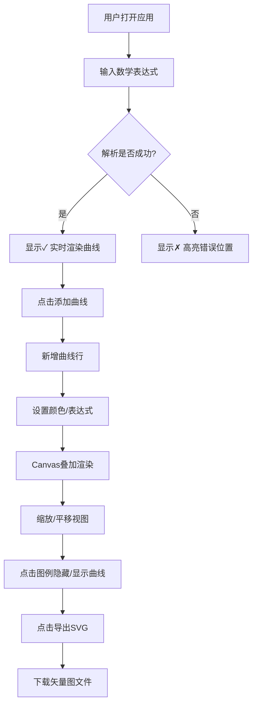

## 1. 产品概述
函数可视化绘图器是一款面向数学学习者、工程师和数据分析师的浏览器端工具，支持实时解析数学表达式并渲染高精度2D函数曲线。产品提供多曲线叠加、视图交互（缩放/平移）和SVG矢量图导出等完整功能，解决手工绘图效率低、精度差的问题。

- 核心价值：将抽象数学公式转化为直观可视的曲线，辅助数学理解与技术分析
- 目标用户：学生、教师、科研人员、数据可视化从业者

## 2. 核心功能

### 2.1 功能模块
1. **表达式输入与解析模块**：主输入框、语法校验状态、错误高亮
2. **坐标系渲染模块**：Canvas画布、网格系统、坐标轴刻度、渐变色曲线
3. **曲线管理模块**：曲线列表表格、颜色选择器、删除操作、图例交互
4. **视图交互模块**：鼠标滚轮缩放、拖拽平移、平滑过渡动画
5. **导出模块**：SVG矢量图导出、2倍屏适配

### 2.2 页面详情

| 页面名称 | 模块名称 | 功能描述 |
|-----------|-------------|---------------------|
| 主页面 | 顶部标题栏 | 产品名称、导出SVG按钮 |
| 主页面 | 表达式输入区 | 主输入框、解析状态指示器（✓/✗）、添加曲线按钮 |
| 主页面 | 曲线列表表格 | 每行包含：表达式输入框、颜色选择器、删除按钮 |
| 主页面 | Canvas绘图区 | 坐标系、网格线、曲线渲染、图例、鼠标交互 |

## 3. 核心流程

用户打开应用 → 在主输入框输入表达式（如 `y = sin(x) + cos(x/2)`）→ 系统实时解析并更新曲线（30fps+）→ 解析成功显示绿色对号，失败显示红色叉号并高亮错误 → 点击「添加曲线」按钮新增曲线行 → 设置曲线颜色 → 在Canvas上叠加所有可见曲线 → 鼠标滚轮缩放/拖拽平移视图（ease-out 250ms动画）→ 点击图例项隐藏/显示对应曲线（淡入淡出）→ 点击「导出SVG」下载矢量图。

## 4. 用户界面设计

### 4.1 设计风格
- **主色调**：深空蓝 (#1e3a5f) 搭配科技感紫罗兰渐变 (#6366f1 → #a855f7)
- **背景**：深色主题 (#0f172a)，画布区域为深色 (#1e293b)，减少视觉疲劳
- **曲线颜色**：渐变色谱，默认曲线从蓝色 (#3b82f6) 渐变到紫色 (#8b5cf6)
- **网格**：主网格浅灰 (#475569) 细线，辅网格更浅 (#334155) 虚线
- **坐标轴**：深色 (#e2e8f0) 粗线，刻度标签使用等宽字体
- **按钮风格**：圆角 (6px)、轻微阴影、hover 时亮度提升
- **字体**：标题使用系统无衬线字体，数值/刻度使用 JetBrains Mono 等宽字体

### 4.2 页面设计概览

| 页面名称 | 模块名称 | UI元素 |
|-----------|-------------|-------------|
| 主页面 | 标题栏 | 左侧产品名「FuncVis」+ 图标，右侧「导出SVG」按钮（蓝紫渐变背景） |
| 主页面 | 输入区 | 输入框带发光边框，右侧状态灯（绿/红圆点+图标），下方添加曲线按钮 |
| 主页面 | 曲线表格 | 紧凑表格，每行：输入框 + 色块 + 删除按钮，hover高亮行 |
| 主页面 | Canvas区 | 深色画布，左上角图例（半透明白底卡片），右下角缩放信息提示 |

### 4.3 响应式
- 桌面端优先（最小宽度 1024px），画布自适应容器宽度
- 中等屏幕下曲线表格改为紧凑模式
- 触摸设备支持双指缩放替代滚轮，单指拖拽

### 4.4 动画规范
- 视图变换：ease-out 缓动函数，250ms 持续时间
- 图例切换：opacity 0→1 淡入淡出，200ms
- 按钮 hover：background-color 过渡，150ms
- 曲线首次渲染：从左到右的 draw-in 效果（可选）
