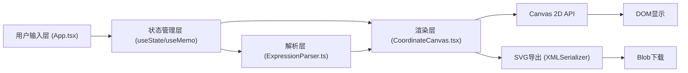

## 1. 架构设计



**分层说明**：
- **输入层**：处理用户输入事件，管理曲线列表与视图参数状态
- **解析层**：纯数学表达式解析引擎，Shunting-yard 算法实现，无副作用
- **渲染层**：Canvas 绑定与交互处理，requestAnimationFrame 驱动渲染循环
- **导出层**：独立的 SVG 渲染路径，根据当前视图和曲线数据生成矢量图

## 2. 技术描述
- **前端框架**：React@18 + TypeScript@5（严格模式，target ES2020）
- **构建工具**：Vite@5 + @vitejs/plugin-react
- **UI 方案**：纯 CSS Modules + CSS 变量（避免引入额外 UI 库，减少包体积）
- **渲染方案**：HTML5 Canvas 2D API（高性能像素级绘制）
- **状态管理**：React Hooks（useState + useMemo + useCallback + useRef）
- **动画方案**：requestAnimationFrame + 自定义 ease-out 缓动函数
- **项目初始化**：Vite React TypeScript 模板

## 3. 核心文件结构

| 路径 | 职责 | 关键技术 |
|------|------|----------|
| `src/App.tsx` | 主组件：状态管理、UI 布局、事件协调 | useState, useMemo, useCallback |
| `src/ExpressionParser.ts` | 数学表达式解析器：词法分析、语法分析、求值函数 | Shunting-yard, Tokenizer, 递归下降 |
| `src/CoordinateCanvas.tsx` | Canvas 组件：渲染循环、网格/坐标轴/曲线绘制、鼠标交互、SVG导出 | Canvas 2D API, requestAnimationFrame, DOMMatrix |
| `src/index.css` | 全局样式：CSS 变量、深色主题、布局样式 | CSS 变量, Flexbox, Grid |

## 4. 关键数据结构

### 4.1 Curve（曲线数据）
```typescript
interface Curve {
  id: string;           // 唯一标识（UUID / 时间戳）
  expression: string;   // 原始表达式字符串
  colorStart: string;   // 渐变起始颜色（hex）
  colorEnd: string;     // 渐变结束颜色（hex）
  visible: boolean;     // 是否可见
  evaluator?: (x: number) => number;  // 编译后的求值函数
  parseError?: ParseError;  // 解析错误信息
}

interface ParseError {
  message: string;      // 错误描述
  position: number;     // 错误字符位置（0-based）
  length?: number;      // 错误片段长度
}
```

### 4.2 View（视图变换参数）
```typescript
interface ViewState {
  xMin: number;         // 可视区域左边界
  xMax: number;         // 可视区域右边界
  yMin: number;         // 可视区域下边界
  yMax: number;         // 可视区域上边界
}

interface ViewAnimation {
  start: ViewState;     // 动画起始视图
  target: ViewState;    // 动画目标视图
  startTime: number;    // 动画开始时间戳
  duration: number;     // 持续时间（ms）
}
```

## 5. ExpressionParser 设计（Shunting-yard 算法）

### 5.1 支持的运算符与函数
- **运算符**：`+` `-` `*` `/` `^`（幂）、括号 `()`、隐式乘法（如 `2x` → `2*x`）
- **一元运算符**：`-x`（负号）、`+x`
- **三角函数**：`sin`, `cos`, `tan`, `asin`, `acos`, `atan`, `sinh`, `cosh`, `tanh`
- **对数/指数**：`log`（自然对数）, `log10`, `log2`, `exp`, `sqrt`, `abs`
- **常量**：`pi`, `e`
- **变量**：`x`

### 5.2 Token 类型
```typescript
type TokenType = 'NUMBER' | 'VARIABLE' | 'FUNCTION' | 'CONSTANT' | 
                 'OP_PLUS' | 'OP_MINUS' | 'OP_MULTIPLY' | 'OP_DIVIDE' | 
                 'OP_POWER' | 'LPAREN' | 'RPAREN' | 'COMMA' | 'EOF';
```

### 5.3 解析流程
1. **词法分析**（Tokenizer）：扫描字符串，识别 Token，记录位置信息
2. **语法分析**（Shunting-yard）：中缀转 RPN（逆波兰表示），同时校验括号匹配
3. **编译**：RPN → 可调用函数 `(x: number) => number`，用闭包缓存执行栈

## 6. Canvas 渲染管线（每帧执行）

1. **视图插值**：如有进行中的动画，根据时间戳插值当前 ViewState
2. **坐标变换计算**：计算世界坐标 → 屏幕坐标的变换矩阵
3. **清空画布**：fillRect 填充背景色
4. **绘制辅网格**：根据 `xMin/xMax` 和自适应间距计算辅网格线，用 `setLineDash`
5. **绘制主网格**：计算主网格线，实线绘制
6. **绘制坐标轴**：找到 x=0 / y=0 在屏幕上的位置，加粗绘制
7. **绘制刻度标签**：沿坐标轴每主网格单位绘制数字标签
8. **绘制图例**：左上角半透明卡片，遍历曲线绘制色块 + 表达式
9. **遍历曲线绘制**：
   - 若不可见则跳过
   - 创建线性渐变（沿曲线从左到右映射 colorStart → colorEnd）
   - `beginPath`，以一定步长（如 2 像素）采样 x 值，求值得到 y，`lineTo` 连接
   - `stroke` 应用渐变描边
10. **结束**：若有动画未结束，安排下一帧 requestAnimationFrame

### 6.1 网格自适应算法
```
当前 x 轴跨度 = xMax - xMin
候选主间距序列 = [0.1, 0.2, 0.5, 1, 2, 5, 10, 20, 50, 100, ...]
目标主网格数（屏幕上 8-12 条）
选择间距：第一个满足 (跨度 / 间距 <= 12) 的候选值
辅间距 = 主间距 / 5
```

### 6.2 坐标变换公式
```
screenX = (worldX - xMin) / (xMax - xMin) * canvasWidth
screenY = canvasHeight - (worldY - yMin) / (yMax - yMin) * canvasHeight
```

## 7. SVG 导出方案

- **独立渲染路径**：不依赖 Canvas 内容，根据当前 ViewState 和 Curve 数组重新渲染为 SVG DOM
- **SVG 结构**：
  - `<svg>` 根元素，设置 `width`/`height` 为画布尺寸 × 2，`viewBox` 为画布尺寸，适配 2 倍屏
  - `<defs>`：定义每条曲线的 `<linearGradient>`
  - `<g class="grid-minor">`：辅网格 `<line>` 元素，stroke-dasharray
  - `<g class="grid-major">`：主网格 `<line>` 元素
  - `<g class="axes">`：坐标轴和刻度 `<line>` + 刻度值 `<text>`
  - `<g class="curves">`：每条曲线的 `<path>`（用 L 命令连续折线），引用渐变
  - `<g class="legend">`：图例 `<rect>` + `<text>`
- **下载方式**：`new XMLSerializer().serializeToString(svg)` → `Blob` (type: image/svg+xml) → `URL.createObjectURL` → `<a download>` 触发点击

## 8. 性能优化策略

1. **解析缓存**：ExpressionParser 对相同表达式字符串使用 WeakMap 缓存编译结果
2. **useMemo 优化**：Curve 数组的 evaluator 仅在 expression 改变时重新解析
3. **渲染循环节流**：输入通过 debounce 50ms 触发解析，避免每个 keystroke 都重新编译
4. **曲线采样优化**：采样点数 = Canvas 宽度 × 2（每 0.5 像素一个采样点），保证缩放时不丢失细节
5. **离屏计算**：NaN / Infinity 值的点自动断开路径，避免干扰绘制
6. **RAF 合并**：所有动画共用一个 requestAnimationFrame 循环，避免重复调度
