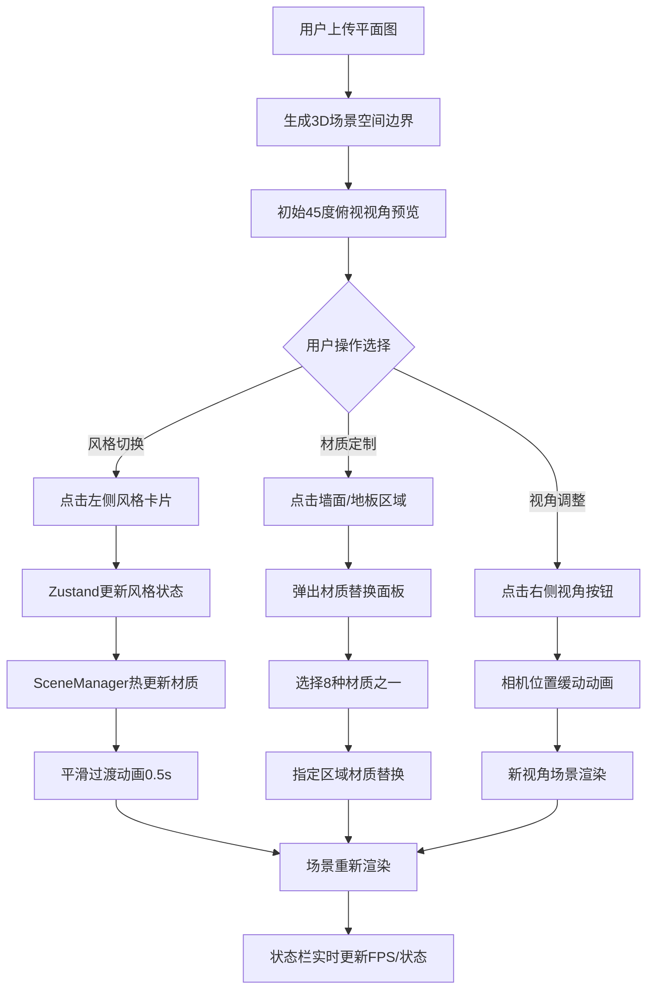

## 1. 产品概述

基于Web的室内装修风格实时预览与交互定制应用，让用户在3D场景中直观体验不同装修风格效果，实现地板、墙面、家具的即时替换与风格切换。

- 主要用途：帮助装修用户在施工前通过3D可视化预览不同装修方案，降低决策成本
- 目标用户：家装业主、室内设计师、装修公司销售人员
- 产品价值：将抽象的装修方案具象化，提供交互式3D预览体验，支持个性化材质定制

## 2. 核心功能

### 2.1 用户角色

| 角色 | 注册方式 | 核心权限 |
|------|----------|----------|
| 普通用户 | 无需注册，直接使用 | 上传平面图、切换风格、替换材质、控制视角 |

### 2.2 功能模块

1. **3D场景渲染模块**：Three.js场景初始化、相机控制、光照系统、网格生成
2. **材质库管理模块**：地板/墙面/家具材质预设、风格组合管理、材质纹理库
3. **UI交互模块**：风格选择面板、材质替换面板、视角控制控件、状态栏
4. **状态同步模块**：Zustand跨模块状态管理、用户操作热更新、撤销栈管理

### 2.3 页面详情

| 页面名称 | 模块名称 | 功能描述 |
|----------|----------|----------|
| 主页面 | 3D画布区域 | 渲染房间3D场景，支持地板/墙面点击交互，家具显示 |
| 主页面 | 左侧风格选择栏 | 3种风格（现代/北欧/工业）缩略图卡片，点击切换整体风格预设 |
| 主页面 | 材质替换面板 | 8种可选材质卡片，点击替换当前选中区域，支持撤销操作 |
| 主页面 | 右侧视角控制面板 | 旋转、复位、切换第一/第三人称视角按钮 |
| 主页面 | 底部状态栏 | 实时显示FPS、材质数量、当前风格名称，低帧率警示 |
| 主页面 | 平面图上传区 | 支持jpg/png图片上传，自动铺设为地面纹理 |

## 3. 核心流程

用户上传房间平面图 → 应用生成3D空间边界 → 用户浏览3D场景预览 → 点击左侧风格卡片切换整体风格 → 点击墙面/地板弹出材质面板 → 选择材质即时替换 → 使用视角按钮调整观察角度 → 状态栏实时反馈场景状态。

## 4. 用户界面设计

### 4.1 设计风格

- **主色调**：暖灰色 #f0ebe3
- **强调色**：靛蓝色 #2c3e50
- **字体**：Inter（无衬线现代字体）
- **整体风格**：现代简约，毛玻璃效果，注重空间层次感

**组件样式规范**：
- 风格卡片：毛玻璃背景 backdrop-filter: blur(10px)，hover放大1.1倍 + 阴影扩散
- 材质卡片：深色半透明浮动层，圆角10px，选中状态2px金色边框
- 视角按钮：圆形半透明图标（Font Awesome），hover白色背景填充
- 状态栏：底部固定条，FPS<20时背景变红警示

### 4.2 页面设计概览

| 页面名称 | 模块名称 | UI元素 |
|----------|----------|--------|
| 主页面 | 左侧风格栏 | 宽度随窗口等比缩放（最小200px），垂直排列3张风格预览卡，毛玻璃面板 |
| 主页面 | 中央3D画布 | Three.js Canvas全屏渲染，OrbitControls交互，点击面高亮选中 |
| 主页面 | 右侧视角面板 | 宽度随窗口等比缩放（最小200px），垂直排列圆形控制按钮，半透明背景 |
| 主页面 | 底部状态栏 | 高度48px固定条，三栏布局：FPS / 材质数 / 风格名，动态背景色 |
| 主页面 | 材质替换弹窗 | 居中浮动深色面板，4x2网格8张材质卡，撤销按钮在右上角 |

### 4.3 响应式设计

- **设计优先**：Desktop-first，适配1366x768 ~ 1920x1080分辨率
- **侧栏缩放**：左右面板宽度使用vw单位，最小宽度200px通过media query锁定
- **画布自适应**：Canvas占满中央区域，ResizeObserver监听窗口变化
- **触控优化**：视角按钮尺寸≥44x44px，支持触屏点击

### 4.4 3D场景指导

- **环境光照**：三种风格差异化光照配置
  - 现代风格：暖白光（色温5500K），AreaLight模拟窗口自然光，阴影柔和
  - 北欧风格：冷白光（色温6500K），高亮度DirectionalLight模拟北欧日光
  - 工业风格：暖黄光（色温3500K），多PointLight模拟工业吊灯，阴影硬朗
- **相机设置**：
  - 初始：PerspectiveCamera fov=50，位置(8, 8, 8)，lookAt原点，45度俯视
  - 第一人称：位置(0, 1.6, 3)，人眼高度1.6m
  - 缓动：lerp线性插值 + ease-in-out，动画时长1s
- **材质系统**：
  - 使用MeshStandardMaterial实现PBR渲染
  - 风格切换时material.color.lerp做0.5s颜色过渡
  - 地板纹理使用TextureLoader加载用户上传图
- **场景构成**：
  - 地板：PlaneGeometry 10x10，接收阴影
  - 四面墙：BoxGeometry，高度3m，面法线朝内
  - 沙发：组合BoxGeometry构建的简化三人位
  - 茶几：BoxGeometry + 金属质感材质
- **性能预算**：
  - 三角面数控制在5万以内
  - 静态场景≥45fps，动画期间≥30fps
  - 响应时间≤200ms
