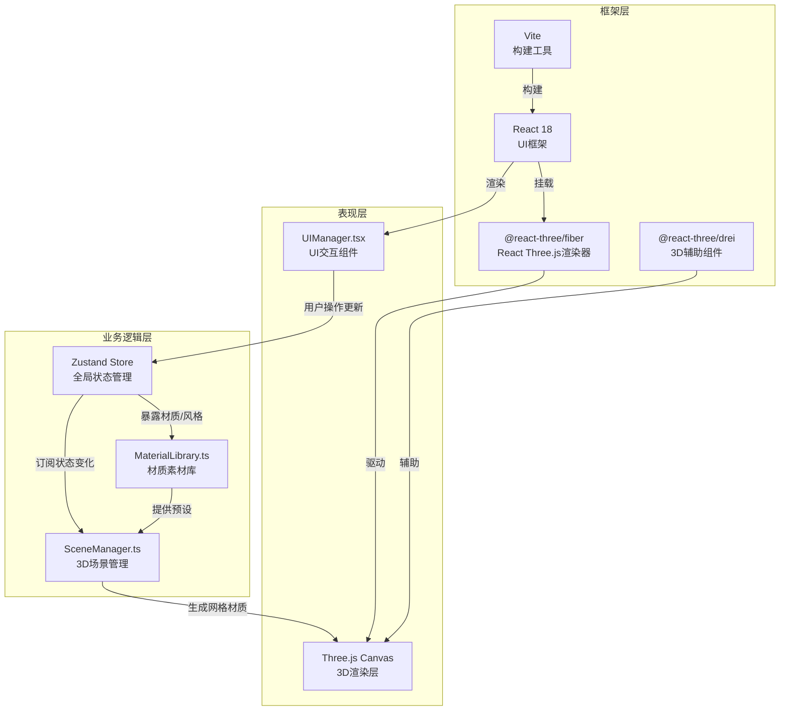
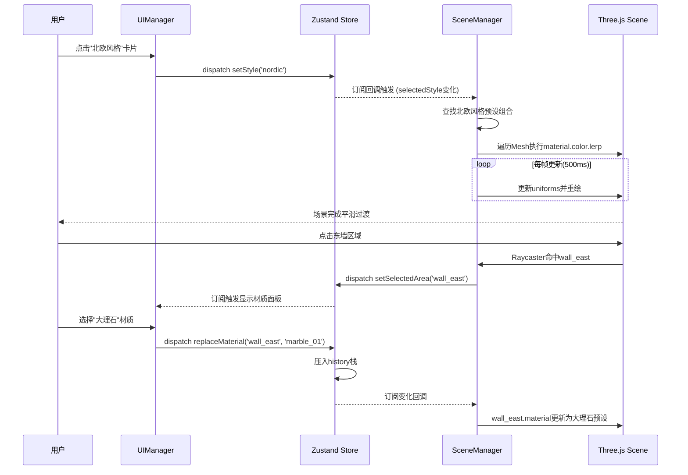

## 1. 架构设计



## 2. 技术说明

- **前端框架**：React@18 + TypeScript@5 + Vite@5
- **3D渲染栈**：three@0.160 + @react-three/fiber@8 + @react-three/drei@9
- **状态管理**：zustand@4（轻量级跨模块状态同步）
- **初始化工具**：vite-init react-ts模板
- **后端**：无后端，纯前端应用，数据本地存储

## 3. 模块与文件结构

```
src/
├── modules/
│   ├── scene/
│   │   └── SceneManager.ts        # 3D场景核心（初始化/网格/光照/材质更新）
│   ├── material/
│   │   └── MaterialLibrary.ts     # 材质预设库 + Zustand Store定义
│   └── ui/
│       └── UIManager.tsx          # UI层（风格栏/视角控制/材质面板/状态栏）
├── store/
│   └── useInteriorStore.ts        # Zustand全局Store实现
├── types/
│   └── index.ts                   # 共享类型定义
├── App.tsx                        # 应用入口
├── main.tsx                       # React挂载入口
└── index.css                      # 全局样式
```

## 4. 核心数据结构与API

### 4.1 Zustand Store 状态定义

```typescript
interface InteriorState {
  selectedStyle: 'modern' | 'nordic' | 'industrial'
  materialList: MaterialPreset[]
  selectedArea: 'floor' | 'wall_north' | 'wall_south' | 'wall_east' | 'wall_west' | null
  floorTexture: string | null
  history: HistoryStep[]
  fps: number

  setStyle: (style: InteriorState['selectedStyle']) => void
  setSelectedArea: (area: InteriorState['selectedArea']) => void
  replaceMaterial: (area: string, materialId: string) => void
  undo: () => void
  setFloorTexture: (url: string) => void
  setFps: (fps: number) => void
}
```

### 4.2 SceneManager API

```typescript
class SceneManager {
  constructor(store: InteriorStore)
  initScene(canvas: HTMLCanvasElement): void
  addFloor(textureUrl?: string): void
  addWalls(height: number): void
  addFurniture(type: 'sofa' | 'table'): void
  updateStyleMaterials(style: StylePreset): void
  replaceAreaMaterial(area: string, material: MaterialPreset): void
  animateCamera(targetPos: Vector3, duration: number): void
  dispose(): void
}
```

### 4.3 材质预设结构

```typescript
interface MaterialPreset {
  id: string
  name: string
  category: 'floor' | 'wall' | 'furniture'
  color: string
  roughness: number
  metalness: number
  textureUrl?: string
  thumbnail: string
}

interface StylePreset {
  id: 'modern' | 'nordic' | 'industrial'
  name: string
  description: string
  lighting: { ambient: number; directional: number; colorTemp: string }
  materials: {
    floor: string
    walls: { north: string; south: string; east: string; west: string }
    sofa: string
    table: string
  }
}
```

## 5. 核心数据流时序



## 6. 性能优化策略

| 优化点 | 方案 |
|--------|------|
| 材质切换卡顿 | 使用颜色lerp插值而非重建材质实例 |
| 低FPS | 阴影贴图尺寸1024，renderer.setPixelRatio(Math.min(dpr, 2)) |
| 视角动画丢帧 | requestAnimationFrame驱动 + THREE.MathUtils.lerp |
| 状态更新频繁 | Zustand subscribe选择器精确订阅 |
| 纹理加载阻塞 | TextureLoader异步加载 + loading占位符 |
| 内存泄漏 | 组件卸载时dispose材质/几何/纹理 |

## 7. 构建与启动

- **依赖安装**：`npm install`
- **开发启动**：`npm run dev`（Vite开发服务器，HMR热更新）
- **生产构建**：`npm run build`（TypeScript严格检查 + Vite打包）
- **类型检查**：`npm run typecheck`（tsc --noEmit）
