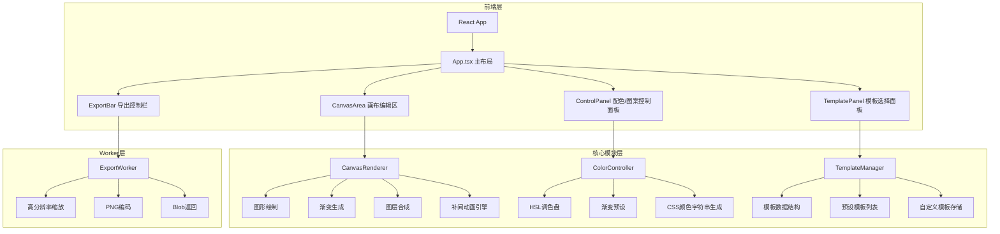

## 1. 架构设计



## 2. 技术说明

- **前端框架**：React@18 + TypeScript + Vite
- **构建工具**：Vite（@vitejs/plugin-react）
- **状态管理**：React Context + useReducer
- **渲染引擎**：Canvas 2D API
- **颜色选择器**：react-colorful
- **工具库**：lodash
- **导出处理**：Web Worker（内联Worker）
- **初始化工具**：vite-init（react-ts模板）

## 3. 路由定义

本项目为单页应用，无路由需求。

| 路由 | 用途 |
|------|------|
| / | 主编辑页面，包含所有功能模块 |

## 4. 文件结构

```
├── package.json
├── vite.config.js
├── tsconfig.json
├── index.html
├── src/
│   ├── main.tsx
│   ├── App.tsx
│   ├── context/
│   │   └── AppContext.tsx
│   ├── modules/
│   │   ├── canvas/
│   │   │   ├── CanvasRenderer.ts
│   │   │   └── ExportWorker.ts
│   │   ├── template/
│   │   │   └── TemplateManager.ts
│   │   └── color/
│   │       └── ColorController.ts
│   └── components/
│       ├── TemplatePanel.tsx
│       ├── CanvasArea.tsx
│       ├── ColorPicker.tsx
│       ├── PatternLayer.tsx
│       ├── ExportBar.tsx
│       └── StatusBar.tsx
```

## 5. 核心模块设计

### 5.1 CanvasRenderer

- 接收配置对象，管理Canvas渲染周期
- 图层系统：背景层 → 渐变层 → 图案层1 → 图案层2 → 图案层3 → 纹理层
- 补间动画引擎：200ms过渡，requestAnimationFrame驱动，60fps目标
- 渐变生成：线性渐变、径向渐变，支持角度和颜色插值

### 5.2 ExportWorker

- 内联Web Worker（Vite兼容方案）
- 接收Canvas位图数据（ImageData）
- OffscreenCanvas执行高分辨率缩放
- 编码为PNG Blob后返回主线程
- 支持2x(1920x1080)和4x(3840x2160)导出

### 5.3 TemplateManager

- 模板数据结构：{ id, name, layers, defaultColors, gradientAngle, patterns }
- 6+种预设模板：纯渐变、几何多边形叠加、微纹理、波纹、菱形网格、极光
- 自定义模板存储：localStorage持久化

### 5.4 ColorController

- HSL调色盘管理
- Hex ↔ HSL双向转换
- 渐变预设生成（线性/径向）
- CSS颜色字符串输出供Canvas使用

## 6. 性能目标

- 画布编辑操作响应时间 ≤ 16ms
- 导出2x分辨率从点击到下载 ≤ 1.5秒
- 本地状态更新不影响动画帧率
- 补间动画稳定60fps
