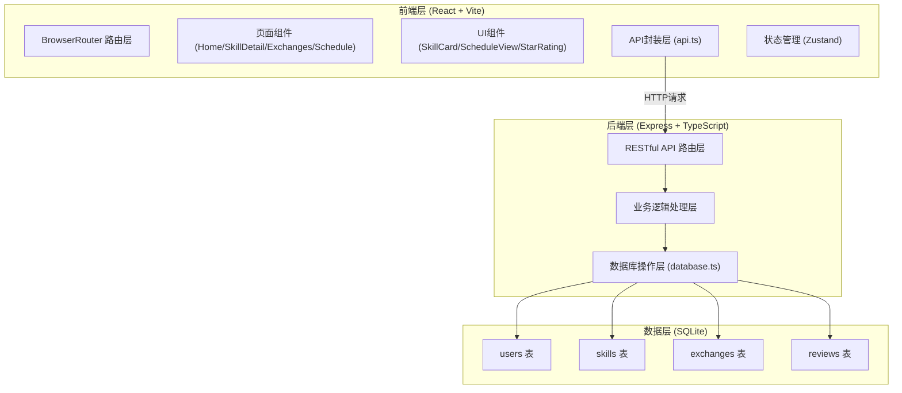
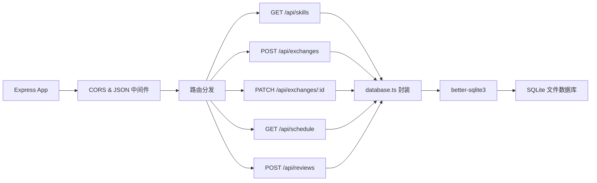
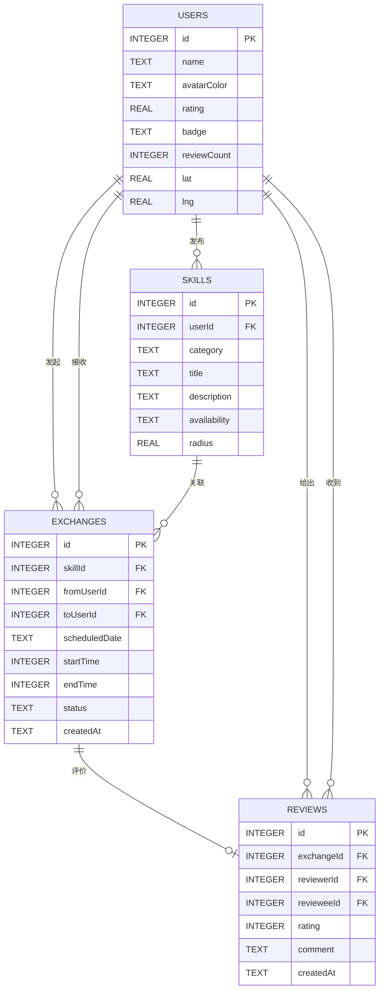

## 1. 架构设计



## 2. 技术说明

- **前端框架**：React@18 + TypeScript + Vite@5
- **前端路由**：react-router-dom@6
- **状态管理**：zustand（轻量级用户状态）
- **图标库**：lucide-react
- **样式方案**：CSS Modules + CSS变量
- **后端框架**：Express@4 + TypeScript
- **后端启动**：ts-node
- **数据库**：SQLite（better-sqlite3）
- **跨域处理**：cors 中间件
- **开发工具**：concurrently（前后端同时启动）
- **构建代理**：vite server.proxy → localhost:3001

## 3. 路由定义

| 路由 | 用途 |
|-------|---------|
| `/` | 首页 - 技能卡片墙展示与筛选 |
| `/skills/:id` | 技能详情页 - 查看提供者信息与预约 |
| `/exchanges` | 我的交换 - 管理发起/收到的交换请求 |
| `/schedule` | 日程总览 - 周视图展示已确认活动 |

## 4. API 定义

```typescript
// 用户与技能
interface User { id: number; name: string; avatarColor: string; rating: number; badge: 'bronze'|'silver'|'gold'; reviewCount: number; lat: number; lng: number; }
interface Skill { id: number; userId: number; category: string; title: string; description: string; availability: WeekSlot[]; radius: number; user?: User; distance?: number; }
interface WeekSlot { day: number; // 0=周日-6=周六 startHour: number; endHour: number; }

// 交换请求
interface Exchange { id: number; skillId: number; fromUserId: number; toUserId: number; scheduledDate: string; startTime: number; endTime: number; status: 'pending'|'confirmed'|'completed'|'cancelled'; createdAt: string; skill?: Skill; fromUser?: User; toUser?: User; }

// 评价
interface Review { id: number; exchangeId: number; reviewerId: number; revieweeId: number; rating: number; comment: string; createdAt: string; }

// API Endpoints
GET  /api/skills?category=&lat=&lng=           → Skill[]  技能列表（含距离计算）
GET  /api/skills/:id                           → Skill    技能详情
POST /api/exchanges                            → Exchange 创建交换请求
GET  /api/exchanges?userId=                    → Exchange[] 我的交换列表
PATCH /api/exchanges/:id/status                → Exchange 更新状态(接受/拒绝/完成)
GET  /api/schedule?userId=&month=&year=        → Exchange[] 当月日程
POST /api/reviews                              → Review   创建评价
GET  /api/users/:id                            → User     用户信息(含评分徽章)
POST /api/users/register                       → User     快速注册
```

## 5. 服务端架构图



## 6. 数据模型

### 6.1 ER 图



### 6.2 DDL 与初始化数据

```sql
CREATE TABLE IF NOT EXISTS users (
    id INTEGER PRIMARY KEY AUTOINCREMENT,
    name TEXT NOT NULL,
    avatarColor TEXT NOT NULL DEFAULT '#4A6741',
    rating REAL NOT NULL DEFAULT 5.0,
    badge TEXT NOT NULL DEFAULT 'bronze',
    reviewCount INTEGER NOT NULL DEFAULT 0,
    lat REAL NOT NULL DEFAULT 31.2304,
    lng REAL NOT NULL DEFAULT 121.4737
);

CREATE TABLE IF NOT EXISTS skills (
    id INTEGER PRIMARY KEY AUTOINCREMENT,
    userId INTEGER NOT NULL,
    category TEXT NOT NULL,
    title TEXT NOT NULL,
    description TEXT NOT NULL,
    availability TEXT NOT NULL DEFAULT '[]',
    radius REAL NOT NULL DEFAULT 5.0,
    FOREIGN KEY (userId) REFERENCES users(id)
);

CREATE TABLE IF NOT EXISTS exchanges (
    id INTEGER PRIMARY KEY AUTOINCREMENT,
    skillId INTEGER NOT NULL,
    fromUserId INTEGER NOT NULL,
    toUserId INTEGER NOT NULL,
    scheduledDate TEXT NOT NULL,
    startTime INTEGER NOT NULL,
    endTime INTEGER NOT NULL,
    status TEXT NOT NULL DEFAULT 'pending',
    createdAt TEXT NOT NULL DEFAULT CURRENT_TIMESTAMP,
    FOREIGN KEY (skillId) REFERENCES skills(id),
    FOREIGN KEY (fromUserId) REFERENCES users(id),
    FOREIGN KEY (toUserId) REFERENCES users(id)
);

CREATE TABLE IF NOT EXISTS reviews (
    id INTEGER PRIMARY KEY AUTOINCREMENT,
    exchangeId INTEGER NOT NULL UNIQUE,
    reviewerId INTEGER NOT NULL,
    revieweeId INTEGER NOT NULL,
    rating INTEGER NOT NULL CHECK(rating BETWEEN 1 AND 5),
    comment TEXT NOT NULL DEFAULT '',
    createdAt TEXT NOT NULL DEFAULT CURRENT_TIMESTAMP,
    FOREIGN KEY (exchangeId) REFERENCES exchanges(id),
    FOREIGN KEY (reviewerId) REFERENCES users(id),
    FOREIGN KEY (revieweeId) REFERENCES users(id)
);

-- 初始示例用户与技能（模拟社区成员）
INSERT INTO users (name, avatarColor, rating, badge, reviewCount, lat, lng) VALUES
('张师傅', '#8B4513', 4.8, 'gold', 24, 31.2308, 121.4740),
('李老师', '#2E86AB', 4.6, 'silver', 12, 31.2299, 121.4729),
('王阿姨', '#C1666B', 4.9, 'gold', 31, 31.2312, 121.4748),
('小陈', '#4A6741', 4.3, 'bronze', 5, 31.2320, 121.4752),
('赵大厨', '#D4A574', 4.7, 'silver', 18, 31.2290, 121.4718);

INSERT INTO skills (userId, category, title, description, availability, radius) VALUES
(1, '维修', '家庭水管维修', '15年水电工经验，擅长水管漏水、龙头更换、马桶疏通，可提供基础配件。', '[{"day":1,"startHour":19,"endHour":21},{"day":3,"startHour":19,"endHour":21},{"day":6,"startHour":9,"endHour":17}]', 3.0),
(2, '教育', '编程入门辅导', 'Python/Scratch零基础教学，适合青少年入门，每节课准备配套练习。', '[{"day":2,"startHour":19,"endHour":21},{"day":4,"startHour":19,"endHour":21},{"day":0,"startHour":10,"endHour":16}]', 5.0),
(3, '烹饪', '家常菜/甜点制作', '上海本帮菜及西式甜点教学，可提供材料清单和现场示范，成品可带走。', '[{"day":5,"startHour":14,"endHour":18},{"day":6,"startHour":14,"endHour":18}]', 2.0),
(4, '园艺', '阳台绿植养护', '多肉、绿萝、月季等常见绿植修剪、换盆、病虫害防治指导。', '[{"day":0,"startHour":9,"endHour":12},{"day":6,"startHour":9,"endHour":12}]', 4.0),
(5, '教育', '英语口语陪练', '商务英语与日常对话，全英文交流，纠正发音与表达。', '[{"day":1,"startHour":20,"endHour":22},{"day":3,"startHour":20,"endHour":22},{"day":5,"startHour":20,"endHour":22}]', 6.0),
(1, '维修', '灯具安装检修', '吊灯、吸顶灯、灯带等灯具安装，电路检测排查。', '[{"day":2,"startHour":19,"endHour":21},{"day":5,"startHour":19,"endHour":21}]', 3.5),
(3, '烹饪', '中式面点制作', '包子、馒头、花卷、饺子皮手工制作教学，老面发酵技术传授。', '[{"day":1,"startHour":9,"endHour":12},{"day":4,"startHour":9,"endHour":12}]', 2.5),
(2, '教育', '作业辅导（小学）', '语数英全科小学作业辅导，注重学习习惯培养。', '[{"day":1,"startHour":17,"endHour":19},{"day":2,"startHour":17,"endHour":19},{"day":4,"startHour":17,"endHour":19}]', 3.0);
```
