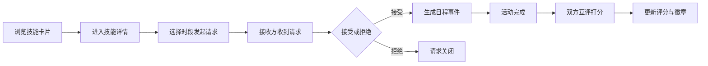

## 1. 产品概述

邻里技能交换平台是一款帮助本地社区居民发现和共享实用技能的Web应用，解决邻里之间难以建立技能互助联系的问题。用户可以发布自己的技能，预约他人的技能，完成交换后进行互评，建立社区信任网络。

- **目标用户**：本地社区居民，有一技之长愿意分享或希望学习实用技能的人群
- **核心价值**：降低邻里技能共享门槛，建立社区互助信任机制，生成可执行的技能交换日程

## 2. 核心功能

### 2.1 用户角色

| 角色 | 注册方式 | 核心权限 |
|------|----------|----------|
| 普通用户 | 昵称注册 | 浏览技能、发起/接收交换请求、互评、查看日程 |

### 2.2 功能模块

1. **首页（技能卡片墙）**：技能卡片展示、筛选、排序、悬停动画
2. **技能详情页**：提供者信息、可预约时段、发起交换申请
3. **我的交换页**：请求列表、状态管理、接受/拒绝操作、互评打分
4. **日程总览页**：周视图展示、技能类别颜色标记、活动详情
5. **用户技能档案**：预设技能选择、时段设置、服务区域配置

### 2.3 页面详情

| 页面名称 | 模块名称 | 功能描述 |
|-----------|-------------|---------------------|
| 首页 | 顶部导航 | Logo、页面导航链接、用户标识 |
| 首页 | 筛选栏 | 按技能类别筛选、按服务区域筛选、搜索 |
| 首页 | 技能卡片墙 | 卡片网格布局、悬停动画、错峰淡入入场动画 |
| 技能详情页 | 提供者信息卡 | 头像、昵称、信誉徽章、总评分、技能简介 |
| 技能详情页 | 时段选择器 | 按周展示可预约时段，选择后发起请求 |
| 技能详情页 | 服务区域 | 地图可视化展示服务半径（虚拟经纬度） |
| 我的交换页 | 发起的请求 | 列表展示、状态标签、取消操作、评价入口 |
| 我的交换页 | 收到的请求 | 接受/拒绝操作、状态更新 |
| 我的交换页 | 评价弹窗 | 1-5星评分、文字评价输入框 |
| 日程总览页 | 周视图日历 | 时间轴、日期列、色块活动标记 |
| 日程总览页 | 活动详情弹窗 | 对方信息、技能信息、时段信息、联系入口 |

## 3. 核心流程

用户在首页浏览技能卡片，通过筛选找到需要的技能提供者，点击卡片进入详情页查看可预约时段，选择时段后提交交换请求。接收方在"我的交换"中看到待确认请求，接受后系统为双方生成日历事件并展示在日程页面。活动完成后双方进行互评打分，评价结果更新用户的总评分和信誉徽章等级。

## 4. 用户界面设计

### 4.1 设计风格

- **主色调**：#F5E6CA 米色背景
- **主色点缀**：#4A6741 草木绿（主按钮、链接、高亮）
- **副色点缀**：#D4A574 陶土色（强调色、徽章边框、评分星）
- **卡片效果**：投影 + 圆角 + backdrop-filter: blur(8px) 磨砂玻璃
- **按钮风格**：圆角矩形，渐变草木绿，0.2s触感过渡
- **字体**：中文使用思源宋体风格标题 + 思源黑体正文
- **布局风格**：卡片式网格布局，充足留白，圆角柔和
- **图标风格**：Lucide线性图标，配合草木绿描边
- **徽章体系**：铜牌/银牌/金牌金属质感徽章

### 4.2 页面设计概览

| 页面名称 | 模块名称 | UI元素 |
|-----------|-------------|-------------|
| 首页 | 顶部导航 | 米色背景，草木绿Logo，导航链接悬停下划线动画 |
| 首页 | 筛选栏 | 陶土色边框圆角筛选按钮，选中态草木绿填充 |
| 首页 | 技能卡片 | 磨砂玻璃卡片，圆角16px，悬停上移4px加深阴影，80ms错峰入场 |
| 技能详情页 | 信息卡 | 大尺寸头像，信誉徽章旁显，评分星级陶土色 |
| 技能详情页 | 时段网格 | 可点击时段格，选中态草木绿边框高亮 |
| 我的交换页 | 状态标签 | 待确认陶土色，已确认草木绿，已完成灰色，已取消浅红 |
| 我的交换页 | 评价弹窗 | 星级评分交互，文字框米色背景 |
| 日程总览页 | 周视图 | 时间轴左侧固定，色块悬停放大显示气泡提示 |

### 4.3 响应式适配

- **桌面端（≥1200px）**：技能卡片4列网格，日程周视图完整7列展示
- **平板端（≥768px）**：技能卡片2-3列自适应，日程周视图可横向滚动
- **手机端（≥375px）**：技能卡片单列瀑布流，顶部导航折叠为图标菜单，日程视图切换为日视图纵向滚动

### 4.4 性能指标

| 指标 | 要求 |
|------|------|
| 详情页渲染耗时 | ≤200ms（API请求到DOM更新） |
| 筛选排序响应 | ≤150ms |
| 卡片悬停过渡 | 0.2s |
| 错峰入场间隔 | 80ms/卡片 |
