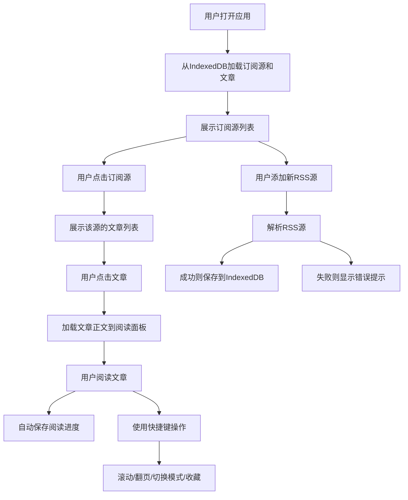

## 1. 产品概述

"纸读"是一款浏览器端电子墨水屏风格的RSS阅读器，为用户提供沉浸式的纸质阅读体验。用户可以订阅和管理RSS源，阅读文章时享受类似纸质书页的视觉效果，支持阅读进度保存、快捷键操作等功能。

- 核心价值：打造专注、舒适的RSS阅读体验，模拟纸质阅读的沉浸感
- 目标用户：喜爱RSS订阅、追求沉浸式阅读体验的内容消费者

## 2. 核心功能

### 2.1 功能模块

1. **订阅源管理**：添加/删除RSS源，展示未读文章数和最后更新时间
2. **文章列表**：按时间倒序展示文章，支持虚拟滚动，标记已读/未读状态
3. **阅读面板**：展示文章正文，支持白天/夜间模式切换，阅读进度条
4. **阅读历史**：自动保存阅读进度，支持续读
5. **收藏功能**：收藏喜欢的文章，金色星号标记
6. **批量操作**：批量标记已读，批量取消订阅
7. **快捷键支持**：翻页、跳转、切换模式等快捷操作

### 2.2 页面详情

| 页面名称 | 模块名称 | 功能描述 |
|-----------|-------------|---------------------|
| 主应用 | 顶部导航栏 | 显示应用名称"纸读"，当前订阅源名称，添加源/关于按钮 |
| 主应用 | 订阅源列表 | 左侧面板，展示所有订阅源，支持添加/删除/批量操作 |
| 主应用 | 文章列表 | 中间面板，展示当前源的文章列表，支持虚拟滚动 |
| 主应用 | 阅读面板 | 右侧面板，展示文章正文，支持阅读进度、夜间模式、收藏 |
| 主应用 | 关于弹窗 | 展示版本号、快捷键帮助、作者信息 |
| 主应用 | 底部标签栏 | 移动端适配，切换三个视图 |

## 3. 核心流程

## 4. 用户界面设计

### 4.1 设计风格

- **主色调**：米黄色（#F5F0E8）模拟纸张，深灰色（#2C2C2C）文字
- **强调色**：蓝色（#3B82F6）用于未读标记和激活状态，金色（#F59E0B）用于收藏标记
- **字体**：优先使用Georgia或Noto Serif SC，应用名称使用仿宋字体
- **布局**：桌面端三栏布局（20%/30%/50%），移动端垂直布局/单页模式
- **视觉效果**：轻微投影（box-shadow: 0 1px 3px rgba(0,0,0,0.08)），圆角4px，悬停阴影加深
- **动效**：0.2s ease-out过渡动画，平滑滚动，淡入效果

### 4.2 页面设计概述

| 页面名称 | 模块名称 | UI Elements |
|-----------|-------------|-------------|
| 主应用 | 顶部导航栏 | 深棕色"纸读"标题（仿宋，字重400），居中显示当前源名称和文章数，右侧功能按钮，底部分割线#D1D5DB |
| 主应用 | 订阅源列表 | 每个源显示名称、未读数（蓝色小圆点）、最后更新时间，复选框用于批量操作，添加源输入框 |
| 主应用 | 文章列表 | 虚拟滚动（约15项视窗），未读文章黑色（#1A1A1A）+ 蓝色圆点，已读灰色（#888），收藏金色星号，相对时间显示 |
| 主应用 | 阅读面板 | 米黄背景#F5F0E8，文字#2C2C2C，行高1.8，两侧留白2%，首字放大，阅读进度条，夜间模式切换 |
| 主应用 | 底部标签栏 | 圆角矩形，Unicode图标（≡、☰、☷），激活标签蓝色#3B82F6 |

### 4.3 响应式

- 桌面端（≥1024px）：三栏横向布局
- 平板端（768px-1024px）：三栏垂直堆叠
- 移动端（<768px）：单页模式，底部标签栏切换

## 5. 性能指标

- 文章列表初始化渲染：≤500ms（1000篇文章）
- RSS解析：≤300ms（100篇文章）
- 快捷键响应：<50ms
- 帧率：≥30fps（1000篇文章滚动时）
