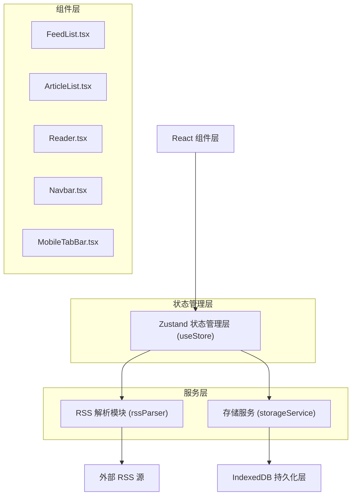
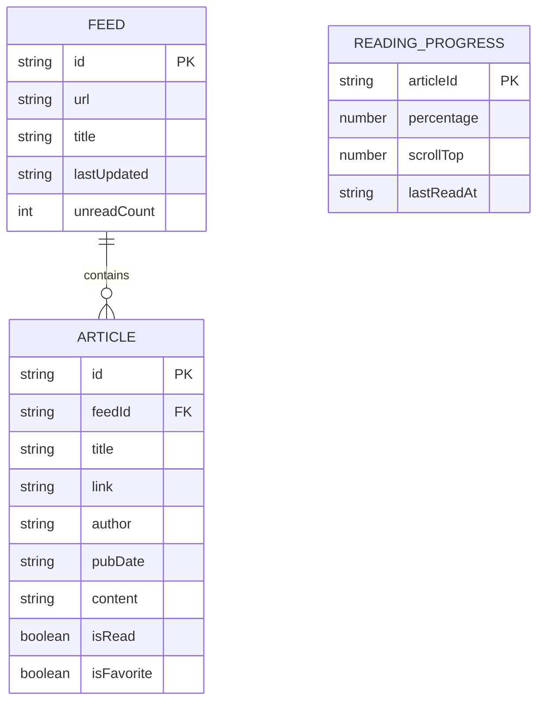

## 1. 架构设计



## 2. 技术描述

- **前端框架**：React 18 + TypeScript + Vite 5
- **状态管理**：zustand 4
- **RSS解析**：rss-parser 3
- **数据存储**：IndexedDB（idb封装）
- **样式方案**：原生CSS + CSS Variables（不使用tailwind）
- **项目初始化**：vite-init

## 3. 项目结构

```
├── package.json
├── index.html
├── vite.config.ts
├── tsconfig.json
├── src/
│   ├── main.tsx
│   ├── App.tsx
│   ├── index.css
│   ├── types/
│   │   └── index.ts
│   ├── store/
│   │   └── useStore.ts
│   ├── parser/
│   │   └── rssParser.ts
│   ├── services/
│   │   └── storageService.ts
│   ├── components/
│   │   ├── FeedList.tsx
│   │   ├── ArticleList.tsx
│   │   ├── Reader.tsx
│   │   ├── Navbar.tsx
│   │   ├── MobileTabBar.tsx
│   │   └── AboutModal.tsx
│   ├── hooks/
│   │   ├── useVirtualScroll.ts
│   │   └── useKeyboardShortcuts.ts
│   └── utils/
│       ├── htmlSanitizer.ts
│       └── relativeTime.ts
```

## 4. 核心类型定义

```typescript
interface Feed {
  id: string;
  url: string;
  title: string;
  lastUpdated: string;
  unreadCount: number;
}

interface Article {
  id: string;
  feedId: string;
  title: string;
  link: string;
  author: string;
  pubDate: string;
  content: string;
  isRead: boolean;
  isFavorite: boolean;
}

interface ReadingProgress {
  articleId: string;
  percentage: number;
  scrollTop: number;
  lastReadAt: string;
}

interface AppState {
  feeds: Feed[];
  articles: Article[];
  selectedFeedId: string | null;
  selectedArticleId: string | null;
  isDarkMode: boolean;
  mobileView: 'feeds' | 'articles' | 'reader';
  readingProgress: Map<string, ReadingProgress>;
}
```

## 5. 数据模型



## 6. IndexedDB 存储结构

- **数据库名**：PaperReadDB
- **版本**：1

| 对象仓库 | 主键 | 索引 |
|---------|------|------|
| feeds | id | url (unique) |
| articles | id | feedId, isRead, isFavorite |
| readingProgress | articleId | - |

## 7. 关键性能优化点

1. **虚拟滚动**：仅渲染视窗内约15篇文章，使用`useVirtualScroll` hook计算可见区域
2. **HTML净化**：使用DOMPurify或自定义净化函数，在解析时完成
3. **异步存储**：IndexedDB操作使用Promise封装，不阻塞UI
4. **防抖优化**：阅读进度保存使用防抖（100ms）
5. **事件委托**：文章列表使用事件委托减少事件监听器
6. **CSS优化**：使用`will-change`和`transform`优化滚动性能
