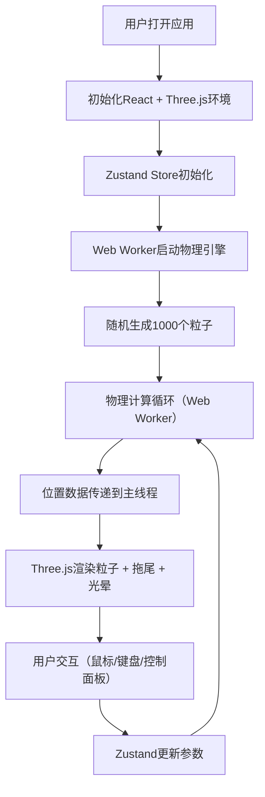

## 1. 产品概述

基于Web的声光互动粒子沙盒应用，让用户通过鼠标和键盘实时操控海量粒子（最多10000个），粒子之间受引力和斥力影响，并产生动态的色彩与光晕效果。

- **主要用途**：提供沉浸式的粒子物理模拟体验，用于创意探索、视觉艺术和教育演示
- **目标用户**：创意工作者、学生、科技爱好者
- **核心价值**：高性能实时物理模拟 + 惊艳的视觉效果 + 直观的交互体验

## 2. 核心功能

### 2.1 功能模块

1. **粒子系统模块**：粒子初始化、位置更新、生命周期管理
2. **物理引擎模块**：引力计算、斥力计算、边界碰撞、鼠标交互力场
3. **3D渲染模块**：Three.js粒子渲染、拖尾效果、光晕效果
4. **UI控制模块**：参数调节面板、模式切换、颜色方案选择
5. **状态管理模块**：Zustand跨模块状态同步

### 2.2 页面详情

| 页面名称 | 模块名称 | 功能描述 |
|-----------|-------------|---------------------|
| 主页 | 3D粒子场景 | 全屏粒子渲染，深空黑色背景，支持鼠标拖拽交互 |
| 主页 | 控制面板 | 右下角悬浮半透明控制面板，包含所有调节控件 |

## 3. 核心流程

用户打开应用 → 自动生成1000个随机粒子 → 粒子在引力和斥力作用下运动 → 用户通过控制面板调节参数 → 用户鼠标拖拽产生交互力场 → 粒子实时响应并产生视觉效果

## 4. 用户界面设计

### 4.1 设计风格

- **主色调**：深空黑色 `#0a0a0f` 作为背景
- **强调色**：蓝色到紫色渐变 `#4a6cf7 → #a855f7` 用于滑块填充
- **面板效果**：毛玻璃效果（背景模糊10px，半透明白色边框）
- **文字颜色**：纯白色 `#ffffff`
- **圆角风格**：控制面板16px圆角，按钮和滑块8px圆角
- **字体**：现代无衬线字体，显示字体选用独特的几何风格字体

### 4.2 页面设计概述

| 页面名称 | 模块名称 | UI元素 |
|-----------|-------------|-------------|
| 主页 | 3D粒子场景 | 全屏黑色背景，粒子色彩鲜艳，光晕叠加效果，星云般视觉 |
| 主页 | 控制面板 | 悬浮右下角，半透明毛玻璃，包含5个控件：粒子数量滑块、引力强度滑块、斥力半径滑块、交互模式切换按钮、颜色方案下拉菜单 |

### 4.3 响应性

- **桌面优先**：针对1920x1080优化设计
- **自适应**：1280x720分辨率下控件大小和间距按视口宽度等比缩放
- **触控优化**：滑块和按钮支持触控操作

### 4.4 3D场景指导

- **环境**：纯净深空黑色背景，无额外环境贴图
- **光照**：使用粒子自发光材质，无需场景光照
- **相机**：PerspectiveCamera，fov 75°，初始位置 z=100，可通过鼠标滚轮缩放
- **合成效果**：Additive Blending实现光晕叠加，营造星云效果
- **后期处理**：轻微Bloom效果增强光晕
- **性能预算**：10000粒子时保持25fps以上，Web Worker处理物理计算
