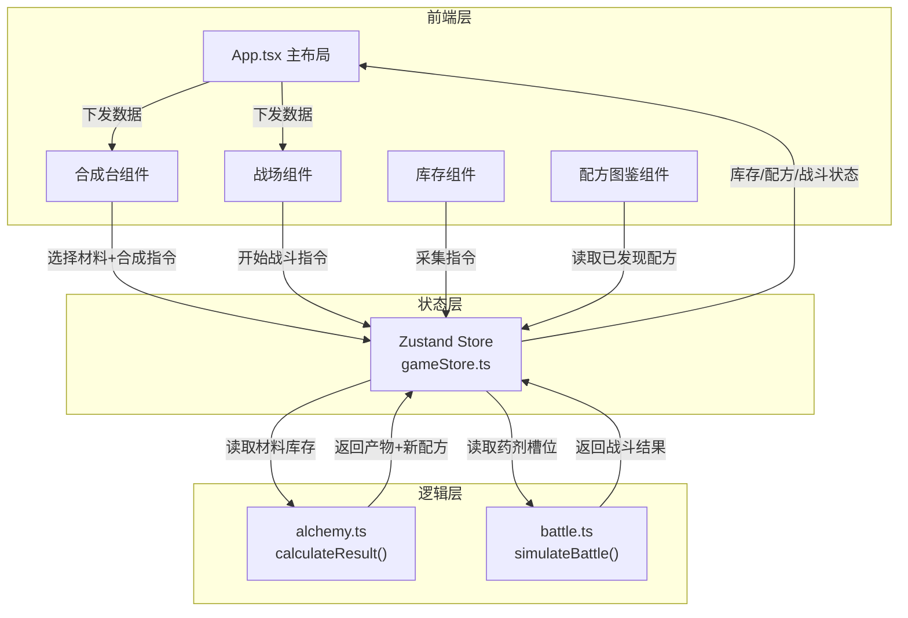

## 1. 架构设计



## 2. 技术说明
- 前端框架：React 18 + TypeScript
- 构建工具：Vite
- 状态管理：Zustand
- 初始化工具：vite-init（react-ts模板）
- 样式方案：CSS Modules + CSS变量 + Tailwind CSS辅助
- 无后端：纯前端应用，所有数据在内存中管理

## 3. 路由定义
| 路由 | 用途 |
|------|------|
| / | 单页应用，合成台与战场同屏展示 |

## 4. 数据模型

### 4.1 核心类型定义

```typescript
type Rarity = "common" | "rare" | "epic" | "legendary"
type MaterialCategory = "plant" | "mineral" | "essence"
type PotionType = "damage" | "heal" | "weaken"

interface Material {
  id: string
  name: string
  icon: string
  rarity: Rarity
  category: MaterialCategory
  quantity: number
}

interface Recipe {
  id: string
  name: string
  material1Id: string
  material2Id: string
  product: Potion
  flavorText: string
  discovered: boolean
}

interface Potion {
  id: string
  name: string
  icon: string
  rarity: Rarity
  type: PotionType
  power: number
  description: string
}

interface BattleState {
  playerHp: number
  playerMaxHp: number
  enemyHp: number
  enemyMaxHp: number
  playerPotion: Potion | null
  enemyPotion: Potion | null
  logs: string[]
  phase: "idle" | "fighting" | "finished"
  winner: "player" | "enemy" | "draw" | null
}

interface GameState {
  inventory: Material[]
  discoveredRecipes: Recipe[]
  allRecipes: Recipe[]
  battle: BattleState
  equippedPotion: Potion | null
  experience: number
  gatherCooldown: number
}
```

### 4.2 数据流向
1. **合成流程**：用户选择材料 → 调用`calculateResult(m1, m2, discoveredRecipes)` → 返回`RecipeResult` → 更新store(inventory减材料, discoveredRecipes加配方, 获得产物)
2. **战斗流程**：用户点击开始 → 调用`simulateBattle(playerPotion, enemyPotion)` → 返回`BattleOutcome` → 更新store(battle状态)
3. **采集流程**：用户点击采集 → 启动30秒冷却 → 随机获得材料 → 更新store(inventory加材料)
4. **UI渲染**：Store状态变更 → App组件接收新状态 → 分发给子组件 → 重渲染

## 5. 文件结构

```
├── package.json
├── vite.config.ts
├── tsconfig.json
├── index.html
├── src/
│   ├── main.tsx                    # 入口，渲染App
│   ├── App.tsx                     # 主布局，接收store数据
│   ├── index.css                   # 全局样式+动画关键帧
│   ├── store/
│   │   └── gameStore.ts            # Zustand store
│   ├── modules/
│   │   ├── alchemy.ts              # 合成逻辑
│   │   └── battle.ts               # 战斗逻辑
│   ├── components/
│   │   ├── AlchemyBench.tsx        # 合成台组件
│   │   ├── MaterialSlot.tsx        # 材料槽位
│   │   ├── ProductDisplay.tsx      # 产物展示
│   │   ├── RecipeCodex.tsx         # 配方图鉴
│   │   ├── BattleField.tsx         # 战场组件
│   │   ├── HealthBar.tsx           # 生命值条
│   │   ├── BattleLog.tsx           # 战斗日志
│   │   ├── BattleResult.tsx        # 结算弹窗
│   │   ├── Inventory.tsx           # 库存组件
│   │   ├── GatherButton.tsx        # 采集按钮
│   │   └── MaterialCard.tsx        # 材料卡片
│   └── types/
│       └── index.ts                # 类型定义
```

## 6. 性能约束
- 合成计算和战斗模拟在主线程20ms内完成
- 战斗日志弹出间隔800±50ms
- 采集冷却倒计时每秒更新，无明显延迟
- 整体交互帧率30fps以上
