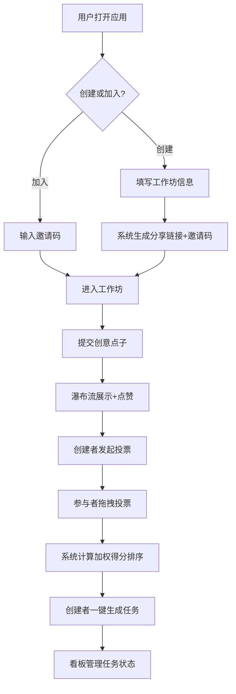

## 1. 产品概述

创意工作坊（Idea Workshop）是一款面向小型创业团队的线上创意协作平台，旨在解决日常会议中头脑风暴杂乱无章、难以收敛和快速转化为实际待办项的问题。通过"创意识别→投票排序→任务生成"的三步流程，帮助团队高效地将零散创意转化为可执行的优先级任务列表。

- 目标用户：2-20人小型创业团队
- 核心价值：将无序的头脑风暴过程结构化，缩短从"创意"到"行动"的转化周期

## 2. 核心功能

### 2.1 用户角色

| 角色 | 进入方式 | 核心权限 |
|------|----------|----------|
| 创建者 | 创建工作坊自动成为 | 发起投票阶段、一键生成任务列表、管理参与者 |
| 参与者 | 通过邀请码加入 | 提交创意、点赞、投票 |

### 2.2 功能模块

1. **工作坊列表页**：创建新工作坊、查看已有工作坊、输入邀请码加入
2. **工作坊详情页**：创意识别提交、瀑布流卡片墙展示、点赞交互
3. **投票页**：洗牌点阵网格、拖拽投票（赞同/反对）、加权得分排序
4. **任务看板页**：一键生成任务列表、看板视图（待办/进行中/已完成）、拖拽改变状态、子任务和截止日期

### 2.3 页面详情

| 页面名称 | 模块名称 | 功能描述 |
|----------|----------|----------|
| 工作坊列表页 | 创建工作坊表单 | 填写名称、描述、参与人数限制（2-20人），系统自动生成分享链接和6位数字邀请码 |
| 工作坊列表页 | 邀请码加入 | 输入6位邀请码直接进入对应工作坊 |
| 工作坊列表页 | 工作坊卡片列表 | 响应式网格展示已有工作坊（桌面4列/平板2列/手机1列） |
| 工作坊详情页 | 创意提交表单 | 填写标题（限40字）、描述、创意类别（技术/设计/运营/其他），提交后瀑布流顶部推送新卡片 |
| 工作坊详情页 | 瀑布流卡片墙 | 展示所有创意点子，卡片含标题、摘要（限200字）、提交人彩色头像+昵称，背景色按类别渐变 |
| 工作坊详情页 | 点赞交互 | 每人最多点赞3个点子，点赞后心形跳动动画，实时更新数字 |
| 工作坊详情页 | 卡片展开 | 点击卡片展开查看完整描述 |
| 工作坊详情页 | 发起投票 | 创建者按钮触发投票阶段 |
| 投票页 | 洗牌点阵网格 | 每行4个缩略卡片，洗牌后随机排列 |
| 投票页 | 拖拽投票 | 拖拽卡片到左侧赞同区或右侧反对区，弹性阻尼+平滑飞入+呼吸缩放动画 |
| 投票页 | 加权得分排名 | 按赞同数×1.5 - 反对数×0.5计算得分并降序排列 |
| 任务看板页 | 一键生成任务 | 将排名前N个创意转化为任务卡片 |
| 任务看板页 | 看板视图 | 待办/进行中/已完成三列，支持拖拽改变状态 |
| 任务看板页 | 任务详情 | 点击展开详情，添加子任务和截止日期（日期选择器） |
| 任务看板页 | 优先级标签 | P0红色/紧急、P1橙色/高、P2蓝色/中、P3灰色/低，根据排名自动计算 |

## 3. 核心流程

用户打开应用 → 创建或加入工作坊 → 参与者在规定时间内提交创意点子 → 瀑布流展示并互相点赞 → 创建者发起投票 → 参与者拖拽投票（赞同/反对） → 系统计算加权得分排序 → 创建者一键生成任务列表 → 任务以看板形式展示 → 拖拽管理任务状态

## 4. 用户界面设计

### 4.1 设计风格

- 主色：#2E86AB（柔和蓝绿）
- 辅色：#A3D9B1（淡绿）
- 点缀色：#F18F01（暖橙）
- 按钮样式：圆角12px，悬停0.2s颜色渐变过渡
- 字体：系统默认字体（-apple-system, BlinkMacSystemFont, "Segoe UI", sans-serif）
- 布局风格：卡片式布局，顶部导航
- 图标风格：简洁线性图标（Lucide）

### 4.2 页面设计概览

| 页面名称 | 模块名称 | UI元素 |
|----------|----------|--------|
| 工作坊列表页 | 顶部导航 | 品牌Logo + 应用名称，背景#2E86AB渐变 |
| 工作坊列表页 | 创建工作坊弹窗 | 模态框，圆角16px，表单含名称/描述/人数输入，创建按钮点缀色#F18F01 |
| 工作坊列表页 | 邀请码输入区 | 6位数字输入框，聚焦态蓝色边框 |
| 工作坊列表页 | 工作坊卡片 | 圆角12px，白色背景，标题+描述+参与人数，悬停抬升阴影 |
| 工作坊详情页 | 瀑布流卡片墙 | 多列瀑布流布局，卡片背景按类别渐变（技术蓝/设计紫/运营绿/其他灰） |
| 工作坊详情页 | 创意卡片 | 圆角12px，标题+摘要+头像，悬停抬升+模糊阴影，点击展开 |
| 工作坊详情页 | 点赞按钮 | 心形图标+数字，点赞后跳动动画0.3s |
| 工作坊详情页 | 新卡片动画 | 淡入+从上方滑入组合动画0.6s |
| 投票页 | 点阵网格 | 每行4个缩略卡片，洗牌排列 |
| 投票页 | 赞同/反对区 | 左右两侧放置区域，虚线边框 |
| 投票页 | 拖拽卡片 | 弹性阻尼跟随，松开后飞入+呼吸缩放 |
| 任务看板页 | 三列看板 | 待办/进行中/已完成，列头带颜色标识 |
| 任务看板页 | 任务卡片 | 优先级色条（P0红/P1橙/P2蓝/P3灰），标题+负责人+截止日期 |
| 任务看板页 | 详情弹窗 | 展开详情，子任务列表+日期选择器 |

### 4.3 响应式设计

- 桌面端（≥768px）：4列网格（工作坊列表）、多列瀑布流（创意卡片）、4列点阵（投票）
- 平板端（<768px）：2列网格、2列瀑布流、2列点阵
- 手机端（<480px）：单列布局、单列瀑布流、2列点阵
- 触摸优化：拖拽投票和看板拖拽支持触摸事件

### 4.4 动画规范

- 卡片悬停：transform: translateY(-4px) + box-shadow增强
- 新卡片入场：fadeIn + slideDownFromTop 0.6s
- 点赞心跳：scale(1→1.3→1) 0.3s
- 拖拽弹性：弹簧阻尼效果，卡片跟随鼠标/手指
- 投票飞入：卡片平滑飞入目标区域 + 呼吸缩放（scale 1→1.05→1）0.4s
- 按钮悬停：颜色渐变过渡0.2s
