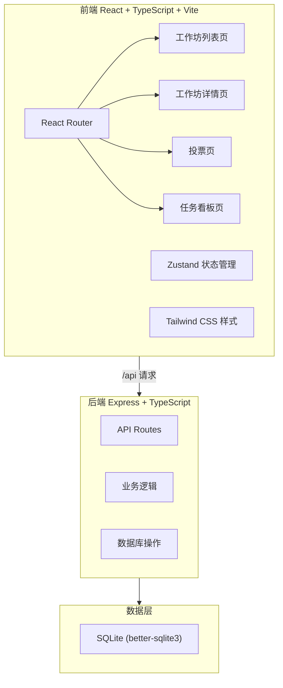
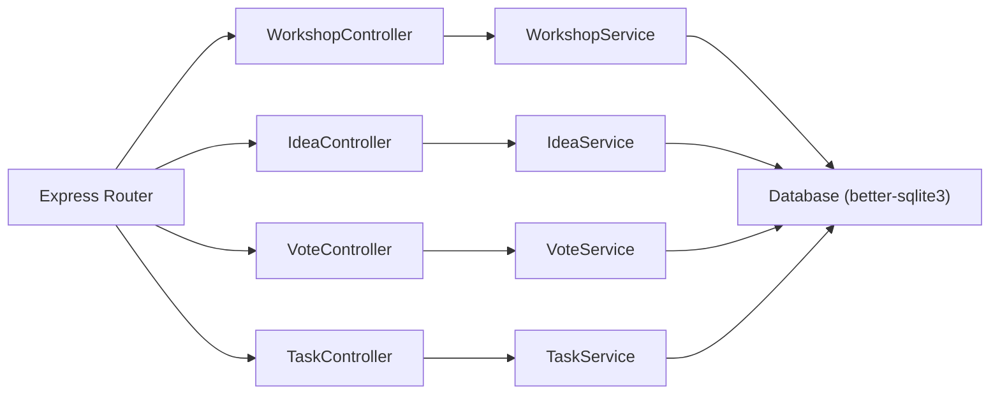
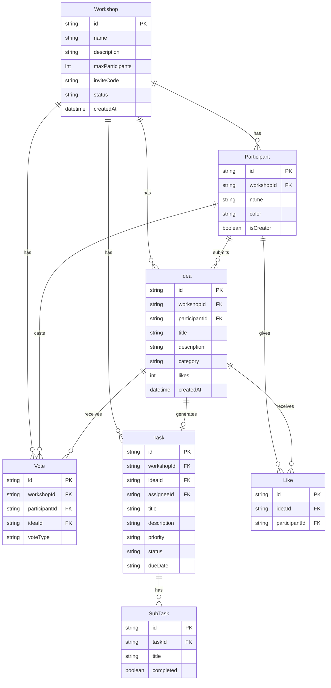

## 1. 架构设计



## 2. 技术说明

- 前端：React@18 + TypeScript + Vite + Tailwind CSS + Zustand
- 初始化工具：vite-init（react-express-ts模板）
- 后端：Express@4 + TypeScript（ESM格式）
- 数据库：SQLite (better-sqlite3)
- 状态管理：Zustand
- 图标库：lucide-react

## 3. 路由定义

| 路由 | 用途 |
|------|------|
| / | 工作坊列表页，创建/加入工作坊 |
| /workshop/:id | 工作坊详情页，创意提交、瀑布流展示、点赞 |
| /workshop/:id/vote | 投票页，拖拽投票 |
| /workshop/:id/tasks | 任务看板页，看板管理 |

## 4. API定义

### 4.1 工作坊相关

```typescript
// POST /api/workshops
// 创建工作坊
interface CreateWorkshopRequest {
  name: string;
  description: string;
  maxParticipants: number;
}
interface CreateWorkshopResponse {
  id: string;
  name: string;
  description: string;
  maxParticipants: number;
  inviteCode: string;
  shareLink: string;
  createdAt: string;
}

// GET /api/workshops
// 获取工作坊列表
interface WorkshopListItem {
  id: string;
  name: string;
  description: string;
  maxParticipants: number;
  currentParticipants: number;
  status: 'brainstorm' | 'voting' | 'task';
  createdAt: string;
}

// GET /api/workshops/:id
// 获取工作坊详情
interface WorkshopDetail extends WorkshopListItem {
  inviteCode: string;
  shareLink: string;
}

// POST /api/workshops/join
// 通过邀请码加入工作坊
interface JoinWorkshopRequest {
  inviteCode: string;
  participantName: string;
}
interface JoinWorkshopResponse {
  workshopId: string;
  participantId: string;
}
```

### 4.2 创意相关

```typescript
// POST /api/workshops/:id/ideas
// 提交创意
interface CreateIdeaRequest {
  title: string;
  description: string;
  category: 'tech' | 'design' | 'operation' | 'other';
  participantId: string;
}
interface IdeaResponse {
  id: string;
  title: string;
  description: string;
  category: 'tech' | 'design' | 'operation' | 'other';
  participantName: string;
  likes: number;
  createdAt: string;
}

// GET /api/workshops/:id/ideas
// 获取创意列表
interface IdeasListResponse {
  ideas: IdeaResponse[];
}

// POST /api/ideas/:id/like
// 点赞
interface LikeIdeaRequest {
  participantId: string;
}
interface LikeIdeaResponse {
  likes: number;
  remainingLikes: number;
}
```

### 4.3 投票相关

```typescript
// POST /api/workshops/:id/start-vote
// 发起投票
interface StartVoteResponse {
  status: 'voting';
  ideas: VoteIdeaItem[];
}
interface VoteIdeaItem {
  id: string;
  title: string;
  summary: string;
  category: string;
}

// POST /api/workshops/:id/vote
// 提交投票结果
interface SubmitVoteRequest {
  participantId: string;
  votes: {
    ideaId: string;
    vote: 'approve' | 'reject';
  }[];
}
interface VoteResultResponse {
  results: {
    ideaId: string;
    title: string;
    approveCount: number;
    rejectCount: number;
    weightedScore: number;
    rank: number;
  }[];
}
```

### 4.4 任务相关

```typescript
// POST /api/workshops/:id/generate-tasks
// 一键生成任务
interface GenerateTasksRequest {
  topN: number;
}
interface GenerateTasksResponse {
  tasks: TaskItem[];
}
interface TaskItem {
  id: string;
  title: string;
  description: string;
  assignee: string;
  priority: 'P0' | 'P1' | 'P2' | 'P3';
  status: 'todo' | 'inProgress' | 'done';
  dueDate?: string;
  subtasks: SubTask[];
  ideaId: string;
}
interface SubTask {
  id: string;
  title: string;
  completed: boolean;
}

// GET /api/workshops/:id/tasks
// 获取任务列表
interface TaskListResponse {
  tasks: TaskItem[];
}

// PATCH /api/tasks/:id
// 更新任务（状态、子任务、截止日期）
interface UpdateTaskRequest {
  status?: 'todo' | 'inProgress' | 'done';
  dueDate?: string;
  subtasks?: SubTask[];
}
```

## 5. 服务端架构图



## 6. 数据模型

### 6.1 数据模型定义



### 6.2 数据定义语言

```sql
CREATE TABLE workshops (
  id TEXT PRIMARY KEY,
  name TEXT NOT NULL,
  description TEXT,
  max_participants INTEGER NOT NULL DEFAULT 20,
  invite_code TEXT NOT NULL UNIQUE,
  status TEXT NOT NULL DEFAULT 'brainstorm',
  created_at TEXT NOT NULL DEFAULT (datetime('now'))
);

CREATE TABLE participants (
  id TEXT PRIMARY KEY,
  workshop_id TEXT NOT NULL REFERENCES workshops(id),
  name TEXT NOT NULL,
  color TEXT NOT NULL,
  is_creator INTEGER NOT NULL DEFAULT 0,
  created_at TEXT NOT NULL DEFAULT (datetime('now'))
);

CREATE TABLE ideas (
  id TEXT PRIMARY KEY,
  workshop_id TEXT NOT NULL REFERENCES workshops(id),
  participant_id TEXT NOT NULL REFERENCES participants(id),
  title TEXT NOT NULL,
  description TEXT,
  category TEXT NOT NULL DEFAULT 'other',
  likes INTEGER NOT NULL DEFAULT 0,
  created_at TEXT NOT NULL DEFAULT (datetime('now'))
);

CREATE TABLE likes (
  id TEXT PRIMARY KEY,
  idea_id TEXT NOT NULL REFERENCES ideas(id),
  participant_id TEXT NOT NULL REFERENCES participants(id),
  created_at TEXT NOT NULL DEFAULT (datetime('now')),
  UNIQUE(idea_id, participant_id)
);

CREATE TABLE votes (
  id TEXT PRIMARY KEY,
  workshop_id TEXT NOT NULL REFERENCES workshops(id),
  participant_id TEXT NOT NULL REFERENCES participants(id),
  idea_id TEXT NOT NULL REFERENCES ideas(id),
  vote_type TEXT NOT NULL,
  created_at TEXT NOT NULL DEFAULT (datetime('now'))
);

CREATE TABLE tasks (
  id TEXT PRIMARY KEY,
  workshop_id TEXT NOT NULL REFERENCES workshops(id),
  idea_id TEXT NOT NULL REFERENCES ideas(id),
  assignee_id TEXT NOT NULL REFERENCES participants(id),
  title TEXT NOT NULL,
  description TEXT,
  priority TEXT NOT NULL DEFAULT 'P3',
  status TEXT NOT NULL DEFAULT 'todo',
  due_date TEXT,
  created_at TEXT NOT NULL DEFAULT (datetime('now'))
);

CREATE TABLE subtasks (
  id TEXT PRIMARY KEY,
  task_id TEXT NOT NULL REFERENCES tasks(id),
  title TEXT NOT NULL,
  completed INTEGER NOT NULL DEFAULT 0
);

CREATE INDEX idx_ideas_workshop ON ideas(workshop_id);
CREATE INDEX idx_participants_workshop ON participants(workshop_id);
CREATE INDEX idx_likes_idea ON likes(idea_id);
CREATE INDEX idx_votes_workshop ON votes(workshop_id);
CREATE INDEX idx_tasks_workshop ON tasks(workshop_id);
CREATE INDEX idx_subtasks_task ON subtasks(task_id);
```
