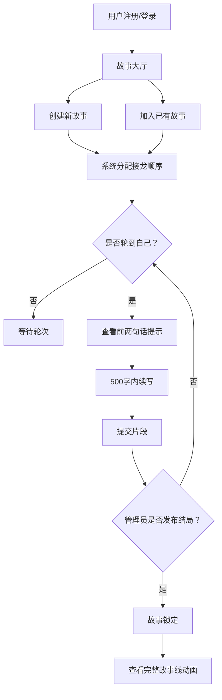

## 1. 产品概述

协作式在线故事接龙平台，让多名用户接力创作同一个故事。每位参与者只能看到前一个片段的最后两句话作为提示，提交后故事逐步展开，最终由管理员发布结局并锁定，所有参与者可查看完整故事线的动画展示。

- 目标用户：创意写作者、文学爱好者、社群互动玩家
- 核心价值：降低协作创作门槛，制造悬念与惊喜感，提供沉浸式故事体验

## 2. 核心功能

### 2.1 用户角色

| 角色 | 注册方式 | 核心权限 |
|------|----------|----------|
| 普通用户 | 用户名+密码注册 | 创建故事、加入故事、接龙写作 |
| 管理员 | 系统预设账号 | 发布结局、锁定故事、管理用户 |

### 2.2 功能模块

1. **登录/注册页**：用户注册与登录表单
2. **故事大厅页**：展示所有故事卡片，支持创建新故事、加入已有故事
3. **接龙页**：核心接龙界面，显示提示、输入框、倒计时
4. **完整故事页**：管理员锁定后展示完整故事线动画

### 2.3 页面详情

| 页面名称 | 模块名称 | 功能描述 |
|----------|----------|----------|
| 登录/注册页 | 注册表单 | 用户名、密码输入与提交，注册成功自动登录 |
| 登录/注册页 | 登录表单 | 用户名、密码输入与登录 |
| 故事大厅页 | 故事卡片列表 | 毛玻璃效果卡片，显示标题、主题标签、参与人数、状态，悬浮上移动画 |
| 故事大厅页 | 创建故事弹窗 | 输入标题、主题标签，创建新故事 |
| 故事大厅页 | 加入故事按钮 | 加入已有故事，系统按申请时间排列接龙顺序 |
| 接龙页 | 提示区 | 展示前一个片段的最后两句话作为提示 |
| 接龙页 | 输入区 | 500字内续写输入框，实时字数统计 |
| 接龙页 | 倒计时环 | 环形进度条显示剩余接龙时间 |
| 接龙页 | 提交按钮 | 提交片段，轮到下一位 |
| 完整故事页 | 时间线动画 | 按时间线逐段淡入显示所有片段 |
| 完整故事页 | 结局片段 | 管理员发布的最终结局高亮显示 |
| 管理员操作 | 发布结局 | 管理员输入结局片段并锁定故事 |

## 3. 核心流程

用户注册登录 → 浏览故事大厅 → 创建新故事或加入已有故事 → 系统按申请时间分配接龙顺序 → 轮到该用户时，查看前两句话提示 → 在500字内续写并提交 → 管理员发布结局并锁定故事 → 所有参与者查看完整故事线动画

## 4. 用户界面设计

### 4.1 设计风格

- 主色调：浅米色背景(#F5F0E8)、深橙色强调(#D4722A)、淡紫灰辅助(#9B8EA8)
- 卡片风格：毛玻璃效果(backdrop-filter: blur)，圆角12px，微弱阴影
- 字体：标题使用衬线体风格，正文使用无衬线体
- 布局：卡片式居中布局，顶部导航
- 动画：卡片悬浮上移2px + 阴影增强，片段淡入，环形倒计时

### 4.2 页面设计概览

| 页面名称 | 模块名称 | UI元素 |
|----------|----------|--------|
| 登录/注册页 | 表单 | 居中卡片，毛玻璃背景，深橙色按钮，输入框带圆角 |
| 故事大厅页 | 故事卡片 | 毛玻璃卡片，标题+标签+参与人数+状态徽章，hover上移动画 |
| 故事大厅页 | 创建弹窗 | 居中模态框，标题输入+标签输入+创建按钮 |
| 接龙页 | 提示区 | 淡紫灰背景卡片，斜体显示前两句话 |
| 接龙页 | 输入区 | 大文本框，右下角字数统计，深橙色提交按钮 |
| 接龙页 | 倒计时环 | SVG环形进度条，中心显示剩余时间 |
| 完整故事页 | 时间线 | 纵向时间线，片段卡片逐个淡入，管理员结局用深橙色高亮 |

### 4.3 响应式设计

- 桌面优先，移动端自适应
- 故事卡片网格：桌面3列 → 平板2列 → 手机1列
- 接龙输入区：移动端全宽，字号适当放大
- 触摸优化：按钮最小点击区域44px

### 4.4 性能要求

- 页面切换和片段加载时间不超过1.2秒
- 使用Vite代理避免跨域延迟
- 前端数据缓存，减少重复请求
