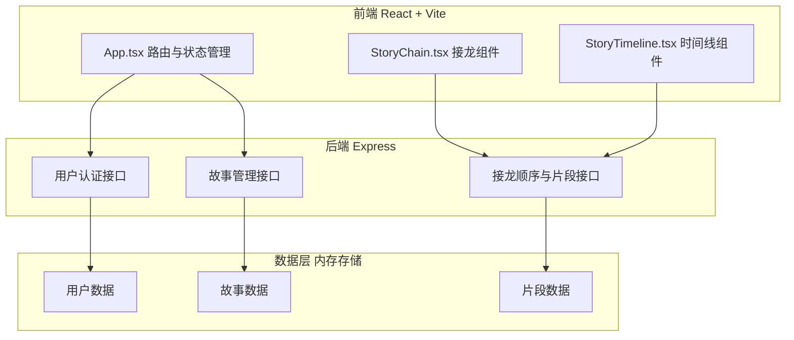
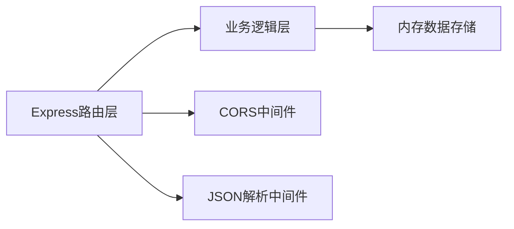
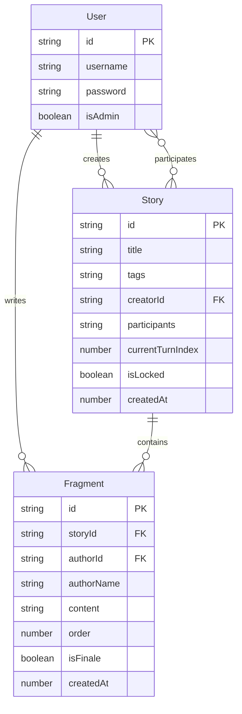

## 1. 架构设计



## 2. 技术说明

- 前端：React 18 + TypeScript + Vite
- 状态管理：React useState/useEffect（轻量场景无需外部库）
- 后端：Express 4 + TypeScript（通过tsx运行）
- 数据库：内存Map存储（演示用途）
- 样式：CSS-in-JS内联样式 + CSS变量
- 构建工具：Vite，开发时代理到后端3001端口

## 3. 路由定义

| 路由 | 用途 |
|------|------|
| / | 登录/注册页 |
| /lobby | 故事大厅，展示故事列表 |
| /story/:id/chain | 接龙页面，续写片段 |
| /story/:id/timeline | 完整故事时间线展示 |

## 4. API定义

### 4.1 用户相关

```
POST /api/auth/register
  Request:  { username: string, password: string }
  Response: { success: boolean, user?: { id: string, username: string, isAdmin: boolean }, error?: string }

POST /api/auth/login
  Request:  { username: string, password: string }
  Response: { success: boolean, user?: { id: string, username: string, isAdmin: boolean }, error?: string }
```

### 4.2 故事相关

```
GET /api/stories
  Response: Story[]

POST /api/stories
  Request:  { title: string, tags: string[], creatorId: string }
  Response: Story

POST /api/stories/:id/join
  Request:  { userId: string }
  Response: { success: boolean, order: number }

GET /api/stories/:id
  Response: Story (含参与者列表和片段列表)
```

### 4.3 片段相关

```
GET /api/stories/:id/prompt
  Request:  { userId: string }
  Response: { hint: string, isMyTurn: boolean, timeLeft: number }

POST /api/stories/:id/fragments
  Request:  { userId: string, content: string }
  Response: { success: boolean, fragment?: Fragment }

POST /api/stories/:id/finale
  Request:  { adminId: string, content: string }
  Response: { success: boolean }

GET /api/stories/:id/full
  Response: Fragment[]
```

### 4.4 TypeScript类型定义

```typescript
interface User {
  id: string;
  username: string;
  password: string;
  isAdmin: boolean;
}

interface Story {
  id: string;
  title: string;
  tags: string[];
  creatorId: string;
  participants: string[];
  currentTurnIndex: number;
  isLocked: boolean;
  createdAt: number;
}

interface Fragment {
  id: string;
  storyId: string;
  authorId: string;
  authorName: string;
  content: string;
  order: number;
  isFinale: boolean;
  createdAt: number;
}
```

## 5. 服务器架构图



## 6. 数据模型

### 6.1 数据模型定义



### 6.2 数据初始化

- 预设管理员账号：admin/admin123
- 预设2个示例故事及若干片段，方便演示
