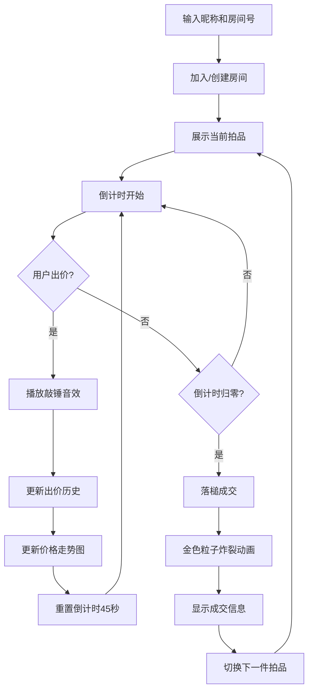

## 1. 产品概述

线上迷你拍卖会场是一款实时模拟真实拍卖会氛围的 Web 应用，用户可创建临时拍卖房间，与其他用户实时竞价虚拟商品，全程营造紧张刺激的拍卖体验。

- 核心价值：打造沉浸式虚拟拍卖体验，通过实时互动、视觉动效和音效模拟真实拍卖会的紧张感
- 目标用户：喜欢社交互动、追求新奇体验的年轻用户群体

## 2. 核心功能

### 2.1 用户角色

| 角色 | 加入方式 | 核心权限 |
|------|----------|----------|
| 竞拍用户 | 输入昵称+房间号加入/创建 | 查看拍品、实时出价、查看出价历史、价格走势 |

### 2.2 功能模块

1. **登录/创建房间页**：昵称输入、房间号输入、加入/创建房间
2. **拍卖房间主界面**：倒计时大屏、拍品展示、出价区、出价历史时间线、价格走势图
3. **拍品展示模块**：大图展示、拖拽上传图片、拍品名称、起拍价
4. **出价交互模块**：出价按钮、敲锤音效、滚动通知横幅
5. **历史与走势模块**：纵向时间线出价列表、Canvas 实时价格走势折线图
6. **成交落槌模块**：45秒无人加价自动落槌、金色粒子炸裂动画、成交提示

### 2.3 页面详情

| 页面名称 | 模块名称 | 功能描述 |
|----------|----------|----------|
| 登录页 | 登录表单 | 昵称输入、房间号输入、加入/创建按钮 |
| 拍卖房间页 | 倒计时大屏 | 显示当前拍品剩余竞拍时间，多用户时间同步 |
| 拍卖房间页 | 拍品展示区 | 大图展示、拖拽上传、拍品名、起拍价 |
| 拍卖房间页 | 出价区 | 出价按钮、敲锤音效、滚动通知横幅 |
| 拍卖房间页 | 出价历史时间线 | 头像缩略图、昵称、出价金额、出价时间差 |
| 拍卖房间页 | 价格走势图 | Canvas 绘制，横轴出价序号，纵轴金额，缓动动画 |
| 拍卖房间页 | 成交动画 | 金色粒子炸裂、成交提示、自动切换下一拍品 |

## 3. 核心流程

用户输入昵称和房间号 → 加入或创建拍卖房间 → 查看当前拍品信息 → 点击出价按钮出价 → 系统广播出价消息 → 出价历史和走势图实时更新 → 45秒无人加价 → 自动落槌成交 → 展示成交动画 → 进入下一件拍品

## 4. 用户界面设计

### 4.1 设计风格

- **主色调**：暗红色 #4A0E0E，营造复古庄重的拍卖会场氛围
- **点缀色**：金色 #D4AF37，突出重要信息和交互元素
- **背景色**：深色系，增强对比度和沉浸感
- **按钮风格**：磨砂玻璃毛玻璃效果（backdrop-filter: blur），按压弹起动画
- **卡片风格**：玻璃态设计，半透明背景，柔和阴影
- **字体**：衬线字体增强复古感，搭配现代无衬线字体保证可读性
- **动效**：卡片淡入上移动画、出价按钮按压反馈、折线末端缓动、粒子爆炸效果

### 4.2 页面设计概述

| 页面名称 | 模块名称 | UI 元素 |
|----------|----------|---------|
| 登录页 | 登录表单 | 暗红色背景、金色边框输入框、玻璃态按钮、淡入动画 |
| 拍卖房间页 | 倒计时大屏 | 大号金色数字、居中显示、紧张感脉动动画 |
| 拍卖房间页 | 拍品展示区 | 大图卡片、拖拽高亮、拍品信息金色文字 |
| 拍卖房间页 | 出价区 | 金色出价按钮、按压缩放动画、滚动通知横幅 |
| 拍卖房间页 | 时间线区域 | 左侧出价历史列表、右侧 Canvas 走势图、金色最高价悬浮 |
| 拍卖房间页 | 成交动画 | 全屏金色粒子、成交信息弹窗、呼吸灯效果 |

### 4.3 响应式

- 桌面端优先设计，保证大屏沉浸式体验
- 适配平板和移动端，保持核心功能可用
- 触屏设备优化按钮尺寸和交互区域

## 5. 性能要求

- 出价后页面更新延迟 ≤ 200ms
- 30人同时在线时帧率 ≥ 30fps
- 动画流畅度：CSS 动画优先，Canvas 走势使用 requestAnimationFrame
