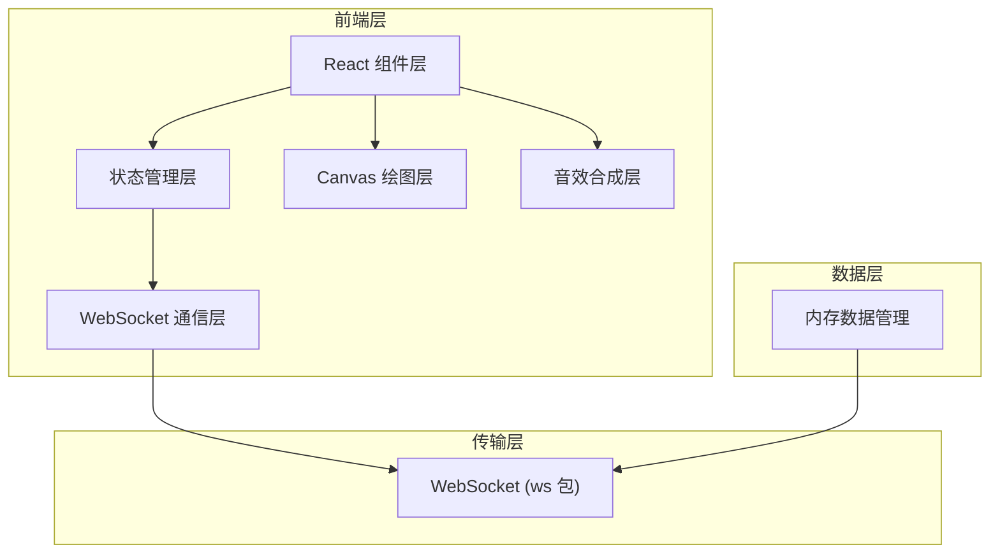

## 1. 架构设计



## 2. 技术描述

- **前端框架**：React 18 + TypeScript
- **构建工具**：Vite
- **实时通信**：ws 包模拟 WebSocket 消息广播
- **绘图技术**：原生 Canvas API 绘制价格走势图
- **音效技术**：Web Audio API (AudioContext) 合成敲锤音效
- **动画方案**：CSS transition/animation + requestAnimationFrame
- **状态管理**：React useState/useReducer + Context（轻量方案）

## 3. 文件结构

```
├── package.json
├── index.html
├── tsconfig.json
├── vite.config.ts
└── src/
    ├── App.tsx              # 根组件，WebSocket 初始化，全局状态
    ├── AuctionRoom.tsx      # 拍卖房间主界面，组合子组件
    ├── components/
    │   ├── ItemDisplay.tsx  # 拍品展示区，拖拽上传
    │   └── BidHistory.tsx   # 出价历史与 Canvas 走势图
    ├── hooks/
    │   └── useAuction.ts    # 拍卖逻辑自定义 Hook
    └── utils/
        ├── audio.ts         # 音效合成工具
        ├── particles.ts     # 粒子动画工具
        └── websocket.ts     # WebSocket 模拟工具
```

## 4. 核心数据模型

### 4.1 拍品 (AuctionItem)

```typescript
interface AuctionItem {
  id: string;
  name: string;
  startPrice: number;
  imageUrl: string;
}
```

### 4.2 出价记录 (BidRecord)

```typescript
interface BidRecord {
  id: string;
  userId: string;
  nickname: string;
  avatar: string;
  amount: number;
  timestamp: number;
}
```

### 4.3 房间状态 (RoomState)

```typescript
interface RoomState {
  roomId: string;
  currentItem: AuctionItem | null;
  itemQueue: AuctionItem[];
  bidHistory: BidRecord[];
  highestBid: number;
  highestBidder: string;
  countdown: number;
  status: 'waiting' | 'bidding' | 'ended';
  users: User[];
}
```

## 5. WebSocket 消息协议

### 5.1 消息类型

| 类型 | 方向 | 描述 |
|------|------|------|
| JOIN_ROOM | 客户端 → 服务端 | 加入房间 |
| ROOM_STATE | 服务端 → 客户端 | 房间全量状态 |
| PLACE_BID | 客户端 → 服务端 | 出价请求 |
| NEW_BID | 服务端 → 客户端 | 新出价广播 |
| ITEM_CHANGED | 服务端 → 客户端 | 拍品切换 |
| AUCTION_ENDED | 服务端 → 客户端 | 拍卖结束 |

## 6. 性能优化策略

1. **虚拟列表**：出价历史超过一定数量时使用虚拟滚动
2. **Canvas 优化**：使用 requestAnimationFrame，仅数据变化时重绘
3. **防抖节流**：高频事件（如鼠标移动）使用节流
4. **CSS 动画**：优先使用 transform 和 opacity 触发 GPU 加速
5. **内存管理**：及时清理粒子动画和定时器，防止内存泄漏
