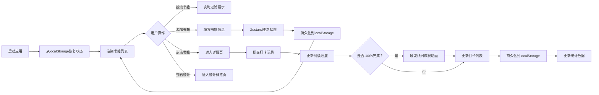

## 1. 产品概述

在线阅读打卡与书籍分享应用，为线上读书俱乐部成员提供书籍管理、阅读打卡、读后感分享和阅读统计功能。

- 解决现有工具过于社交化或缺乏阅读进度追踪的痛点
- 目标用户：读书俱乐部成员、个人阅读爱好者
- 产品价值：打造专注阅读、鼓励持续打卡的专属阅读空间

## 2. 核心功能

### 2.1 用户角色

| 角色 | 注册方式 | 核心权限 |
|------|----------|----------|
| 普通用户 | 无需注册，本地使用 | 管理个人书籍、打卡记录、查看统计 |

### 2.2 功能模块

1. **书籍管理模块**：书籍增删改查、卡片网格展示、搜索筛选
2. **阅读打卡模块**：记录页数/时长/感想、打卡列表、100%完成庆祝动画
3. **统计概览模块**：本月总时长、本月打卡次数、平均完成度、近7天柱状图

### 2.3 页面详情

| 页面名称 | 模块名称 | 功能描述 |
|----------|----------|----------|
| 书籍列表页 | 书籍管理模块 | 三列响应式网格展示书籍卡片，顶部搜索框实时过滤，支持添加/编辑/删除 |
| 书籍详情页 | 阅读打卡模块 | 展示书籍详情，打卡表单，打卡记录列表（虚拟滚动），完成庆祝动画 |
| 统计概览页 | 统计概览模块 | 四个统计卡片 + 近7天阅读时长柱状图（SVG动画过渡） |

## 3. 核心流程

用户打开应用 → 查看书籍列表（localStorage恢复数据）→ 搜索/筛选书籍 → 点击书籍进入详情 → 填写打卡信息提交 → 状态更新并持久化 → 查看统计数据

## 4. 用户界面设计

### 4.1 设计风格

- 主色调：#F5E6D3（米白背景）、#8B5E3C（深棕文字/按钮）
- 卡片：白色背景 + 轻微阴影 + 12px圆角
- 字体：Google Fonts Merriweather（Serif衬线字体）营造阅读氛围
- 按钮：点击按压缩放效果 transform: scale(0.95)
- 过渡动画：统一 200ms ease-in-out

### 4.2 页面设计概述

| 页面名称 | 模块名称 | UI元素 |
|----------|----------|--------|
| 书籍列表页 | 书籍管理 | 暖色调背景、顶部搜索框（防抖+清除按钮）、三列响应式网格、书籍卡片（封面+进度环+悬停上移）、模态框（添加/编辑/删除确认） |
| 书籍详情页 | 阅读打卡 | 书籍信息展示、打卡表单（页数/时长/感想输入）、打卡记录列表（左侧圆形彩色标签+右侧信息）、Canvas纸屑庆祝动画 |
| 统计概览页 | 统计概览 | 四张统计卡片（深色文字+大号数字）、SVG柱状图（平滑过渡+渐变填充）、响应式布局 |

### 4.3 响应式设计

- 桌面端：三列网格
- 平板端：两列网格
- 手机端：单列网格
- 触控优化：按钮最小尺寸44x44px
