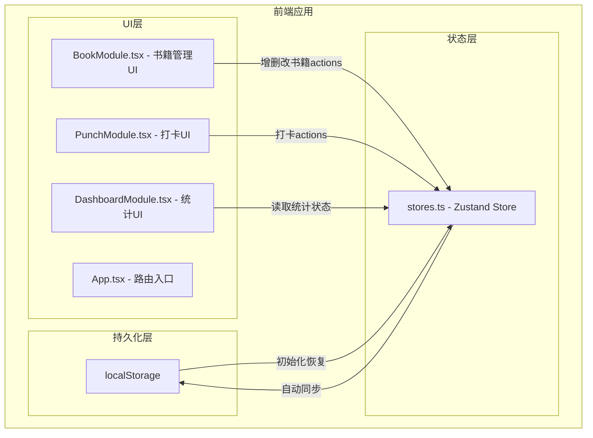
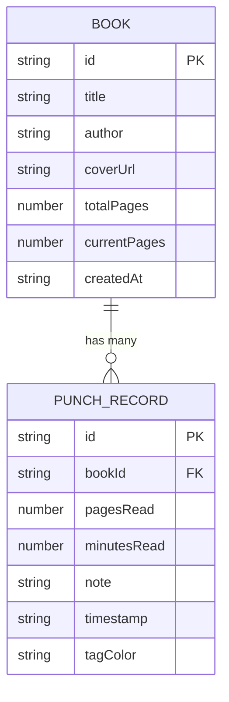

## 1. 架构设计



## 2. 技术说明

- 前端框架：React 18 + TypeScript
- 构建工具：Vite
- 状态管理：Zustand（支持localStorage中间件）
- 路由管理：React Router DOM
- 图标：lucide-react
- 数据持久化：localStorage + Zustand persist中间件
- 虚拟滚动：自定义虚拟列表实现（无额外依赖）

## 3. 路由定义

| 路由 | 用途 |
|------|------|
| / | 书籍列表页（BookModule） |
| /book/:id | 书籍详情/打卡页（PunchModule） |
| /dashboard | 统计概览页（DashboardModule） |

## 4. 数据模型

### 4.1 数据模型定义



### 4.2 TypeScript类型定义

```typescript
interface Book {
  id: string;
  title: string;
  author: string;
  coverUrl: string;
  totalPages: number;
  currentPages: number;
  createdAt: string;
}

interface PunchRecord {
  id: string;
  bookId: string;
  pagesRead: number;
  minutesRead: number;
  note: string;
  timestamp: string;
  tagColor: string;
}

interface ReadingStats {
  monthlyTotalMinutes: number;
  monthlyPunchCount: number;
  averageCompletion: number;
  last7Days: { date: string; minutes: number }[];
}
```

## 5. 文件结构及调用关系

```
src/
├── App.tsx              # 根组件：路由配置 + 三模块整合
├── stores.ts            # Zustand状态：提供books/punches/states及actions
├── main.tsx             # 入口文件
├── index.css            # 全局样式
├── hooks/
│   ├── useDebounce.ts   # 防抖Hook（搜索框用）
│   └── useVirtualList.ts # 虚拟列表Hook
├── components/
│   ├── BookCard.tsx     # 书籍卡片组件（BookModule使用）
│   ├── PunchItem.tsx    # 打卡条目组件（PunchModule使用）
│   ├── BookModal.tsx    # 添加/编辑书籍模态框
│   ├── StatCard.tsx     # 统计卡片组件
│   └── Confetti.tsx     # 纸屑庆祝动画组件
└── modules/
    ├── BookModule.tsx    # 调用 stores.books + addBook/editBook/deleteBook
    ├── PunchModule.tsx   # 调用 stores.punches + addPunch
    └── DashboardModule.tsx # 调用 stores.stats（只读）
```

**数据流向：**
1. BookModule → stores.addBook/editBook/deleteBook → 更新books → localStorage持久化
2. PunchModule → stores.addPunch → 更新punches + book.currentPages → localStorage持久化
3. stores → 计算派生出stats → DashboardModule读取渲染
4. 应用启动 → localStorage → stores初始化
