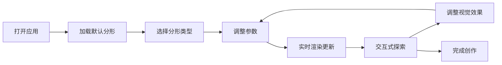

## 1. 产品概述

3D分形图形编辑器是一款在浏览器中创建和编辑复杂3D分形图形的Web应用，解决数学分形（如Mandelbulb、Julia集）在三维空间中生成缓慢、参数调整不直观的问题。面向数学爱好者、数字艺术家和科研人员，提供高性能实时渲染和直观的参数调节体验。

## 2. 核心功能

### 2.1 用户角色

| 角色 | 注册方式 | 核心权限 |
|------|----------|----------|
| 普通用户 | 无需注册 | 使用所有分形编辑功能、实时渲染、参数调整和交互式探索 |

### 2.2 功能模块

1. **3D渲染主区域**：实时渲染分形模型、视角信息显示、帧率监控
2. **参数控制面板**：分形类型选择、迭代参数调节、颜色映射设置、视觉效果控制
3. **交互式探索模块**：鼠标拖拽旋转、滚轮缩放、WASD键平移、平滑过渡动画
4. **分形计算模块**：基于Ray marching的Mandelbulb/Julia集/Quaternion分形算法

### 2.3 页面详情

| 页面名称 | 模块名称 | 功能描述 |
|---------|---------|----------|
| 主页面 | 3D渲染区域 | 占屏幕70%宽度，实时渲染分形模型，支持鼠标/键盘交互，显示观察角度和缩放比例 |
| 主页面 | 参数控制面板 | 固定宽度320px，包含分形类型下拉菜单、多个参数滑块、颜色选择器，200ms过渡动画 |
| 主页面 | 响应式抽屉 | 屏幕宽度<768px时，面板折叠为底部可拖动抽屉 |

## 3. 核心流程

用户打开应用→加载默认示例分形→选择分形类型（Mandelbulb/Julia集/Quaternion）→调整参数（幂指数、迭代次数、逃逸半径、Julia常数等）→实时查看渲染效果→通过鼠标拖拽/滚轮/键盘探索分形→调整颜色映射和视觉效果→持续优化直至满意

## 4. 用户界面设计

### 4.1 设计风格

- **主色调**：背景#1a1a2e，面板背景#16213e，强调色#0f3460，文字#e0e0e0
- **按钮样式**：圆角按钮，悬停时发光效果（box-shadow: 0 0 15px rgba(15, 52, 96, 0.8)）
- **字体**：显示字体使用 'Space Mono' 等宽字体，正文字体使用 'Inter' 无衬线字体
- **布局风格**：左右分栏布局，左侧3D渲染区域（70%），右侧参数面板（320px固定宽度）
- **滑块样式**：渐变轨道（从#16213e到#0f3460），圆形滑块带数值标签
- **图标风格**：使用lucide-react线性图标，保持简洁科技感

### 4.2 页面设计概述

| 页面名称 | 模块名称 | UI元素 |
|---------|---------|--------|
| 主页面 | 3D渲染区域 | Canvas渲染画布、FPS指示器、视角信息标签（角度/缩放）、平滑旋转动画 |
| 主页面 | 参数控制面板 | 分形类型下拉选择、幂指数滑块（2-8）、迭代次数滑块（8-128）、逃逸半径滑块（2-10）、Julia常数三分量滑块（-1到1）、颜色映射调色板、内部着色开关、环境光遮蔽强度滑块（0-1）、重置按钮 |
| 主页面 | 响应式抽屉 | 底部拖动把手、可滑动面板、遮罩层、200ms平滑过渡 |

### 4.3 响应式设计

- **桌面端（>1024px）**：左右分栏布局，3D区域70%，面板320px固定宽度
- **平板端（768px-1024px）**：面板宽度自适应为280px，保持分栏布局
- **移动端（<768px）**：面板折叠为底部可拖动抽屉，点击/拖拽展开，支持触摸手势优化
- **触摸优化**：增加滑块触摸区域，按钮最小尺寸44x44px，支持双指缩放

### 4.4 3D场景指导

- **环境**：深色宇宙背景，微弱星空粒子效果，营造深邃空间感
- **光照**：主光源从右上方45度照射，环境光强度0.3，支持环境光遮蔽（AO）效果
- **相机设置**：PerspectiveCamera，fov 60度，初始距离2.5倍，平滑插值过渡0.3秒
- **构图**：分形模型居中，保持黄金比例视觉平衡
- **交互动画**：所有视角变化带0.3秒平滑插值，参数变化时2秒内完成重渲染
- **后期处理**：支持环境光遮蔽、抗锯齿、色调映射
- **性能**：帧率不低于25fps，使用ShaderMaterial GPU加速渲染
