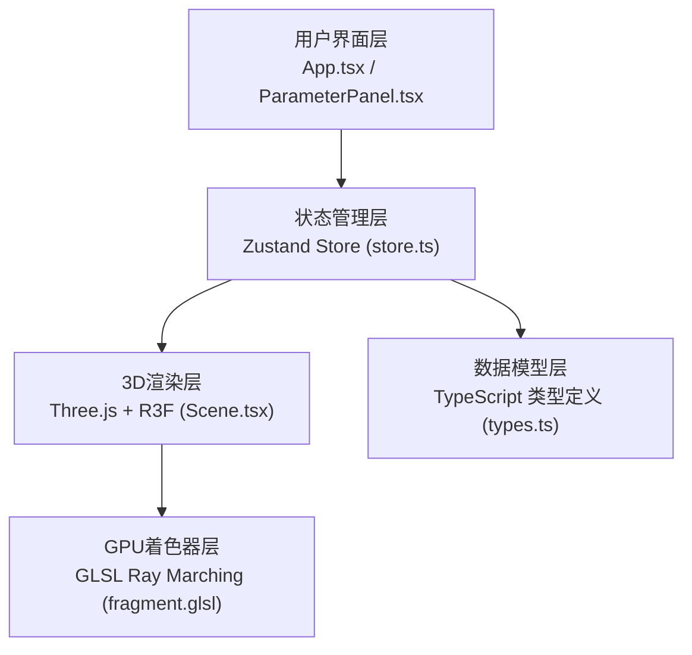

## 1. 架构设计



## 2. 技术描述

- **前端框架**：React@18 + TypeScript@5
- **构建工具**：Vite@5 + @vitejs/plugin-react@4
- **3D渲染引擎**：three@0.160 + @react-three/fiber@8 + @react-three/drei@9
- **状态管理**：zustand@4
- **编程语言**：TypeScript（严格模式）
- **目标环境**：ES2020，浏览器原生WebGL 2.0支持

## 3. 项目结构

```
├── package.json
├── vite.config.js
├── tsconfig.json
├── index.html
└── src/
    ├── types.ts          # 类型定义：FractalParams, FractalType, ColorMap
    ├── store.ts          # Zustand状态管理
    ├── shaders/
    │   └── fragment.glsl # Ray Marching片元着色器
    ├── components/
    │   ├── Scene.tsx     # 3D场景组件
    │   └── ParameterPanel.tsx # 参数控制面板
    └── App.tsx           # 根组件
```

## 4. 核心数据模型

### 4.1 FractalType 枚举

```typescript
enum FractalType {
  MANDELBULB = 'mandelbulb',
  JULIA_SET = 'julia_set',
  QUATERNION = 'quaternion'
}
```

### 4.2 FractalParams 接口

```typescript
interface FractalParams {
  iterations: number;      // 迭代次数 8-128
  escapeRadius: number;    // 逃逸半径 2-10
  power: number;           // 幂指数 2-8
  juliaConstant: [number, number, number]; // Julia常数 [-1,1]
  ambientOcclusion: number; // AO强度 0-1
  internalColoring: boolean; // 内部着色开关
}
```

### 4.3 ColorMap 接口

```typescript
interface ColorMap {
  name: string;
  colors: Array<{ position: number; rgb: [number, number, number] }>;
}
```

### 4.4 ViewState 接口

```typescript
interface ViewState {
  rotationX: number;       // X轴旋转角度
  rotationY: number;       // Y轴旋转角度
  zoom: number;            // 缩放比例 0.5-10
  panX: number;            // X轴平移
  panY: number;            // Y轴平移
}
```

## 5. 核心模块设计

### 5.1 状态管理 (store.ts)

- **currentParams**: FractalParams - 当前分形参数
- **fractalType**: FractalType - 分形类型
- **isRendering**: boolean - 是否正在渲染
- **viewState**: ViewState - 视角状态
- **updateParams(params: Partial<FractalParams>)**: 更新参数并触发重渲染
- **setFractalType(type: FractalType)**: 切换分形类型
- **updateViewState(state: Partial<ViewState>)**: 更新视角状态

### 5.2 3D场景 (Scene.tsx)

- 使用 `@react-three/fiber` 的 `<Canvas>` 组件
- 创建全屏平面几何体，应用自定义 `ShaderMaterial`
- 监听store变化，实时更新uniform变量
- 集成 `@react-three/drei` 的 `OrbitControls` 进行相机控制
- 实现键盘WASD平移控制
- 平滑插值动画0.3秒

### 5.3 Ray Marching着色器 (fragment.glsl)

- 实现Mandelbulb距离估算函数 (DE函数)
- 实现Julia集距离估算函数
- 实现Quaternion分形距离估算函数
- 支持uniform变量：iterations, escapeRadius, power, juliaConstant, time
- 实现光线步进算法，最大步进128次
- 实现环境光遮蔽效果
- 支持内部着色和外部着色

### 5.4 参数面板 (ParameterPanel.tsx)

- 分形类型下拉选择
- 滑块组件：迭代次数、逃逸半径、幂指数、Julia常数(x/y/z)、AO强度
- 颜色映射选择器和自定义RGB输入
- 开关组件：内部着色
- 所有控件带实时数值显示
- 过渡动画200ms

## 6. 性能优化策略

1. **GPU加速**：所有分形计算在GLSL片元着色器中并行执行
2. **视口缩减**：参数调整时临时降低渲染分辨率，动画结束后恢复
3. **自适应帧率**：根据性能动态调整渲染分辨率，保持25fps以上
4. **防抖更新**：参数滑块使用debounce(100ms)减少重渲染次数
5. **内存管理**：及时释放着色器资源和纹理对象

## 7. 着色器核心算法

### Mandelbulb DE函数

```glsl
float mandelbulbDE(vec3 pos, int iterations, float escapeRadius, float power) {
  vec3 z = pos;
  float dr = 1.0;
  float r = 0.0;
  for (int i = 0; i < 128; i++) {
    if (i >= iterations) break;
    r = length(z);
    if (r > escapeRadius) break;
    float theta = acos(z.z / r);
    float phi = atan(z.y, z.x);
    dr = pow(r, power - 1.0) * power * dr + 1.0;
    float zr = pow(r, power);
    theta = theta * power;
    phi = phi * power;
    z = zr * vec3(sin(theta) * cos(phi), sin(phi) * sin(theta), cos(theta));
    z += pos;
  }
  return 0.5 * log(r) * r / dr;
}
```

## 8. 构建配置

### tsconfig.json 关键配置

```json
{
  "compilerOptions": {
    "target": "ES2020",
    "module": "ESNext",
    "moduleResolution": "node",
    "strict": true,
    "jsx": "react-jsx",
    "esModuleInterop": true,
    "skipLibCheck": true
  }
}
```

### vite.config.js

```javascript
import { defineConfig } from 'vite'
import react from '@vitejs/plugin-react'

export default defineConfig({
  plugins: [react()],
  assetsInclude: ['**/*.glsl']
})
```
